# Artemis：探索复杂视频中的指称理解能力

发布时间：2024年05月31日

`Agent

理由：这篇论文介绍了一个名为 Artemis 的模型，该模型能够处理基于视频的指称理解任务，通过接收带有边界框的自然语言问题来精准描述视频中的目标。这种能力涉及到对视频内容的理解和响应，类似于一个智能代理的行为。因此，将其归类为Agent是合适的。虽然该模型使用了多模态大型语言模型（MLLMs），但论文的重点在于模型的应用和性能，而不是理论探讨，因此不适合归类为LLM理论或LLM应用。同时，该论文并未涉及检索增强生成（RAG）的相关内容，因此也不适合归类为RAG。` `视频理解`

> Artemis: Towards Referential Understanding in Complex Videos

# 摘要

> 视频蕴含丰富的视觉信息，如物体描述、动作与互动，然而，现有的多模态大型语言模型（MLLMs）在处理基于视频的指称理解任务时显得力不从心。本文推出的 Artemis 模型，则将这一能力推向了新的高度。面对视频，Artemis 能接收带有边界框的自然语言问题，并精准描述视频中被指称的目标。其核心在于提取目标特定的紧凑视频特征，我们通过跟踪视频中的时空特征，确立了坚实的基准。Artemis 在包含 45K 视频-问答对的新数据集 VideoRef45K 上接受训练，采用高效的三阶段训练流程。结果令人鼓舞，无论是在定量还是定性分析上。此外，Artemis 还能与视频定位和文本摘要工具结合，应对更为复杂的场景。相关代码和数据已公开于 https://github.com/qiujihao19/Artemis。

> Videos carry rich visual information including object description, action, interaction, etc., but the existing multimodal large language models (MLLMs) fell short in referential understanding scenarios such as video-based referring. In this paper, we present Artemis, an MLLM that pushes video-based referential understanding to a finer level. Given a video, Artemis receives a natural-language question with a bounding box in any video frame and describes the referred target in the entire video. The key to achieving this goal lies in extracting compact, target-specific video features, where we set a solid baseline by tracking and selecting spatiotemporal features from the video. We train Artemis on the newly established VideoRef45K dataset with 45K video-QA pairs and design a computationally efficient, three-stage training procedure. Results are promising both quantitatively and qualitatively. Additionally, we show that \model can be integrated with video grounding and text summarization tools to understand more complex scenarios. Code and data are available at https://github.com/qiujihao19/Artemis.

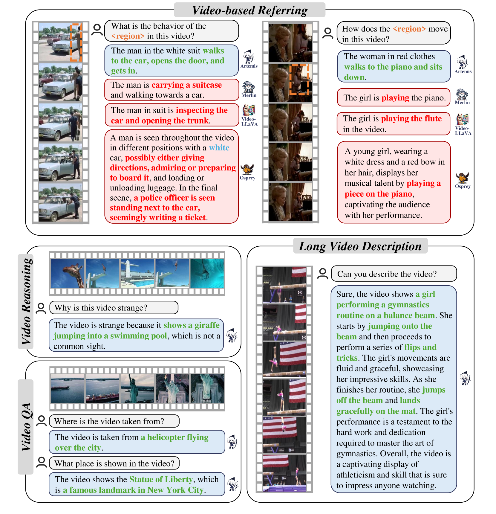

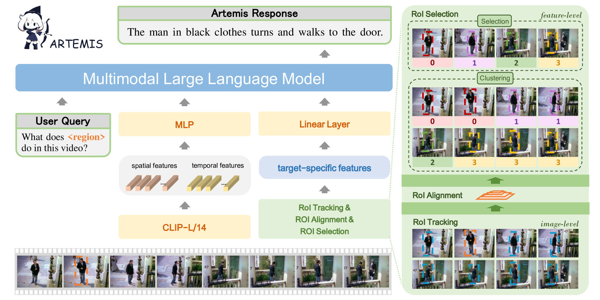

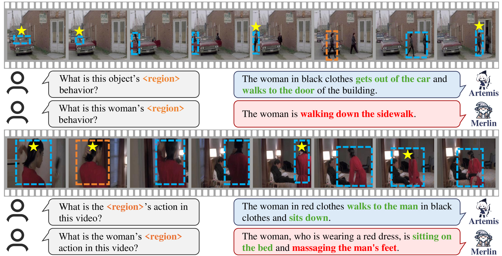

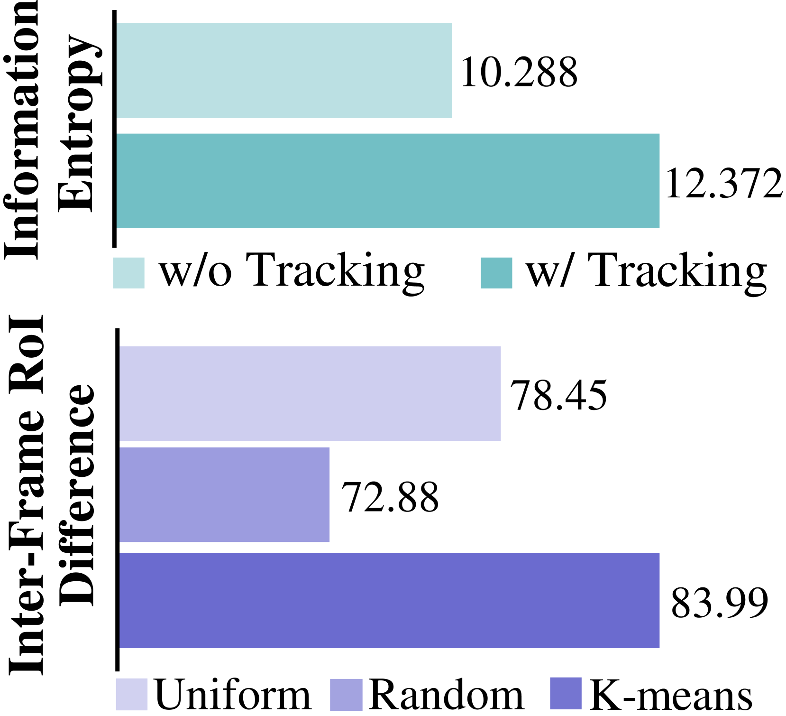

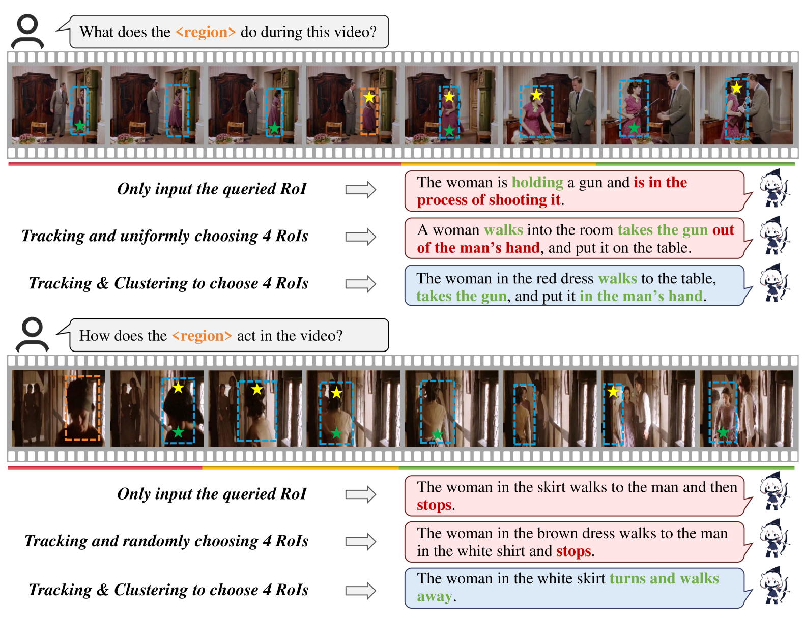

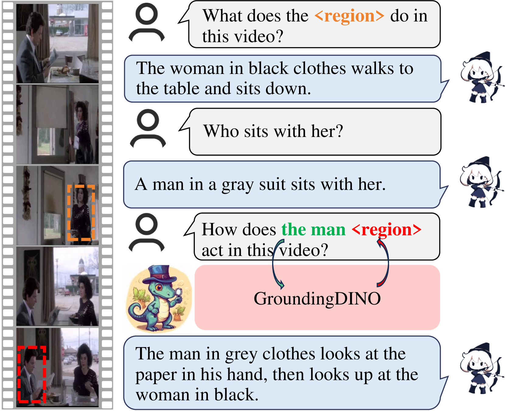

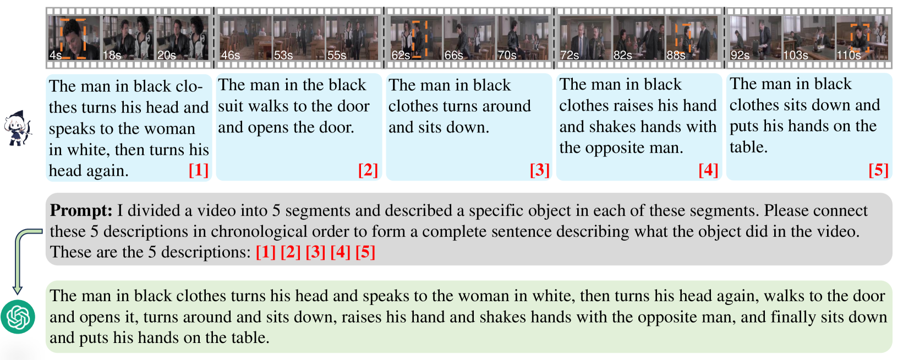

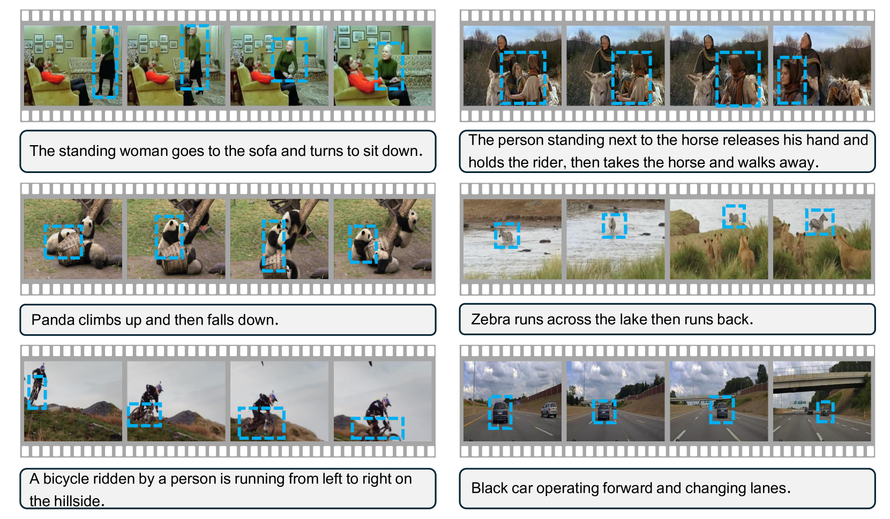

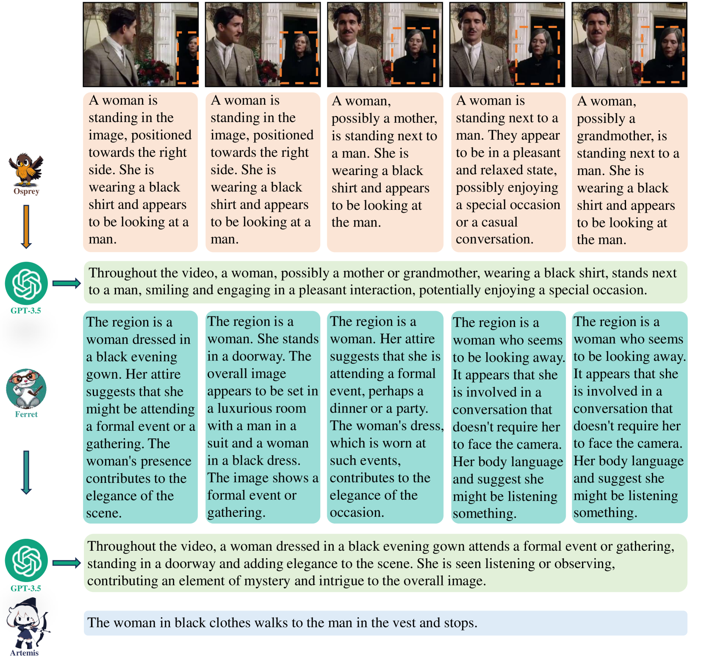

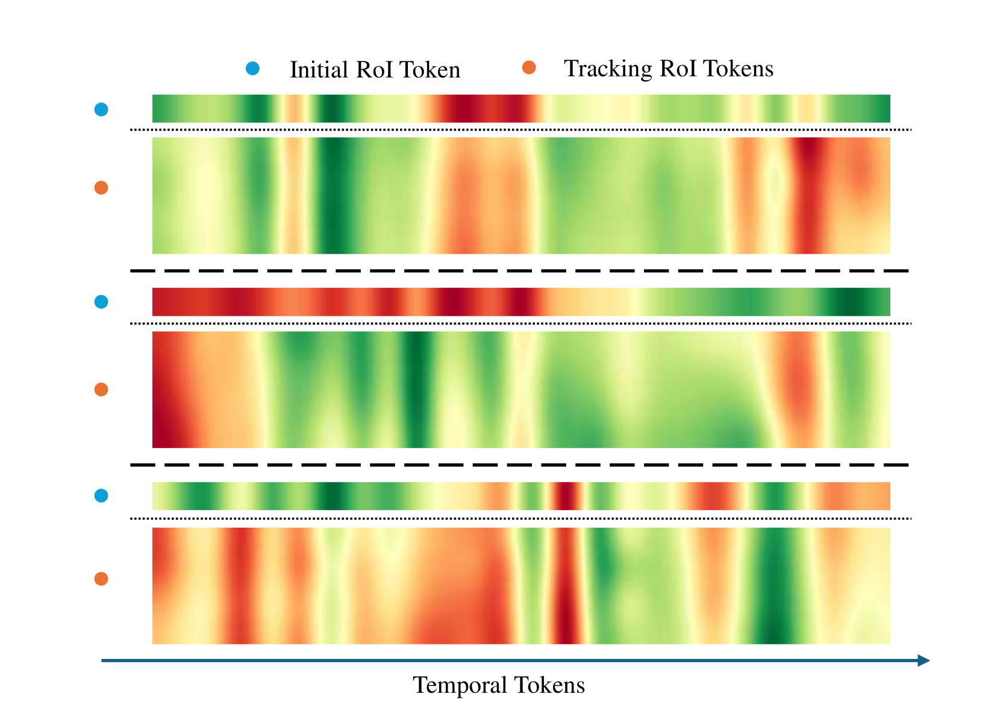

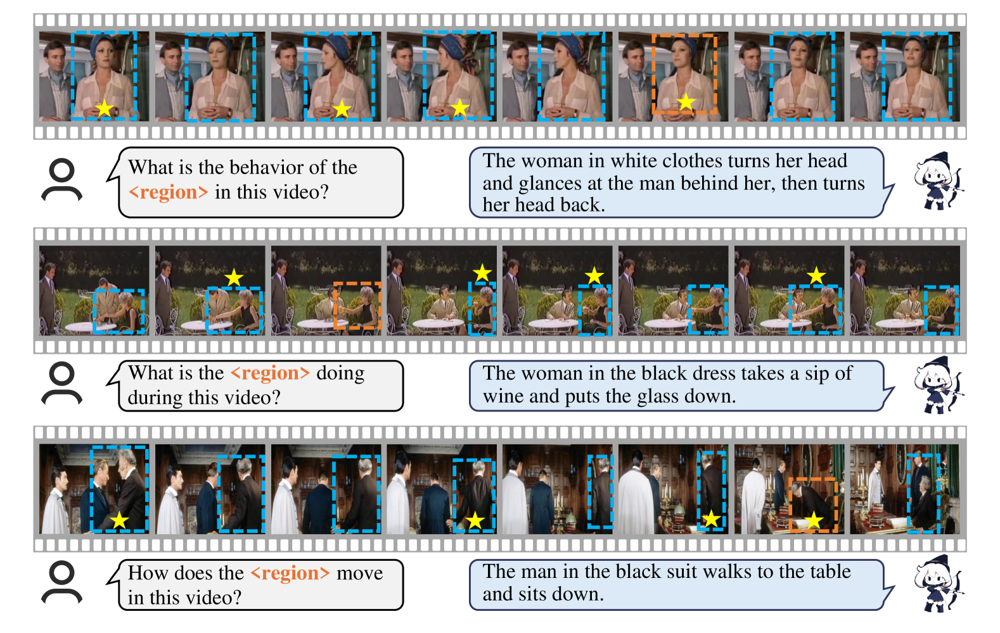

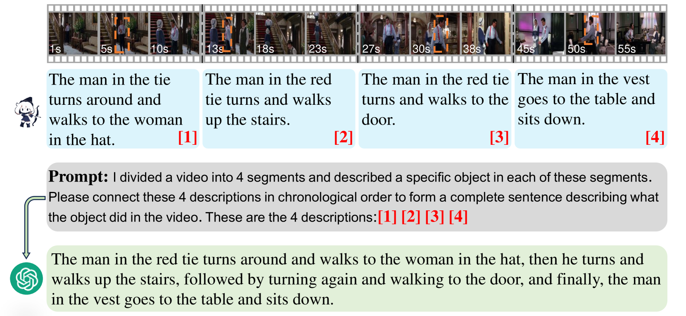

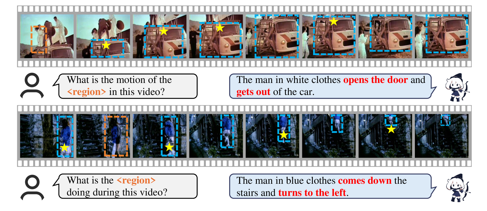

[Arxiv](https://arxiv.org/abs/2406.00258)