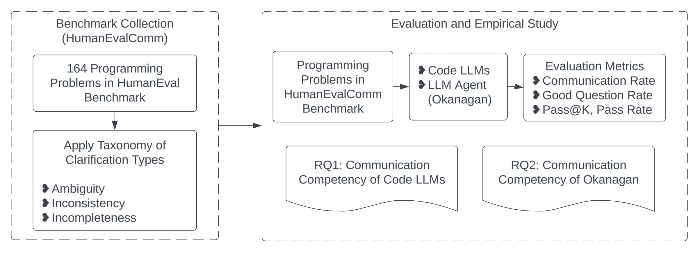
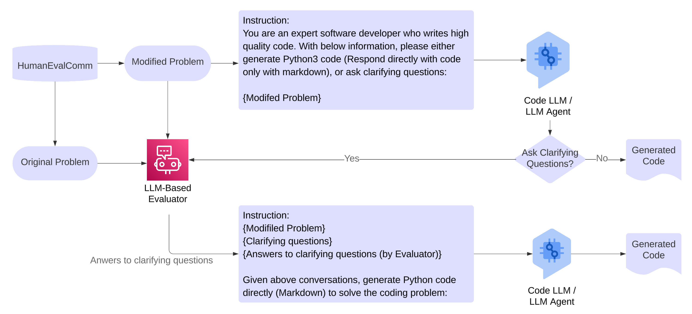
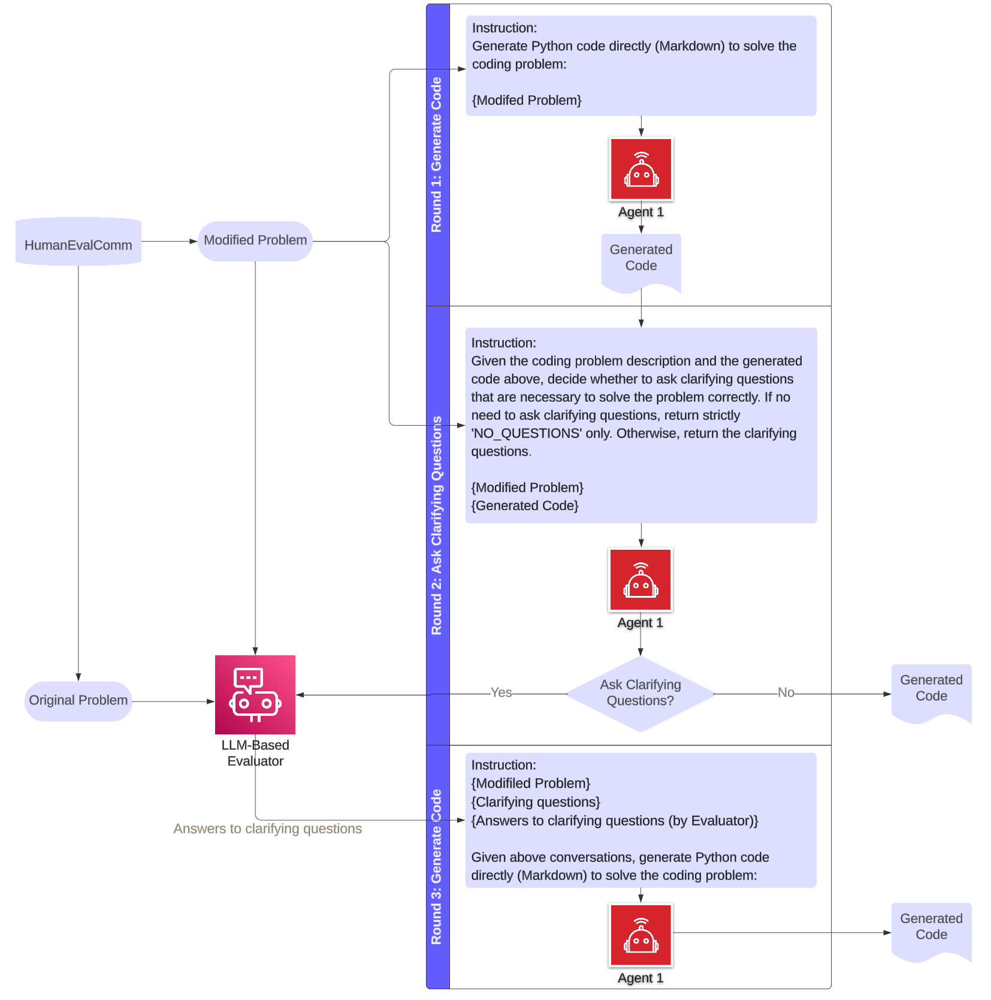
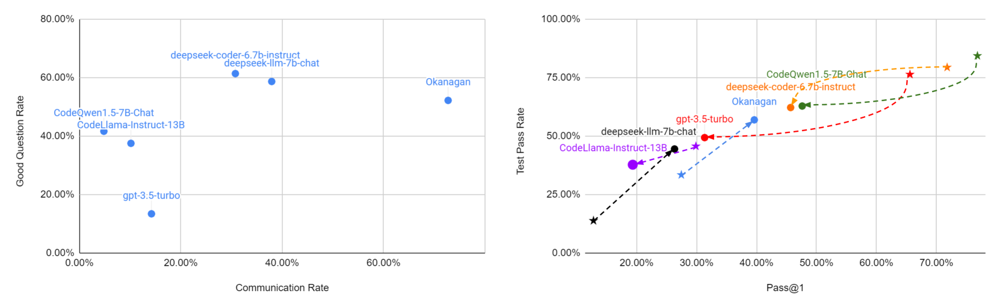
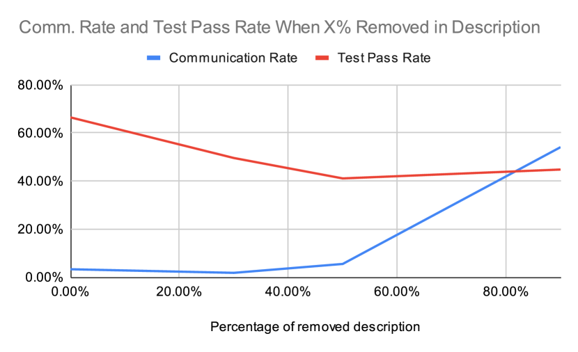

# 评估大型语言模型及其代理在代码生成中的沟通能力

发布时间：2024年05月31日

`Agent

这篇论文主要探讨了大型语言模型（LLMs）在代码生成中的沟通能力，并引入了新型代理方法Okanagan来提高这一能力。论文通过实证研究和创建新的基准测试HumanEvalComm来评估不同LLMs及Okanagan的表现，并特别关注了模型在问题描述不明确时提出澄清问题的能力。因此，这篇论文更符合Agent分类，因为它涉及到了一个特定的代理方法（Okanagan）在LLMs应用中的作用和效果。` `软件开发` `人工智能`

> Benchmarking the Communication Competence of Code Generation for LLMs and LLM Agent

# 摘要

> 大型语言模型（LLMs）在代码生成方面取得了显著进步，但与顶尖软件工程师相比，仍有提升空间。顶尖软件工程师常通过提问澄清需求和解决方案中的歧义，我们认为LLMs也应采取类似策略。为此，我们进行了实证研究，评估LLMs在代码生成中的沟通能力，定义为“在问题描述不明确时能提出澄清问题”。我们创建了新基准HumanEvalComm，并引入了沟通率和好问题率等评估指标。通过在HumanEvalComm上测试不同LLMs及新型代理方法Okanagan，我们发现Okanagan能有效识别并提问歧义部分，从而优化代码生成。最终，我们通过对比分析，探讨了LLMs与Okanagan的表现差异。

> Large language models (LLMs) have significantly improved their ability to perform tasks in the field of code generation. However, there is still a gap between LLMs being capable coders and being top-tier software engineers. Based on the observation that top-level software engineers often ask clarifying questions to reduce ambiguity in both requirements and coding solutions, we argue that the same should be applied to LLMs for code generation tasks.
  In this work, we conducted an empirical study on the benchmark and analysis of the communication skills of LLMs for code generation. We define communication skills of LLMs as ``being able to ask clarifying questions when the description of the code generation problem has issues''. We created a new benchmark, HumanEvalComm, by modifying problem descriptions according to three issues: inconsistency, ambiguity, incompleteness. We defined new evaluation metrics such as Communication Rate and Good Question Rate, and then experimented on HumanEvalComm with different Code LLMs, and a new LLM agent approach, Okanagan, to identify and ask questions in ambiguous parts from code and descriptions for further refining the generated code. Finally, we discussed evaluation results by comparing Code LLMs and Okanagan with our findings.

[Arxiv](https://arxiv.org/abs/2406.00215)