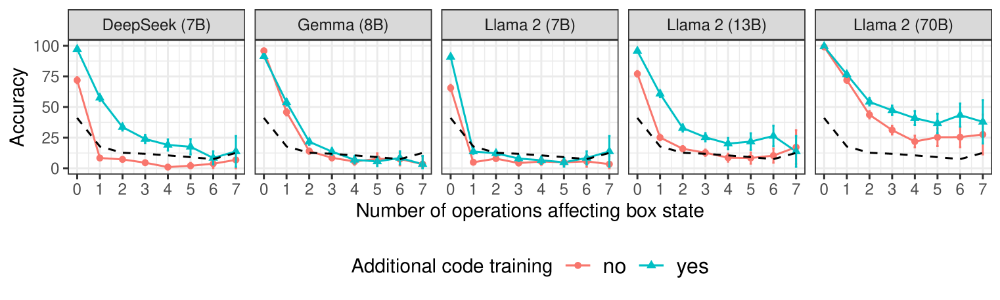
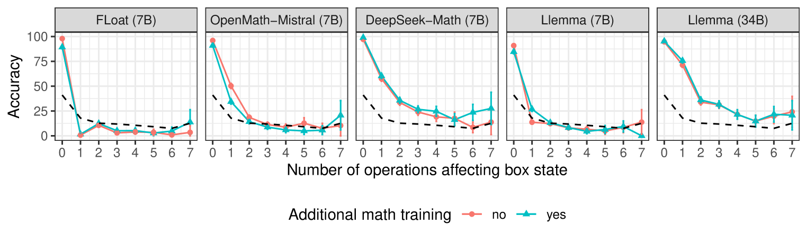
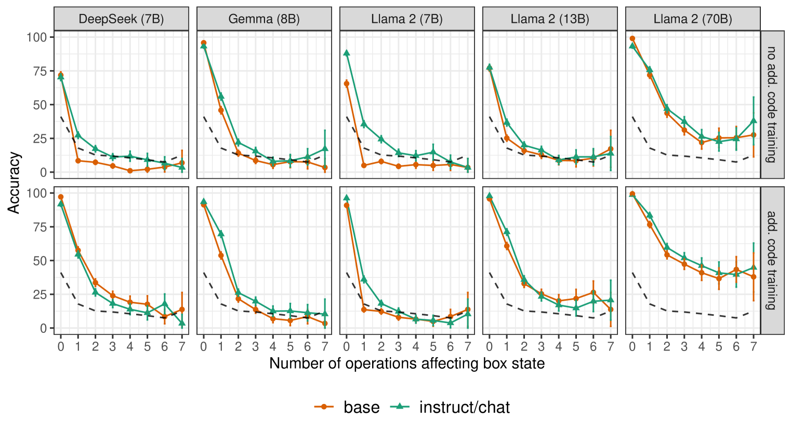

# 通过代码预训练，语言模型在实体追踪上的表现得到了显著提升。

发布时间：2024年05月31日

`LLM理论

这篇论文主要探讨了通过代码预训练语言模型如何增强其跟踪自然语言中论述实体状态变化的能力，并通过实验对比了不同训练方法（如代码数据训练、数学训练和校准调整）对模型性能的影响。这些内容属于对大型语言模型（LLM）的理论研究，特别是关于模型训练和性能优化的方面，因此应归类于LLM理论。` `软件开发`

> Code Pretraining Improves Entity Tracking Abilities of Language Models

# 摘要

> 近期研究表明，通过代码预训练语言模型能增强其跟踪自然语言中论述实体状态变化的能力。本研究通过对比语言模型在实体跟踪上的表现，系统验证了这一观点。我们特别关注了基础模型与经过额外代码数据训练的模型之间的差异，并进一步探究了数学训练（一种结构化数据类型）和校准调整（提升模型可用性的关键步骤）的影响。结果显示，经过大量代码训练的模型明显优于基础模型。然而，对于不同模型家族而言，额外的数学训练或校准调整并未带来一致的益处。

> Recent work has provided indirect evidence that pretraining language models on code improves the ability of models to track state changes of discourse entities expressed in natural language. In this work, we systematically test this claim by comparing pairs of language models on their entity tracking performance. Critically, the pairs consist of base models and models trained on top of these base models with additional code data. We extend this analysis to additionally examine the effect of math training, another highly structured data type, and alignment tuning, an important step for enhancing the usability of models. We find clear evidence that models additionally trained on large amounts of code outperform the base models. On the other hand, we find no consistent benefit of additional math training or alignment tuning across various model families.

[Arxiv](https://arxiv.org/abs/2405.21068)