# 驾驭大型语言模型代理：熵激活引导之术

发布时间：2024年05月31日

`Agent

这篇论文主要探讨了大型语言模型（LLMs）作为情境学习代理在决策过程中的行为，特别是它们如何基于与环境的有限互动来形成信念并进行决策。论文通过实验分析了LLM代理的过度自信问题，并提出了一种新的激活引导方法（EAST）来增加代理的动作熵，促进更多的探索行为。因此，这篇论文更符合Agent分类，因为它专注于LLM在代理角色中的应用和改进。` `人工智能` `决策支持系统`

> Controlling Large Language Model Agents with Entropic Activation Steering

# 摘要

> 预训练的大型语言模型（LLMs）因其广泛适用性而备受关注，人们越来越倾向于将其作为情境学习代理来使用。这些代理的成功关键在于，它们必须基于与环境的有限互动来形成实现目标的信念，这自然带来了每一步行动选择的不确定性。本文通过一系列受控的顺序决策实验，探讨了LLM代理如何基于这些信念进行决策。我们发现，LLM代理往往过于自信，他们基于有限的证据就做出决定，导致探索不足。进一步分析表明，这种过度自信源于LLM动作分布熵的减少。我们接着指出，现有的标记级采样技术单独使用时，无法有效促进代理的探索行为。为此，我们提出了熵激活引导（EAST），一种针对情境LLM代理的新型激活引导方法。EAST通过计算一个熵加权的引导向量，并在正向传播过程中调整激活，来增加LLM代理的动作熵，从而激发更多的探索行为。最终，EAST不仅改变了LLM代理表达的不确定性，还为理解和调控LLM代理决策过程中的不确定性提供了新途径。

> The generality of pretrained large language models (LLMs) has prompted increasing interest in their use as in-context learning agents. To be successful, such agents must form beliefs about how to achieve their goals based on limited interaction with their environment, resulting in uncertainty about the best action to take at each step. In this paper, we study how LLM agents form and act on these beliefs by conducting experiments in controlled sequential decision-making tasks. To begin, we find that LLM agents are overconfident: They draw strong conclusions about what to do based on insufficient evidence, resulting in inadequately explorative behavior. We dig deeper into this phenomenon and show how it emerges from a collapse in the entropy of the action distribution implied by sampling from the LLM. We then demonstrate that existing token-level sampling techniques are by themselves insufficient to make the agent explore more. Motivated by this fact, we introduce Entropic Activation Steering (EAST), an activation steering method for in-context LLM agents. EAST computes a steering vector as an entropy-weighted combination of representations, and uses it to manipulate an LLM agent's uncertainty over actions by intervening on its activations during the forward pass. We show that EAST can reliably increase the entropy in an LLM agent's actions, causing more explorative behavior to emerge. Finally, EAST modifies the subjective uncertainty an LLM agent expresses, paving the way to interpreting and controlling how LLM agents represent uncertainty about their decisions.

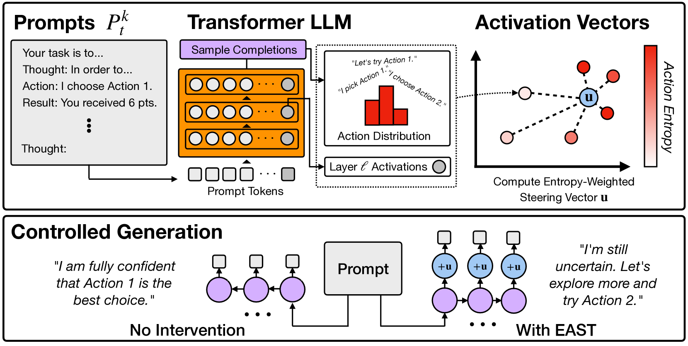

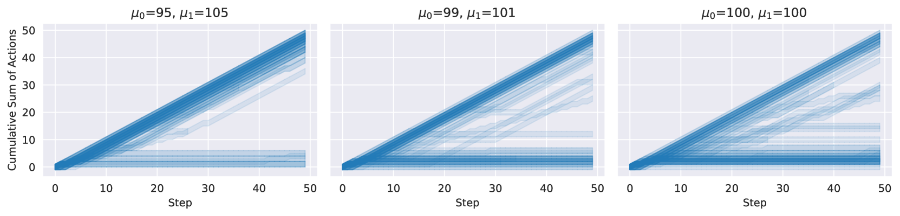

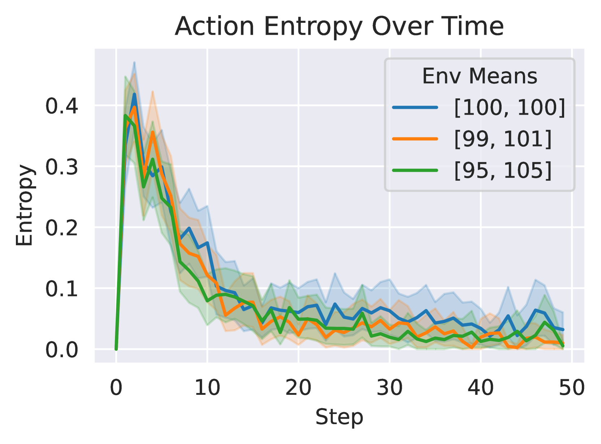

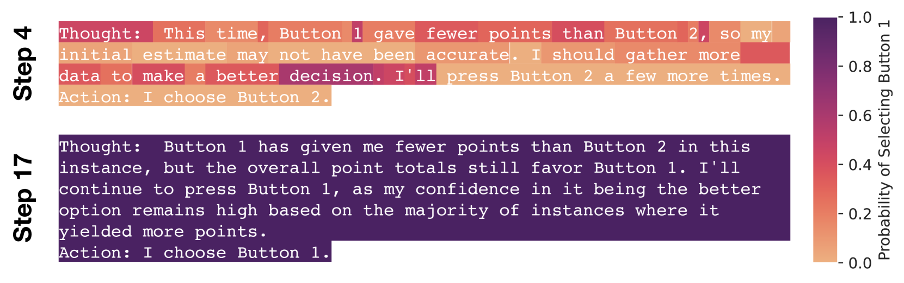

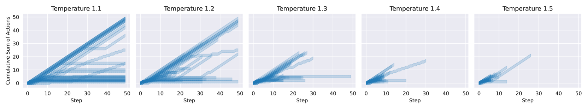

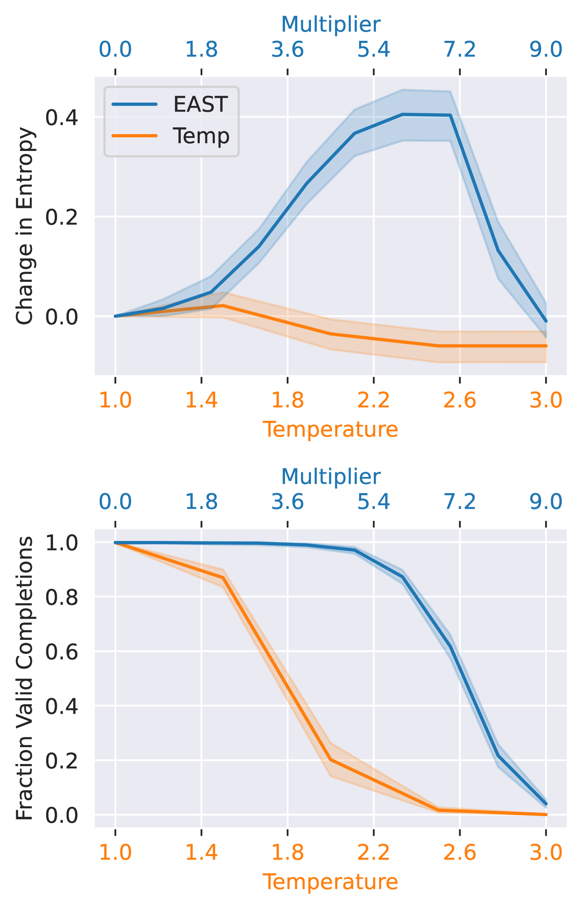

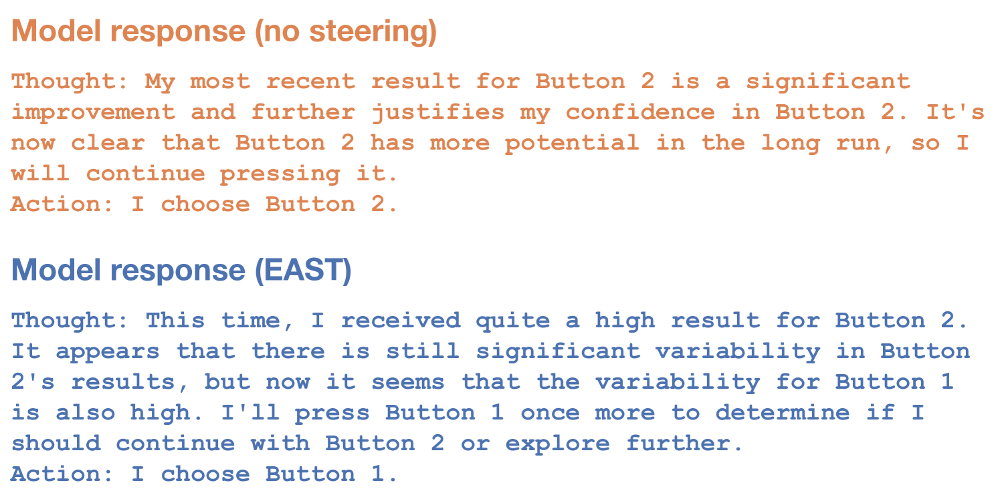

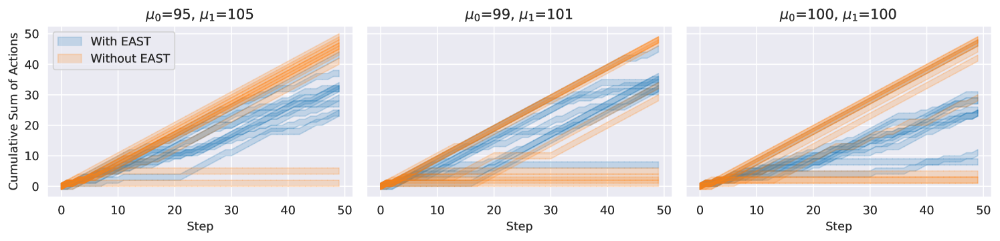

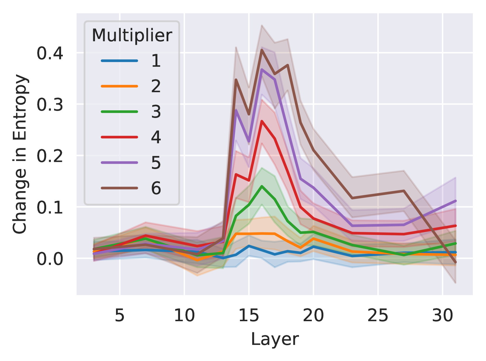

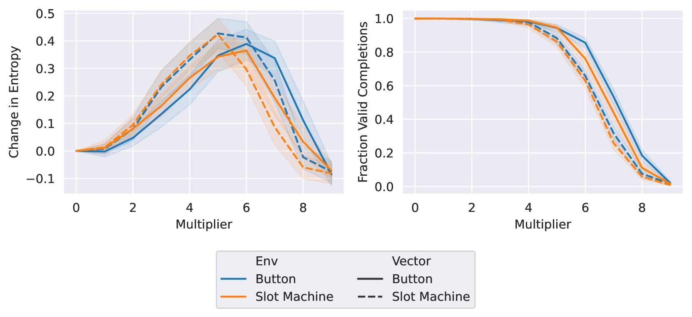

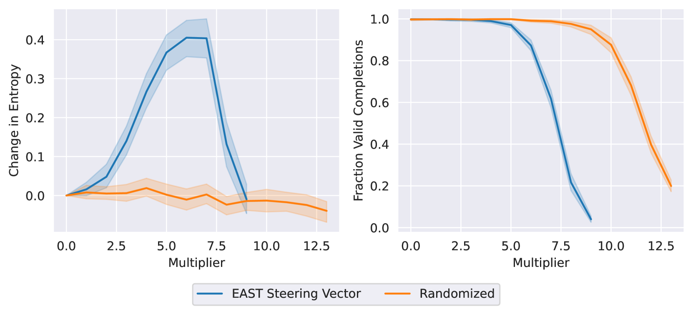

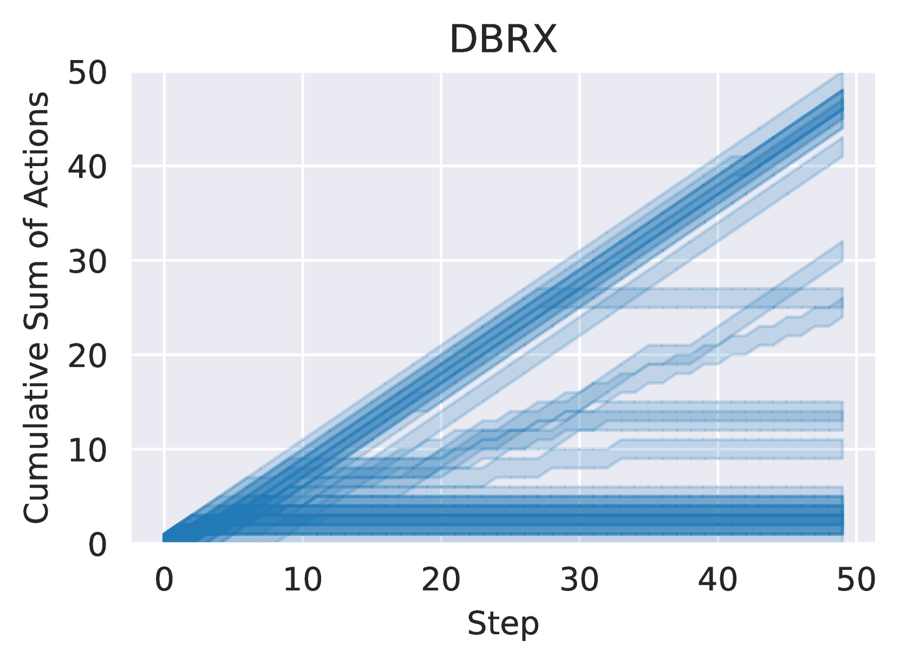

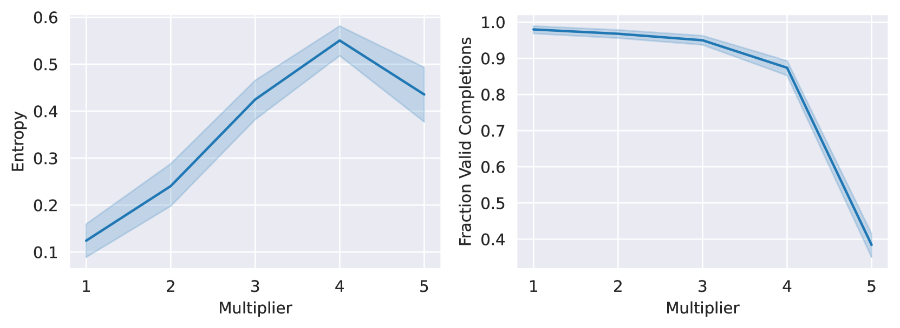

[Arxiv](https://arxiv.org/abs/2406.00244)