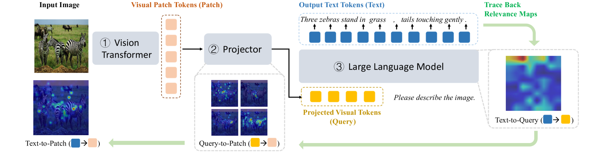
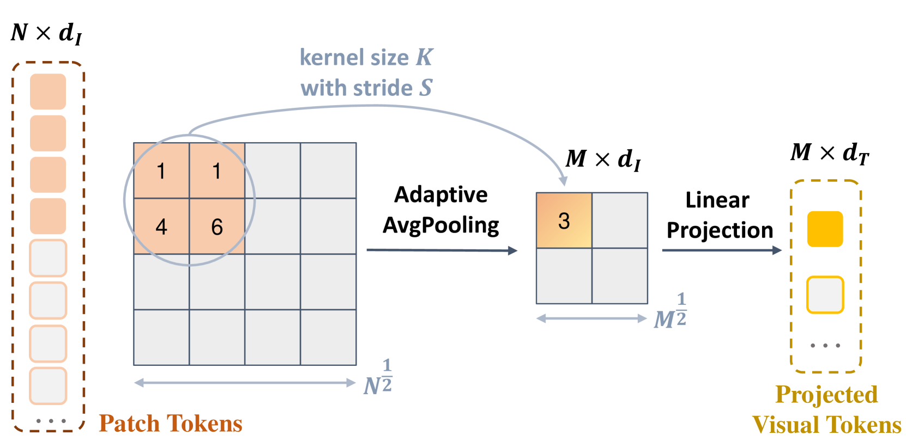
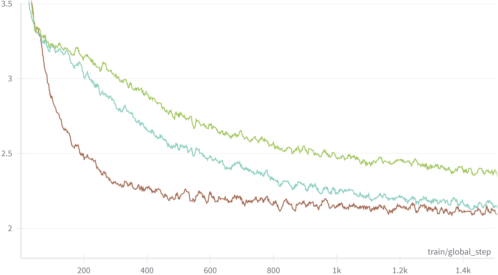
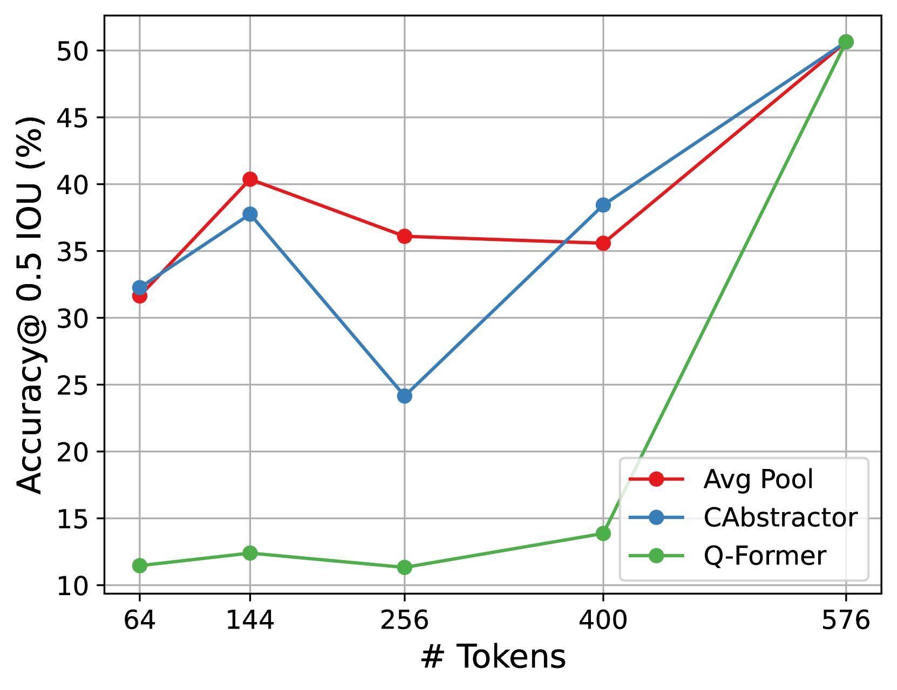
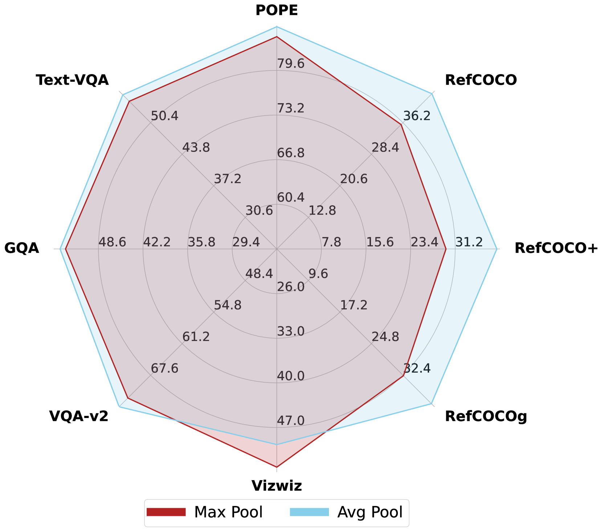
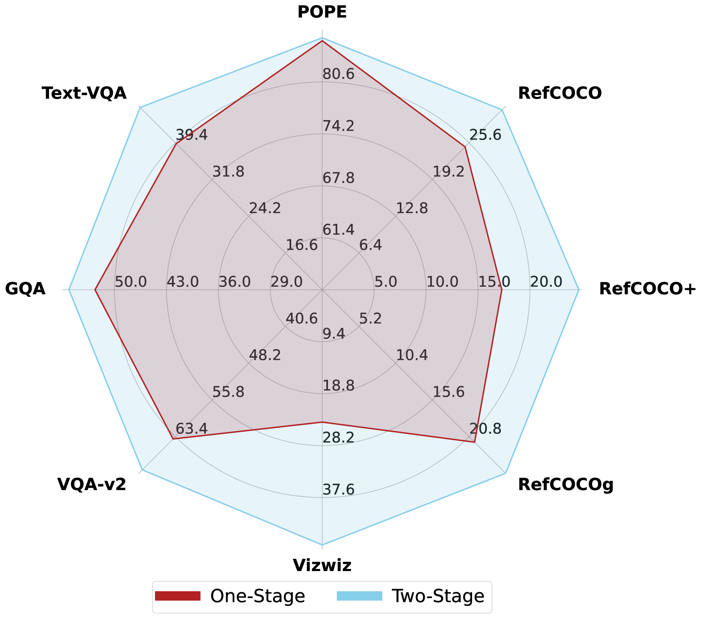
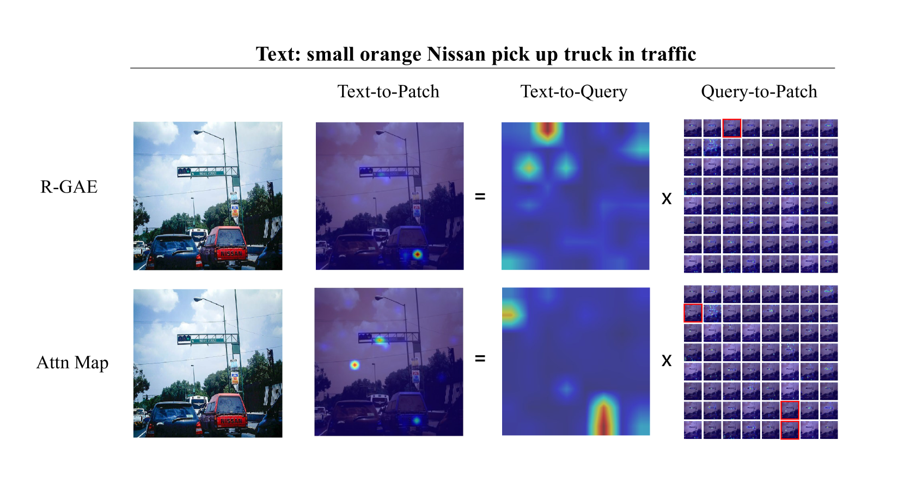

# DeCo：解耦多模态大型语言模型中的令牌压缩与语义抽象

发布时间：2024年05月31日

`LLM应用

理由：这篇论文主要探讨了多模态大型语言模型（MLLMs）中的视觉投影器的作用及其在视觉-语言对齐中的效能问题。论文提出了一种新的策略“解耦压缩与抽象（DeCo）”，并通过实证研究展示了其在性能和效率上的改进。这些内容主要关注于LLM在实际应用中的具体问题和解决方案，因此属于LLM应用类别。` `多模态学习` `视觉-语言对齐`

> DeCo: Decoupling Token Compression from Semantic Abstraction in Multimodal Large Language Models

# 摘要

> 视觉投影器在多模态大型语言模型（MLLMs）中扮演着连接视觉与语言、促进跨模态对齐的关键角色。然而，评估投影器在视觉-语言对齐中的效能仍是一个未解之谜，我们只能从MLLMs在下游任务的表现中窥见一斑。本研究受到这一挑战的启发，深入探索了MLLMs内部视觉与语言之间的语义流动，特别关注了投影器模块。我们追踪了从语言生成到原始视觉编码器补丁以及投影器中间输出的语义关联路径。研究发现，压缩投影器（例如QFormer）将视觉补丁抽象为一组有限的语义概念，如物体或属性，引发了“双重抽象”现象。这一现象首先由投影器根据预设查询令牌进行视觉语义抽象，随后由LLM基于文本指令进行第二次抽象。这种双重抽象在训练中效率低下，并可能导致视觉语义的累积缺失。为此，我们提出了“解耦压缩与抽象（DeCo）”的策略，即在补丁级别通过投影器减少视觉令牌数量，同时让LLM全权负责视觉语义的抽象。我们采用了一种简单的2D自适应池化技术，以无参数方式对视觉补丁进行下采样。实证结果显示，DeCo在性能和效率上均优于传统压缩投影器，在MLLM基准、视觉定位和开放式VQA任务上分别提升了0.9%、7.1%和2.9%，同时减少了可训练参数并加快了收敛速度。

> The visual projector, which bridges the vision and language modalities and facilitates cross-modal alignment, serves as a crucial component in MLLMs. However, measuring the effectiveness of projectors in vision-language alignment remains under-explored, which currently can only be inferred from the performance of MLLMs on downstream tasks. Motivated by the problem, this study examines the projector module by interpreting the vision-language semantic flow within MLLMs. Specifically, we trace back the semantic relevance flow from generated language tokens to raw visual encoder patches and the intermediate outputs produced by projectors. Our findings reveal that compressive projectors (e.g., QFormer), abstract visual patches into a limited set of semantic concepts, such as objects or attributes, resulting in a 'double abstraction' phenomenon. This involves a first visual semantic abstraction by the projector referring to pre-defined query tokens, and a second extraction by the LLM based on text instructions. The double abstraction is inefficient in training and will result in cumulative vision semantics deficiency. To mitigate this issue, we propose the key insight of 'Decouple Compression from Abstraction (DeCo), that is compressing the visual token number at the patch level by projectors and allowing the LLM to handle visual semantic abstraction entirely. Consequently, we adopt a simple compressor, i.e., 2D Adaptive Pooling, to downsample visual patches in a parameter-free manner. Empirical evaluation demonstrates that DeCo surpasses traditional compressive projectors regarding both performance and efficiency. It achieves performance gains of 0.9%, 7.1%, and 2.9% across the MLLM Benchmarks, Visual Localization, and Open-ended VQA tasks with fewer trainable parameters and faster convergence speed.

[Arxiv](https://arxiv.org/abs/2405.20985)