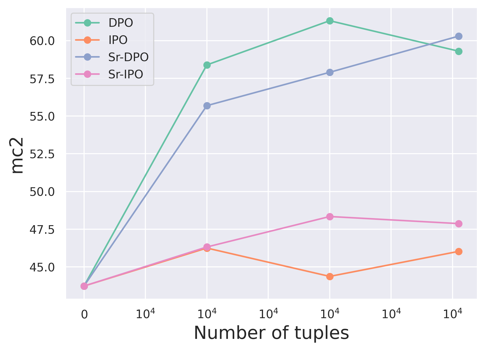

# 语言模型通过质量感知自我精炼实现直接对齐

发布时间：2024年05月31日

`Agent

这篇论文主要探讨了如何利用大型语言模型（LLM）的内在知识来评估和优化从人类反馈中学习强化学习（RLHF）的过程，特别是在直接策略优化（DPO）中。论文提出了一种新的方法，通过设计一个细化函数来评估正面和负面反馈的质量，并优化损失函数，从而提高模型的性能。这种方法涉及到对LLM的即时微调和策略优化，属于Agent领域的研究，因为其核心在于如何更好地调整和优化模型以适应和响应外部反馈，这是Agent行为的核心特征。` `人工智能` `机器学习`

> Direct Alignment of Language Models via Quality-Aware Self-Refinement

# 摘要

> 从人类反馈中学习强化学习（RLHF）常用于调整大型语言模型（LLMs）以符合人类偏好。近期，直接策略优化（DPO）作为一种流行替代方案，通过直接使用策略本身取代基于LLM的奖励模型，节省了学习奖励模型所需的额外资源和时间。但DPO未考虑正面与负面反馈的相对质量，可能导致训练效果不佳。为此，我们探索了利用LLM即时微调中的内在知识来评估这些反馈的质量，并优化损失函数。我们设计了一个细化函数，利用LLM的知识来评估正面和负面反馈的质量，并在适度假设下，该函数能自我优化损失函数。此细化函数已融入DPO及其变体身份策略优化（IPO），实验结果显示，这些方法在多个评估者中均提升了微调模型的性能，超越了DPO和IPO。

> Reinforcement Learning from Human Feedback (RLHF) has been commonly used to align the behaviors of Large Language Models (LLMs) with human preferences. Recently, a popular alternative is Direct Policy Optimization (DPO), which replaces an LLM-based reward model with the policy itself, thus obviating the need for extra memory and training time to learn the reward model. However, DPO does not consider the relative qualities of the positive and negative responses, and can lead to sub-optimal training outcomes. To alleviate this problem, we investigate the use of intrinsic knowledge within the on-the-fly fine-tuning LLM to obtain relative qualities and help to refine the loss function. Specifically, we leverage the knowledge of the LLM to design a refinement function to estimate the quality of both the positive and negative responses. We show that the constructed refinement function can help self-refine the loss function under mild assumptions. The refinement function is integrated into DPO and its variant Identity Policy Optimization (IPO). Experiments across various evaluators indicate that they can improve the performance of the fine-tuned models over DPO and IPO.

[Arxiv](https://arxiv.org/abs/2405.21040)