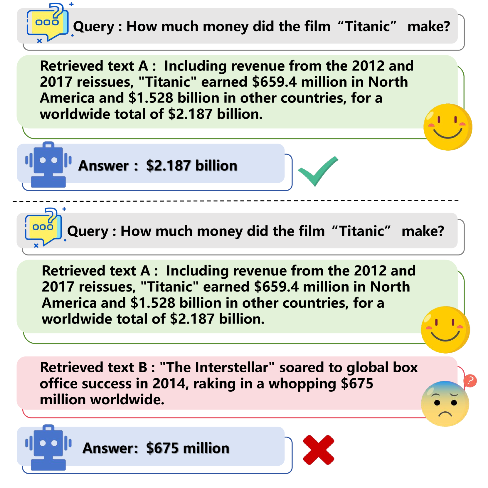
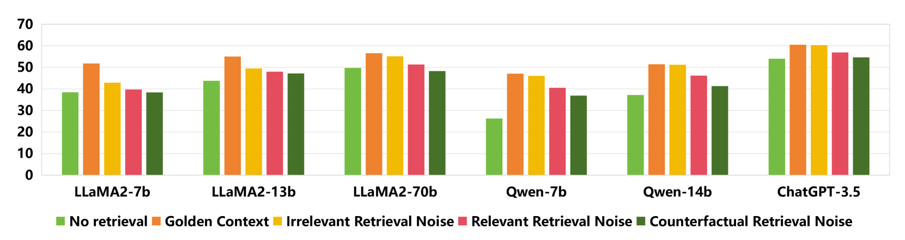
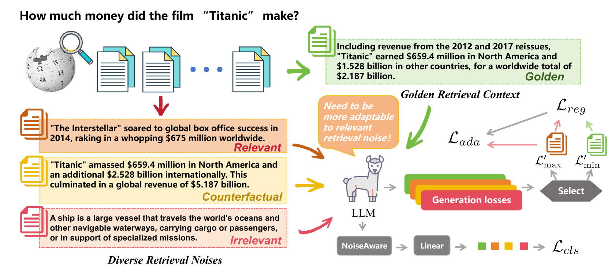
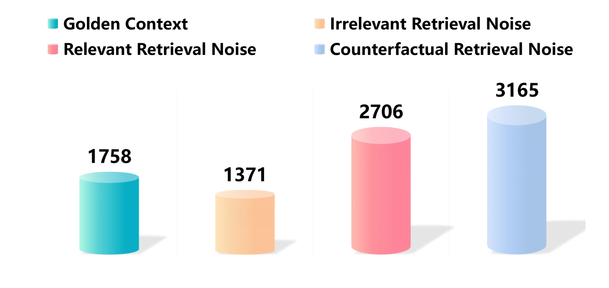

# 利用自适应对抗训练提升检索增强型语言模型对噪声的抵抗力

发布时间：2024年05月31日

`RAG

理由：这篇论文主要探讨了检索增强生成（RAG）技术在面对检索噪声时的鲁棒性问题，并提出了一种新的方法——检索增强自适应对抗训练（RAAT）。这种方法旨在提高模型在噪声环境下的性能，特别是在处理检索到的信息时。因此，这篇论文的内容与RAG技术的改进和应用紧密相关，属于RAG分类。` `机器学习`

> Enhancing Noise Robustness of Retrieval-Augmented Language Models with Adaptive Adversarial Training

# 摘要

> 大型语言模型（LLMs）虽能力强大，却也面临幻觉、知识过时及推理不透明等挑战。检索增强生成（RAG）作为一种潜在解决方案，通过整合外部知识库信息来缓解这些问题。但不当的检索内容可能影响LLMs生成全面且高质量的回答。以往关于RAG对检索噪声鲁棒性的研究多局限于特定噪声类型，未能真实反映实际检索环境，限制了其实用性。本研究首次深入探讨检索噪声，并将其细分为三类，以更贴近真实环境。我们分析了这些噪声对LLMs鲁棒性的影响，并提出了一种创新的RAG方法——检索增强自适应对抗训练（RAAT）。RAAT通过自适应对抗训练动态调整模型训练，同时结合多任务学习，增强模型识别噪声上下文的能力。实验证明，采用RAAT训练的LLaMA-2 7B模型在多种噪声环境下，F1和EM分数均有显著提升。为确保研究的可复现性，我们已公开代码和数据集：https://github.com/calubkk/RAAT。

> Large Language Models (LLMs) exhibit substantial capabilities yet encounter challenges, including hallucination, outdated knowledge, and untraceable reasoning processes. Retrieval-augmented generation (RAG) has emerged as a promising solution, integrating knowledge from external databases to mitigate these challenges. However, inappropriate retrieved passages can potentially hinder the LLMs' capacity to generate comprehensive and high-quality responses. Prior RAG studies on the robustness of retrieval noises often confine themselves to a limited set of noise types, deviating from real-world retrieval environments and limiting practical applicability. In this study, we initially investigate retrieval noises and categorize them into three distinct types, reflecting real-world environments. We analyze the impact of these various retrieval noises on the robustness of LLMs. Subsequently, we propose a novel RAG approach known as Retrieval-augmented Adaptive Adversarial Training (RAAT). RAAT leverages adaptive adversarial training to dynamically adjust the model's training process in response to retrieval noises. Concurrently, it employs multi-task learning to ensure the model's capacity to internally recognize noisy contexts. Extensive experiments demonstrate that the LLaMA-2 7B model trained using RAAT exhibits significant improvements in F1 and EM scores under diverse noise conditions. For reproducibility, we release our code and data at: https://github.com/calubkk/RAAT.

[Arxiv](https://arxiv.org/abs/2405.20978)