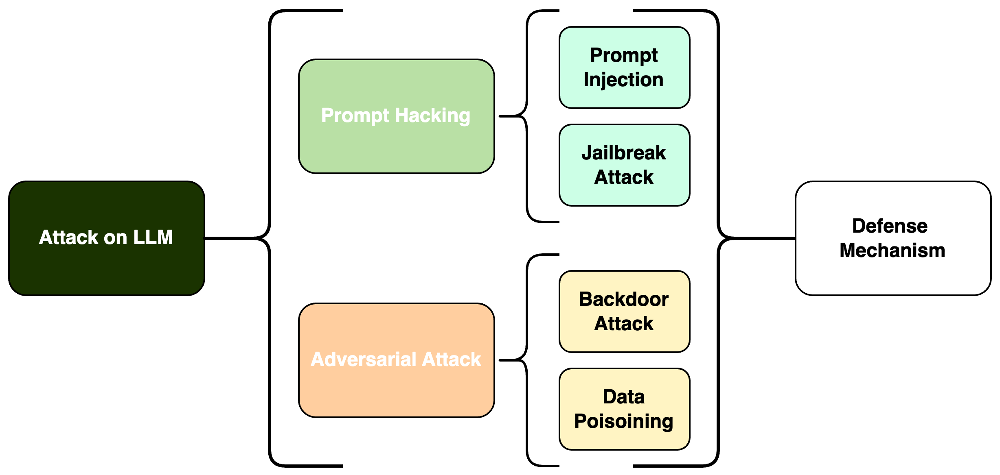

# 大型语言模型漏洞与防护探索：一份综述

发布时间：2024年05月31日

`LLM理论

这篇论文摘要主要探讨了大型语言模型（LLMs）的安全性问题，包括提示词攻击和对抗性攻击等安全挑战，并分析了这些攻击的运作机制、潜在风险及缓解策略。这些内容更多地涉及LLMs的理论层面，即模型安全性的基础研究和分析，而不是具体的应用实例或Agent的设计与实现。因此，将其归类为LLM理论是合适的。` `人工智能安全` `网络安全`

> Exploring Vulnerabilities and Protections in Large Language Models: A Survey

# 摘要

> 随着大型语言模型（LLMs）在AI应用中的地位日益重要，其安全漏洞和防御机制的有效性成为关键议题。本调查深入探讨了LLMs面临的安全挑战，特别关注提示词攻击和对抗性攻击两大领域，并分别探讨了各自的威胁类型。在提示词攻击方面，我们详细分析了提示注入和越狱攻击的运作机制、潜在风险及缓解策略。对抗性攻击方面，我们将其分解为数据投毒和后门攻击进行深入分析。通过这种结构化的审查，我们更好地理解了这些漏洞与防御策略之间的关系。调查不仅揭示了这些安全挑战，还探讨了构建强大防御框架以保护LLMs免受威胁的方法。详细阐述这些安全问题，有助于推动关于构建能够抵御复杂攻击的弹性AI系统的讨论。

> As Large Language Models (LLMs) increasingly become key components in various AI applications, understanding their security vulnerabilities and the effectiveness of defense mechanisms is crucial. This survey examines the security challenges of LLMs, focusing on two main areas: Prompt Hacking and Adversarial Attacks, each with specific types of threats. Under Prompt Hacking, we explore Prompt Injection and Jailbreaking Attacks, discussing how they work, their potential impacts, and ways to mitigate them. Similarly, we analyze Adversarial Attacks, breaking them down into Data Poisoning Attacks and Backdoor Attacks. This structured examination helps us understand the relationships between these vulnerabilities and the defense strategies that can be implemented. The survey highlights these security challenges and discusses robust defensive frameworks to protect LLMs against these threats. By detailing these security issues, the survey contributes to the broader discussion on creating resilient AI systems that can resist sophisticated attacks.

[Arxiv](https://arxiv.org/abs/2406.00240)