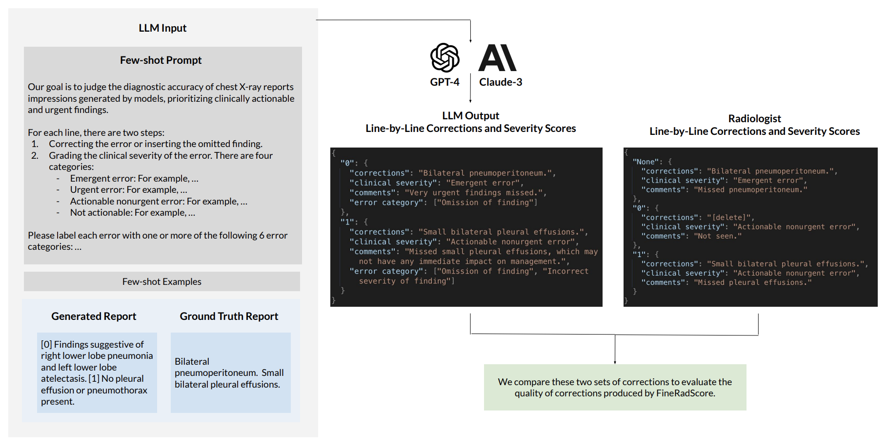
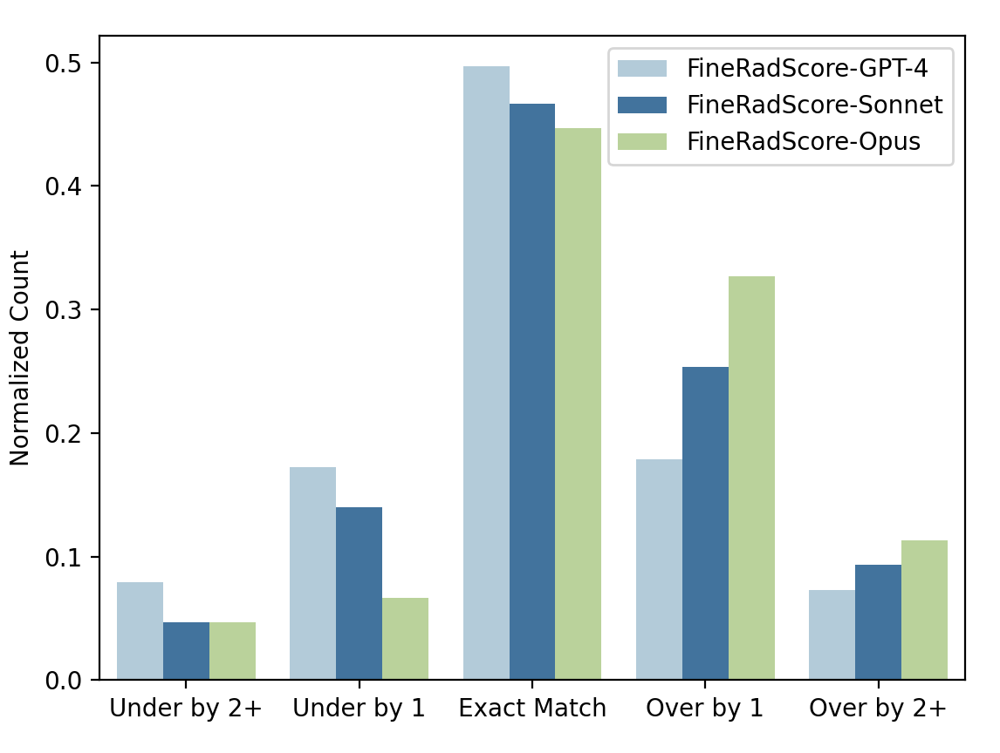
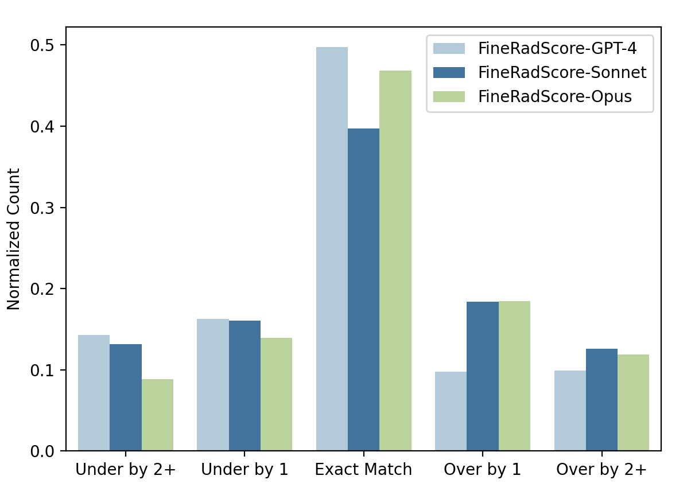
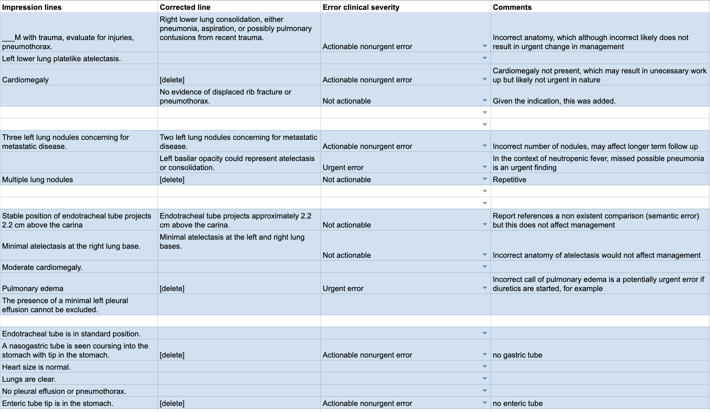
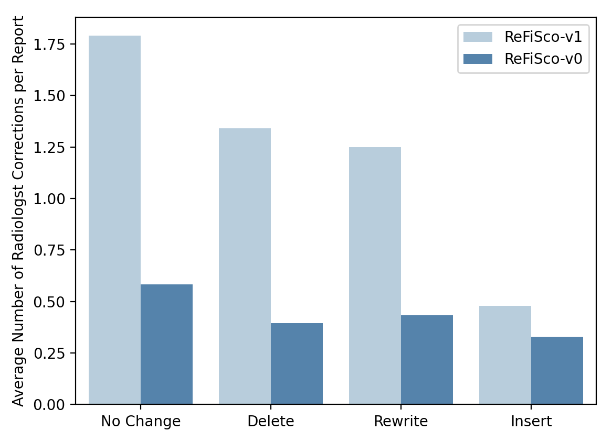

# FineRadScore：一种创新的放射学报告评估方法，通过逐行分析并提供修正建议，同时附带严重性评分，以提升报告质量。

发布时间：2024年05月31日

`LLM应用

这篇论文介绍了一种基于大型语言模型（LLM）的自动化评估工具FineRadScore，专门用于胸部X光（CXR）报告的评估。该工具能够自动计算修正报告所需的最小行数，评定每次修正的错误严重性，并提供解释性评论。研究结果显示，FineRadScore的修正和评分与专业放射科医生的判断高度一致，且在报告质量评估方面与现有的顶级自动化评估工具表现相当。因此，这篇论文属于LLM应用类别，因为它展示了LLM在医疗报告评估领域的实际应用和效果。` `放射学`

> FineRadScore: A Radiology Report Line-by-Line Evaluation Technique Generating Corrections with Severity Scores

# 摘要

> 目前，评估胸部X光报告的黄金标准依赖于放射科医生的注释，这一过程既耗时又昂贵，尤其在处理大量报告时。为此，我们开发了FineRadScore，一种基于LLM的自动化评估工具，专门用于CXR报告。它不仅能计算出将候选报告修正至真实报告所需的最小行数，还能为每次修正评定错误严重性，并附上解释性评论。我们的研究表明，FineRadScore的修正和评分与专业放射科医生的判断高度一致，且在整体报告质量评估上，它与现有顶级自动化评估工具表现相当。最后，我们指出了FineRadScore的局限性，并提出了改进方向。

> The current gold standard for evaluating generated chest x-ray (CXR) reports is through radiologist annotations. However, this process can be extremely time-consuming and costly, especially when evaluating large numbers of reports. In this work, we present FineRadScore, a Large Language Model (LLM)-based automated evaluation metric for generated CXR reports. Given a candidate report and a ground-truth report, FineRadScore gives the minimum number of line-by-line corrections required to go from the candidate to the ground-truth report. Additionally, FineRadScore provides an error severity rating with each correction and generates comments explaining why the correction was needed. We demonstrate that FineRadScore's corrections and error severity scores align with radiologist opinions. We also show that, when used to judge the quality of the report as a whole, FineRadScore aligns with radiologists as well as current state-of-the-art automated CXR evaluation metrics. Finally, we analyze FineRadScore's shortcomings to provide suggestions for future improvements.

[Arxiv](https://arxiv.org/abs/2405.20613)