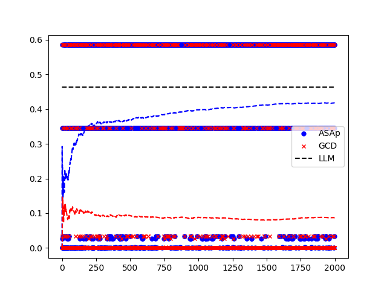
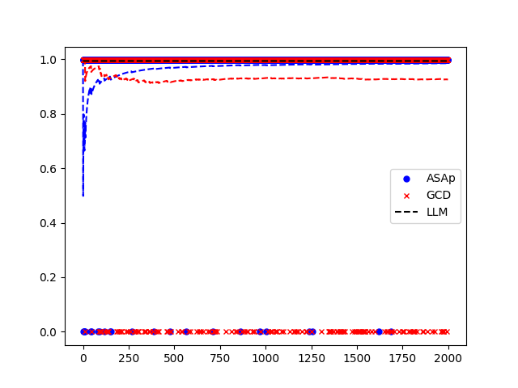
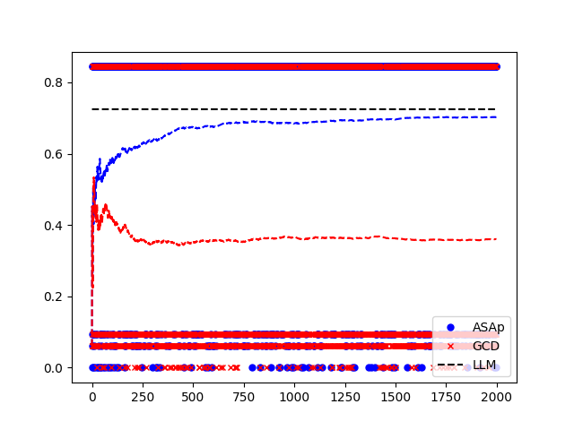
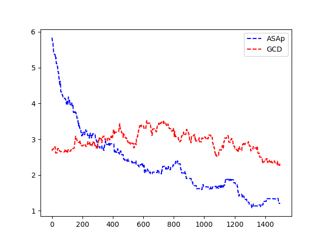

# 语法对齐解码法

发布时间：2024年05月31日

`LLM应用

这篇论文主要讨论了大型语言模型（LLMs）在生成结构化输出，如程序代码和数学公式时遇到的问题，并提出了一种新的解码技术——语法对齐解码（GAD）以及相应的自适应采样与近似预期未来（ASAp）算法。这些技术旨在确保生成的输出既符合语法规则，又能与模型的条件概率分布保持一致，从而提高输出质量。因此，这篇论文属于LLM应用类别，因为它关注的是LLMs在特定应用场景下的实际问题和解决方案。`

> Grammar-Aligned Decoding

# 摘要

> 大型语言模型（LLMs）在生成结构化输出如程序代码、数学公式时面临挑战。受限解码技术通过限制每步输出令牌来确保符合特定约束，如语法约束解码（GCD）。然而，这种方法可能导致输出虽符合语法，但出现概率与模型预测不符，质量低下。我们提出“语法对齐解码（GAD）”问题，并开发了自适应采样与近似预期未来（ASAp）算法，确保输出既符合语法，又与模型条件概率一致。通过评估，ASAp在保持语法正确性的同时，提高了输出与模型分布的一致性，优于现有GCD技术。

> Large Language Models (LLMs) struggle with reliably generating highly structured outputs, such as program code, mathematical formulas, or well-formed markup. Constrained decoding approaches mitigate this problem by greedily restricting what tokens an LLM can output at each step to guarantee that the output matches a given constraint. Specifically, in grammar-constrained decoding (GCD), the LLM's output must follow a given grammar. In this paper we demonstrate that GCD techniques (and in general constrained decoding techniques) can distort the LLM's distribution, leading to outputs that are grammatical but appear with likelihoods that are not proportional to the ones given by the LLM, and so ultimately are low-quality. We call the problem of aligning sampling with a grammar constraint, grammar-aligned decoding (GAD), and propose adaptive sampling with approximate expected futures (ASAp), a decoding algorithm that guarantees the output to be grammatical while provably producing outputs that match the conditional probability of the LLM's distribution conditioned on the given grammar constraint. Our algorithm uses prior sample outputs to soundly overapproximate the future grammaticality of different output prefixes. Our evaluation on code generation and structured NLP tasks shows how ASAp often produces outputs with higher likelihood (according to the LLM's distribution) than existing GCD techniques, while still enforcing the desired grammatical constraints.

[Arxiv](https://arxiv.org/abs/2405.21047)