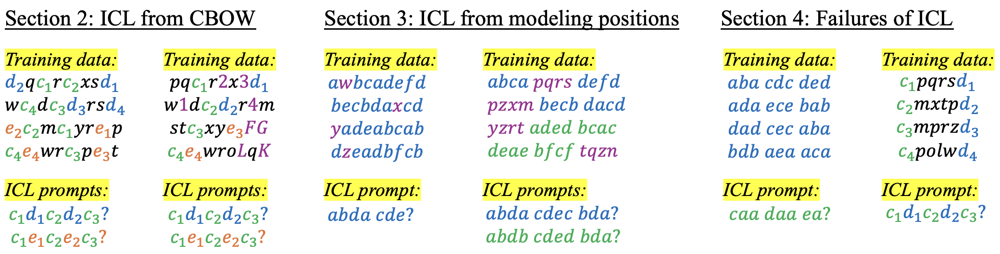
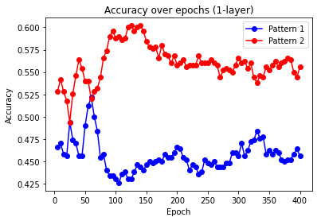
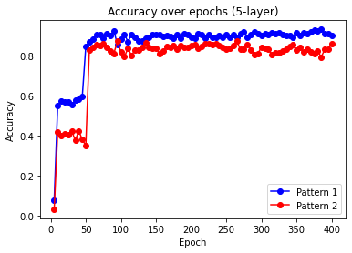

# 情境学习如何在非结构化数据训练中显现：探讨共现、位置信息及噪声结构的影响

发布时间：2024年05月31日

`LLM理论

这篇论文主要探讨了大型语言模型（LLMs）中的上下文学习（ICL）能力是如何从非结构化数据的无监督训练中涌现的。它提供了理论证明和实证验证，说明了ICL可以通过简单的共现信息建模（如连续词袋CBOW模型）产生，并讨论了位置信息和噪声结构对ICL泛化能力的影响。此外，论文还分析了ICL失败的案例，并提供了理论解释，指出LLMs的ICL能力可能对训练数据的结构非常敏感。这些内容属于对LLMs理论层面的深入探讨，因此归类为LLM理论。` `机器学习`

> How In-Context Learning Emerges from Training on Unstructured Data: On the Role of Co-Occurrence, Positional Information, and Noise Structures

# 摘要

> Transformer等大型语言模型（LLMs）展现出卓越的上下文学习（ICL）能力，能基于提示中的输入输出序列，对新查询做出预测，无需参数更新。尽管众多理论试图阐释ICL，但它们多聚焦于类似ICL任务的结构化训练数据，例如回归。实际上，这些模型在无监督状态下，针对非结构化文本数据进行训练，与ICL任务相去甚远。因此，我们探究了ICL如何从非结构化数据的无监督训练中涌现。关键发现是，ICL可简单地通过连续词袋（CBOW）等经典语言模型对共现信息进行建模而产生，我们对此进行了理论证明和实证验证。此外，我们明确了位置信息和噪声结构对于将ICL泛化至未见数据的重要性。最后，我们揭示了ICL失败的案例，并提供了理论解释，指出LLMs识别特定任务的ICL能力可能对训练数据结构高度敏感。

> Large language models (LLMs) like transformers have impressive in-context learning (ICL) capabilities; they can generate predictions for new queries based on input-output sequences in prompts without parameter updates. While many theories have attempted to explain ICL, they often focus on structured training data similar to ICL tasks, such as regression. In practice, however, these models are trained in an unsupervised manner on unstructured text data, which bears little resemblance to ICL tasks. To this end, we investigate how ICL emerges from unsupervised training on unstructured data. The key observation is that ICL can arise simply by modeling co-occurrence information using classical language models like continuous bag of words (CBOW), which we theoretically prove and empirically validate. Furthermore, we establish the necessity of positional information and noise structure to generalize ICL to unseen data. Finally, we present instances where ICL fails and provide theoretical explanations; they suggest that the ICL ability of LLMs to identify certain tasks can be sensitive to the structure of the training data.

[Arxiv](https://arxiv.org/abs/2406.00131)