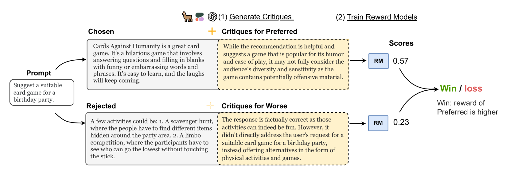
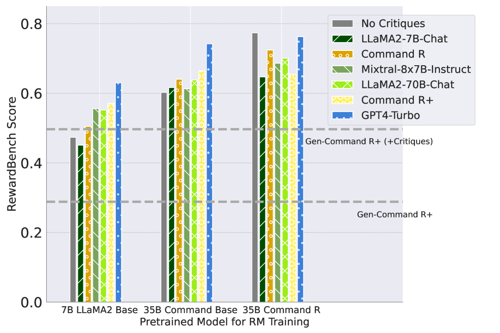
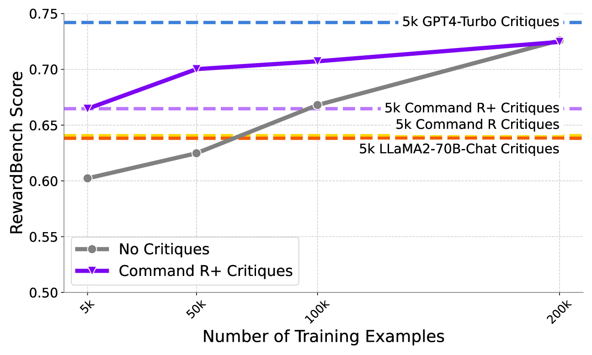
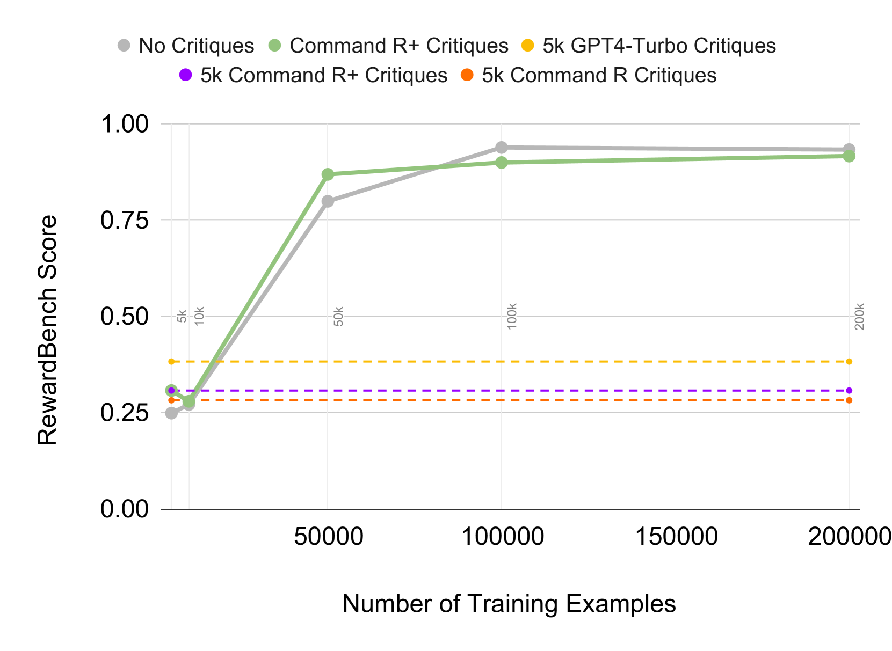
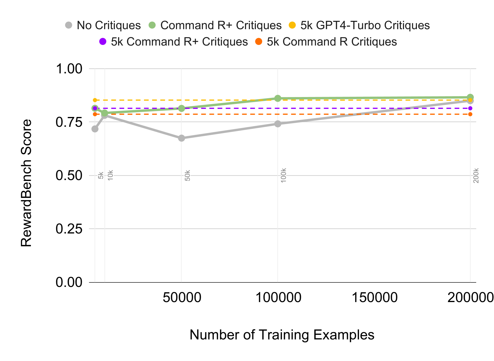
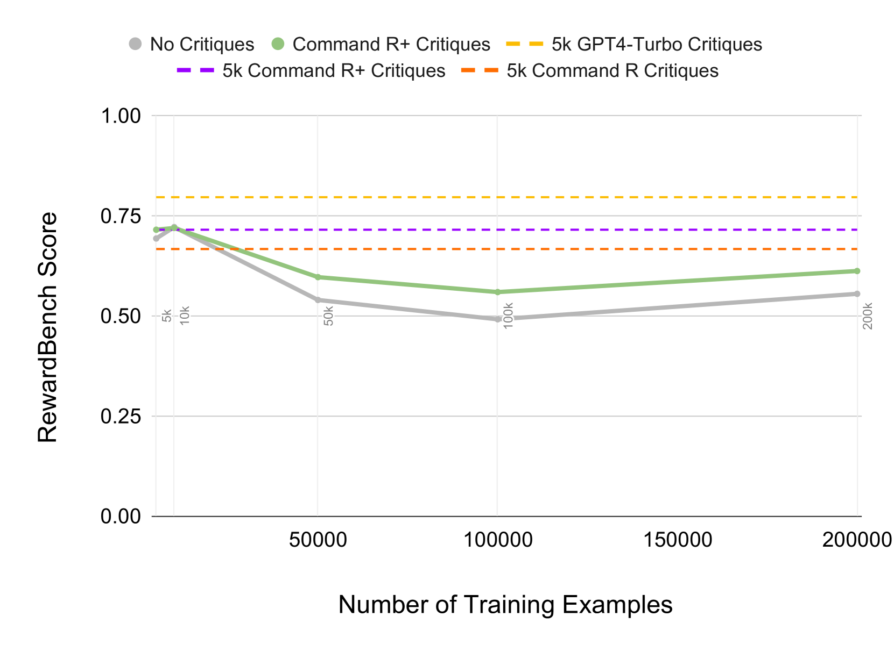
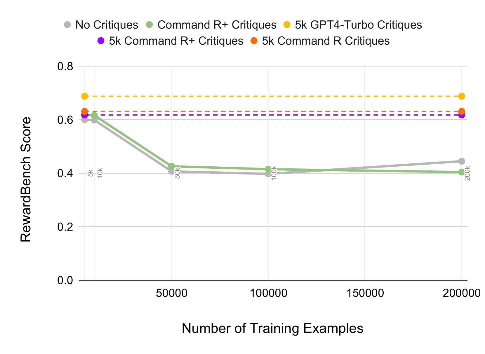
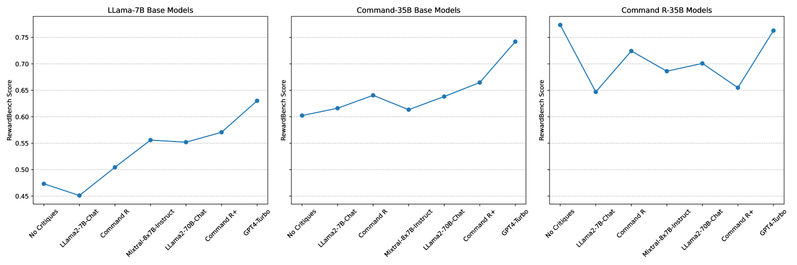

# 借助合成评论优化奖励模型

发布时间：2024年05月31日

`RAG

理由：这篇论文主要关注的是奖励模型（RM）在语言模型对齐中的应用，并提出了一种创新的方法，即利用大型语言模型生成的合成评论来提供额外反馈，以改善RM的性能和数据效率。这与RAG（Retrieval-Augmented Generation）的概念相符，因为RAG模型通常涉及使用外部信息源（如合成评论）来增强语言模型的生成能力。虽然论文中提到的RM和合成评论的使用与LLM应用相关，但其核心贡献在于改进RM的方法，这更接近于RAG的范畴，即通过引入外部信息来增强模型的性能。因此，将这篇论文分类为RAG是合适的。` `人工智能`

> Improving Reward Models with Synthetic Critiques

# 摘要

> 奖励模型（RM）在通过人类反馈强化学习对齐语言模型中扮演关键角色，但人类标注的高成本和时间消耗，以及RM在表面特征上的快速过拟合，限制了其泛化能力。我们创新性地利用大型语言模型生成的合成评论来提供额外反馈，评估指令遵循、正确性和风格等维度，从而为RM提供更丰富、更稳健的评估依据。实验表明，高质量评论显著提升了RM的性能和数据效率，而低质量评论则产生负面影响。此外，引入评论还增强了RM训练的可解释性和鲁棒性。

> Reward models (RM) play a critical role in aligning language models through the process of reinforcement learning from human feedback. RMs are trained to predict a score reflecting human preference, which requires significant time and cost for human annotation. Additionally, RMs tend to quickly overfit on superficial features in the training set, hindering their generalization performance on unseen distributions. We propose a novel approach using synthetic natural language critiques generated by large language models to provide additional feedback, evaluating aspects such as instruction following, correctness, and style. This offers richer signals and more robust features for RMs to assess and score on. We demonstrate that high-quality critiques improve the performance and data efficiency of RMs initialized from different pretrained models. Conversely, we also show that low-quality critiques negatively impact performance. Furthermore, incorporating critiques enhances the interpretability and robustness of RM training.

[Arxiv](https://arxiv.org/abs/2405.20850)