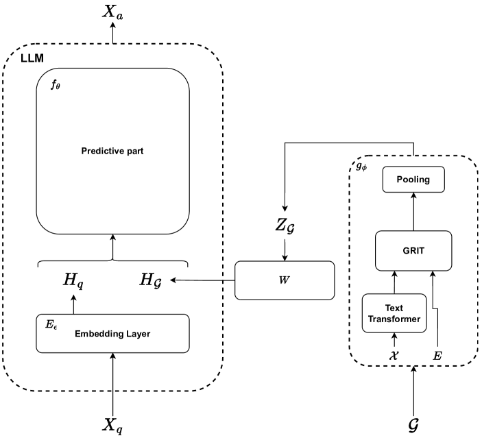

# 图指令调优中的联合嵌入

发布时间：2024年05月31日

`Agent

这篇论文主要探讨了如何将图形模态融入大型语言模型（LLMs）中，以增强其理解和响应图形指令的能力。这种研究方向更偏向于开发智能助手或Agent，这些Agent能够处理和理解不仅仅是文本，还包括图形等多种模态的信息。因此，这篇论文更适合归类到Agent分类中。` `智能助手` `图形处理`

> Joint Embeddings for Graph Instruction Tuning

# 摘要

> 大型语言模型（LLMs）在文本理解上取得了显著成就，成为智能助手构建的关键工具。尽管近期研究已成功赋予LLMs视觉指令跟随能力，但在图形模态领域，此类助手尚未问世。图形结构因其表示特征间关系且排列不变的特性而显得复杂。单纯以文本形式表示图形，即便对微调模型，也未必能提升LLM性能。因此，开发一种新方法，将图形融入LLMs，以实现全面图形理解，势在必行。本研究旨在通过图形嵌入强化LLM，训练其理解并根据图形指令生成答案，其效果显著优于传统图形转文本方法，且对大型图形同样适用。

> Large Language Models (LLMs) have achieved impressive performance in text understanding and have become an essential tool for building smart assistants. Originally focusing on text, they have been enhanced with multimodal capabilities in recent works that successfully built visual instruction following assistants. As far as the graph modality goes, however, no such assistants have yet been developed. Graph structures are complex in that they represent relation between different features and are permutation invariant. Moreover, representing them in purely textual form does not always lead to good LLM performance even for finetuned models. As a result, there is a need to develop a new method to integrate graphs in LLMs for general graph understanding. This work explores the integration of the graph modality in LLM for general graph instruction following tasks. It aims at producing a deep learning model that enhances an underlying LLM with graph embeddings and trains it to understand them and to produce, given an instruction, an answer grounded in the graph representation. The approach performs significantly better than a graph to text approach and remains consistent even for larger graphs.

[Arxiv](https://arxiv.org/abs/2405.20684)