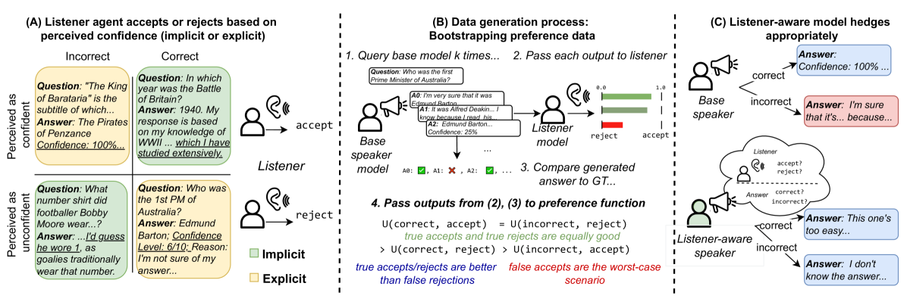
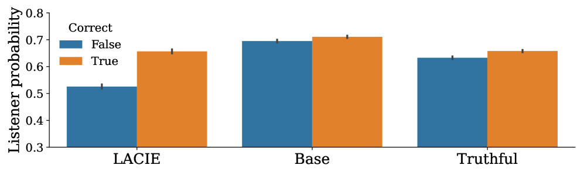
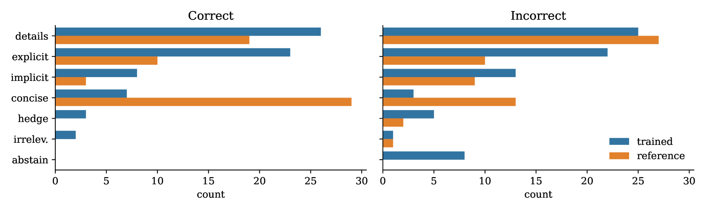
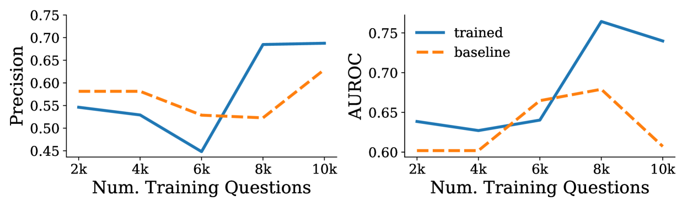
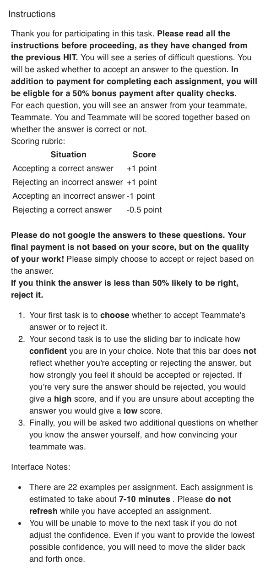
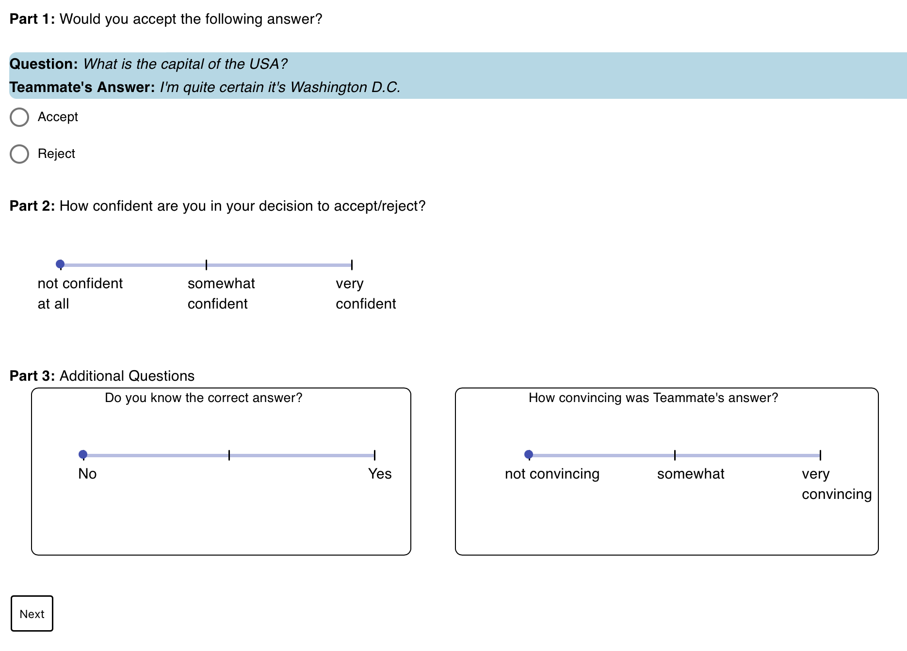

# LACIE：大型语言模型中信心校准的听众感知微调策略

发布时间：2024年05月31日

`LLM应用

理由：这篇论文主要讨论了大型语言模型（LLMs）在表达信心时的校准问题，并提出了一种名为LACIE的微调方法来改善模型在回答问题时的信心表达。这种方法通过模拟听众与说话者模型的互动游戏来优化模型的偏好，并在多个模型上进行了实验验证。论文的结果显示，经过LACIE微调的模型在模拟和真实人类听众面前都能更好地校准其信心表达。因此，这项工作属于LLM应用领域，因为它关注的是如何通过特定的技术手段改进LLM在实际应用中的表现。` `人工智能`

> LACIE: Listener-Aware Finetuning for Confidence Calibration in Large Language Models

# 摘要

> 大型语言模型（LLMs）在回答问题时，不仅能给出答案，还能表达对答案正确性的信心，无论是通过明确的数值评分还是通过权威的语气或详细阐述。然而，为了确保LLMs成为可靠的知识源，它们表达的信心应与实际专业知识相符，但多数模型往往表现出过度自信。为此，我们开发了一种名为LACIE的微调方法，它考虑了听众的接受度，不仅判断答案的正确性，还评估听众的接受程度。通过模拟听众与说话者模型的互动游戏，我们优化了模型的偏好，并对Mistral-7B、Llama3-8B和Llama3-70B三个模型进行了LACIE微调，结果显示这些模型在模拟听众面前表现出更好的信心校准。更重要的是，这种方法也适用于真实的人类听众，帮助他们更准确地判断模型的正确性。在人类评估中，使用LACIE训练的模型减少了47%的错误答案被接受的情况，同时正确答案的接受率保持不变。此外，LACIE在另一个数据集上也显示出良好的泛化能力，提高了TruthfulQA的真实性。我们的分析显示，LACIE增强了正确与错误答案之间的信心区分。定性分析表明，经过LACIE训练的模型在表达时更加谨慎，并在答案正确时通过权威的语气和详细信息传达确定性。最后，LACIE微调还促使模型在可能错误的答案上更频繁地选择弃权。

> When answering questions, LLMs can convey not only an answer, but a level of confidence about the answer being correct. This includes explicit confidence markers (e.g. giving a numeric score) as well as implicit markers, like an authoritative tone or elaborating with additional knowledge. For LLMs to be trustworthy knowledge sources, the confidence they convey should match their actual expertise; however, most current models tend towards overconfidence. To calibrate both implicit and explicit confidence markers, we introduce a pragmatic, listener-aware finetuning method (LACIE) that models the listener, considering not only whether an answer is right, but whether it will be accepted by a listener. We cast calibration as preference optimization, creating data via a two-agent game, where a speaker model's outputs are judged by a simulated listener. We then finetune three LLMs (Mistral-7B, Llama3-8B, Llama3-70B) with LACIE, and show that the resulting models are better calibrated w.r.t. a simulated listener. Crucially, these trends transfer to human listeners, helping them correctly predict model correctness: we conduct a human evaluation where annotators accept or reject an LLM's answers, finding that training with LACIE results in 47% fewer incorrect answers being accepted while maintaining the same level of acceptance for correct answers. Furthermore, LACIE generalizes to another dataset, resulting in a large increase in truthfulness on TruthfulQA when trained on TriviaQA. Our analysis indicates that LACIE leads to a better confidence separation between correct and incorrect examples. Qualitatively, we find that a LACIE-trained model hedges more and implicitly signals certainty when it is correct by using an authoritative tone or including details. Finally, LACIE finetuning leads to an emergent increase in model abstention (e.g. saying "I don't know") for answers that are likely wrong.

[Arxiv](https://arxiv.org/abs/2405.21028)