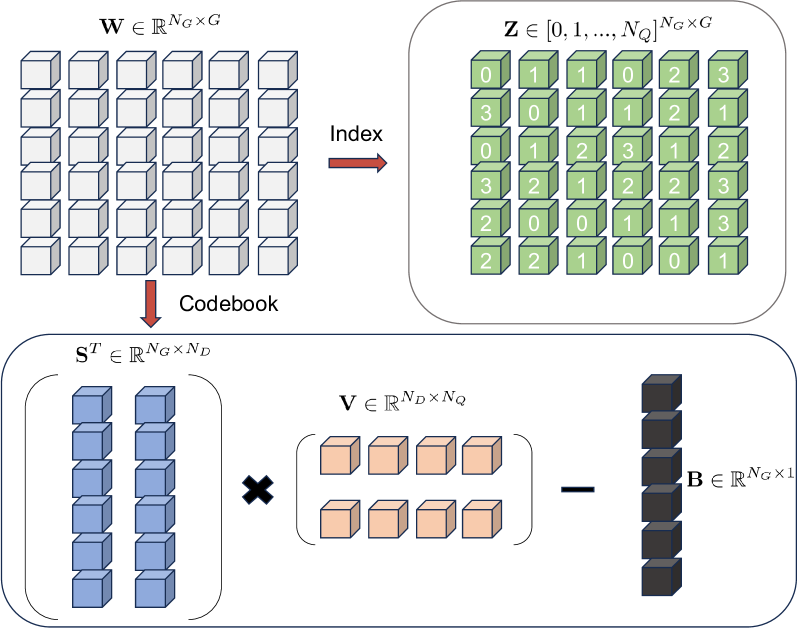
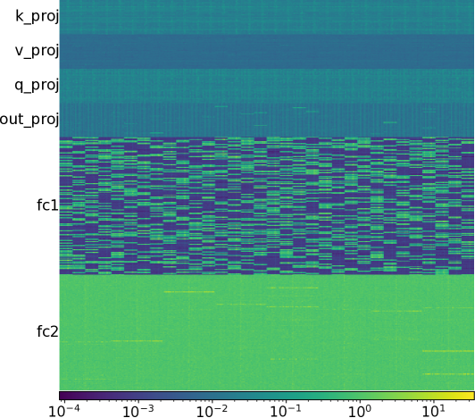
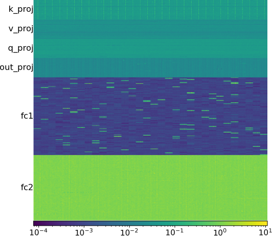
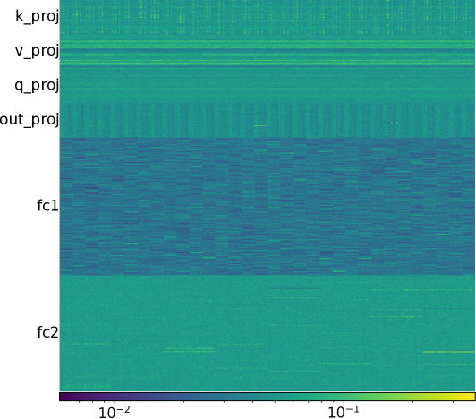
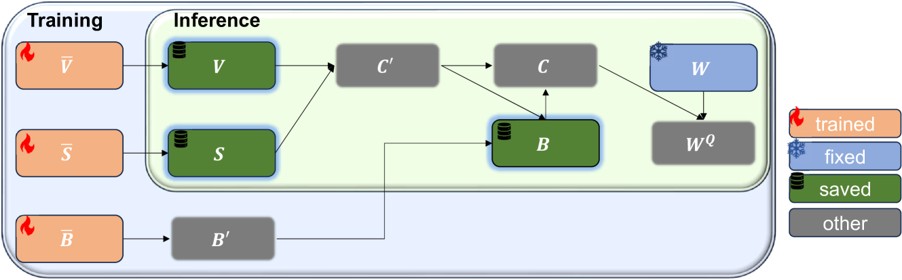
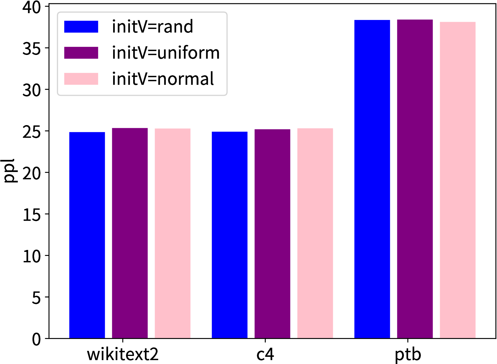
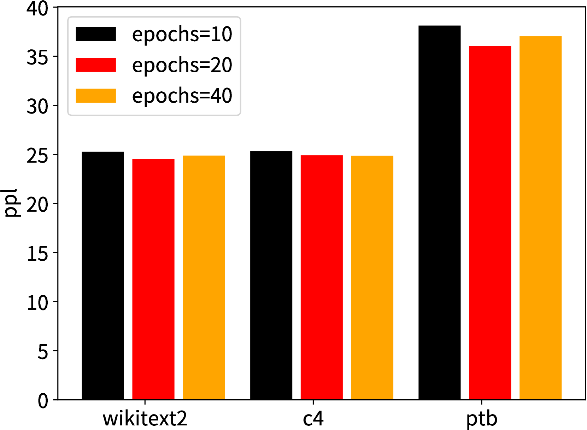
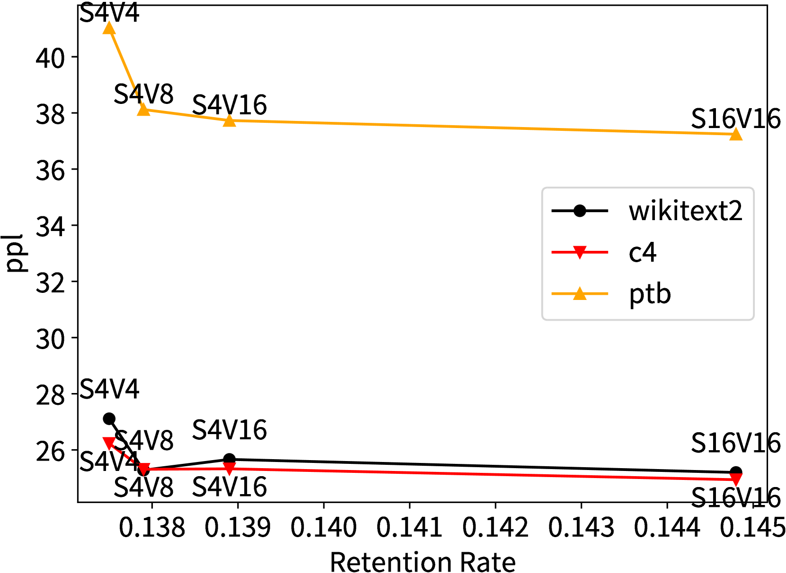

# LCQ：大型语言模型的低秩码本量化技术

发布时间：2024年05月31日

`LLM理论

这篇论文主要探讨了大型语言模型（LLMs）的权重量化技术，特别是提出了一种新的基于低秩码本的量化方法（LCQ）。这种新方法旨在解决现有量化技术在高压缩比率下精度损失的问题。论文的研究重点在于模型压缩的理论和方法，这是LLM理论研究的一个重要方面，因为它涉及到模型的优化和效率提升，而不是直接应用于特定的Agent或RAG系统，也不是关于LLM的具体应用案例。因此，这篇论文更适合归类于LLM理论。` `模型压缩` `人工智能`

> LCQ: Low-Rank Codebook based Quantization for Large Language Models

# 摘要

> 近期，大型语言模型（LLMs）在众多任务中展现出卓越性能，但其高昂的存储与计算成本却成为实际部署的一大障碍。权重量化作为一种模型压缩技术，能有效降低这两方面的开销。然而，现有方法多采用秩一码本，当压缩比率提升时，精度损失显著。本文创新性地提出了基于低秩码本的量化方法（LCQ），其码本秩可大于一，实验证明，LCQ在几乎不增加额外存储成本的前提下，实现了优于现有方法的精度表现。

> Large language models~(LLMs) have recently demonstrated promising performance in many tasks. However, the high storage and computational cost of LLMs has become a challenge for deploying LLMs. Weight quantization has been widely used for model compression, which can reduce both storage and computational cost. Most existing weight quantization methods for LLMs use a rank-one codebook for quantization, which results in substantial accuracy loss when the compression ratio is high. In this paper, we propose a novel weight quantization method, called low-rank codebook based quantization~(LCQ), for LLMs. LCQ adopts a low-rank codebook, the rank of which can be larger than one, for quantization. Experiments show that LCQ can achieve better accuracy than existing methods with a negligibly extra storage cost.

[Arxiv](https://arxiv.org/abs/2405.20973)