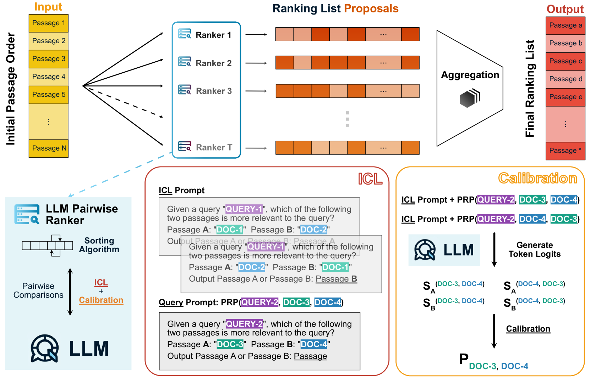

# LLM-RankFusion：调和基于大型语言模型的排序系统中的内在不一致性

发布时间：2024年05月31日

`LLM应用

这篇论文主要讨论了大型语言模型（LLM）在信息检索系统中的应用，特别是在文档排序方面的问题和解决方案。论文提出了LLM-RankFusion框架，旨在解决LLM在文档比较时出现的不一致性问题，通过情境学习（ICL）和多排序器结果的聚合来提高排序的稳定性和质量。因此，这篇论文属于LLM应用类别，因为它关注的是LLM在实际应用中的性能改进和优化。` `信息检索` `机器学习`

> LLM-RankFusion: Mitigating Intrinsic Inconsistency in LLM-based Ranking

# 摘要

> 在现代信息检索系统中，通过大型语言模型（LLM）提示排序文档展现出良好的性能。通常，这种方法依赖于LLM的成对比较来排序文档列表。但问题在于，LLM在比较时往往无法保持一致性，导致排序结果不稳定。我们发现了两种由LLM引起的不一致性：顺序不一致性，即改变文档顺序后结果矛盾；传递性不一致性，即偏好关系出现非传递性。为此，我们提出了LLM-RankFusion框架，旨在通过情境学习（ICL）进行顺序无关的比较和校准，以及通过多排序器结果的聚合，来减少这些不一致性，生成更稳健的排序列表。实验证明，LLM-RankFusion有效减少了不一致的比较结果，并提升了排序质量。

> Ranking passages by prompting a large language model (LLM) can achieve promising performance in modern information retrieval (IR) systems. A common approach is to sort the ranking list by prompting LLMs for pairwise comparison. However, sorting-based methods require consistent comparisons to correctly sort the passages, which we show that LLMs often violate. We identify two kinds of intrinsic inconsistency in LLM-based pairwise comparisons: order inconsistency which leads to conflicting results when switching the passage order, and transitive inconsistency which leads to non-transitive triads among all preference pairs. In this paper, we propose LLM-RankFusion, an LLM-based ranking framework that mitigates these inconsistencies and produces a robust ranking list. LLM-RankFusion mitigates order inconsistency using in-context learning (ICL) to demonstrate order-agnostic comparisons and calibration to estimate the underlying preference probability between two passages. We then address transitive inconsistency by aggregating the ranking results from multiple rankers. In our experiments, we empirically show that LLM-RankFusion can significantly reduce inconsistent pairwise comparison results, and improve the ranking quality by making the final ranking list more robust.

[Arxiv](https://arxiv.org/abs/2406.00231)