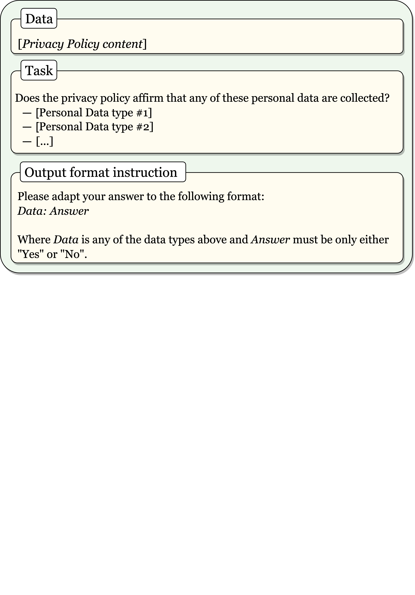
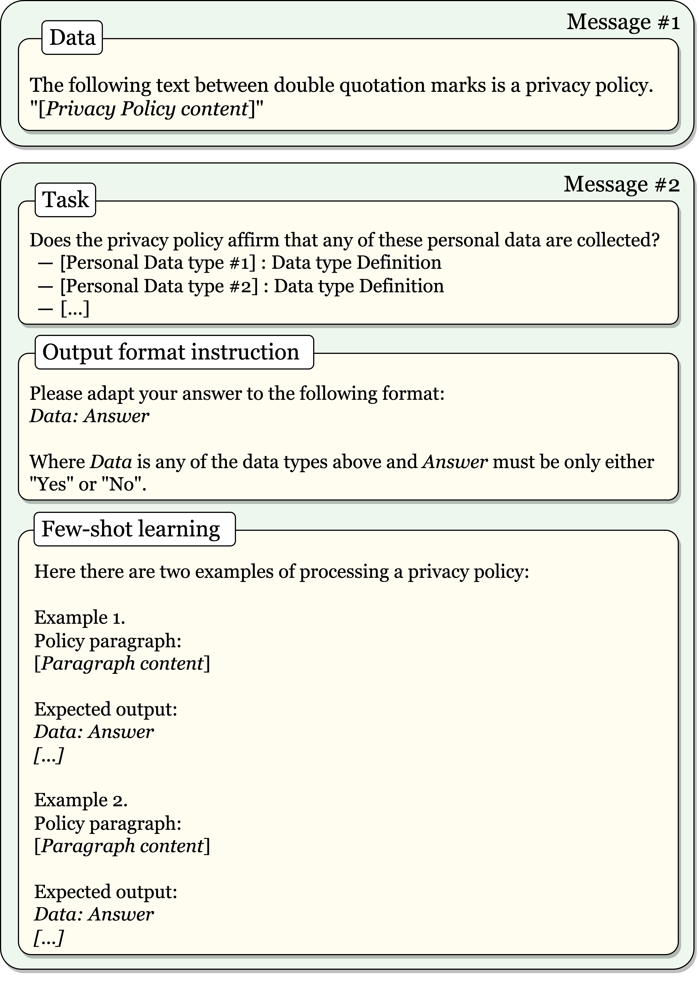
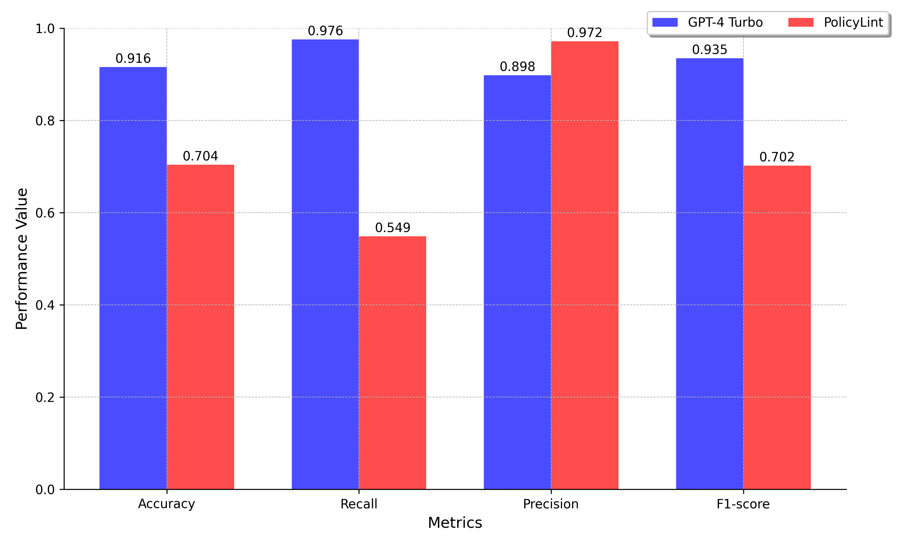
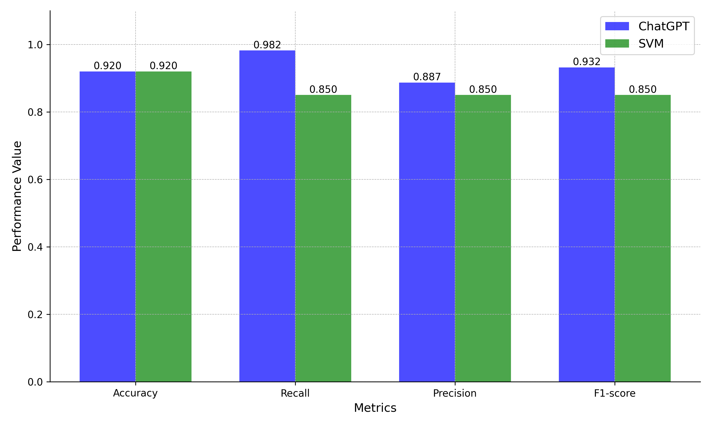
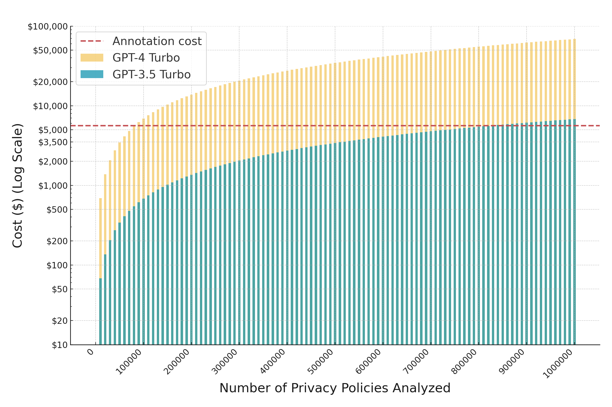
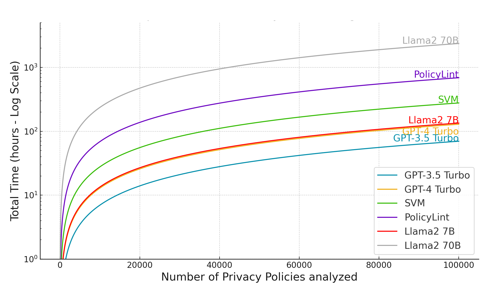

# 大型语言模型：开启大规模隐私政策分析的新篇章

发布时间：2024年05月31日

`LLM应用

这篇论文探讨了如何利用大型语言模型（如ChatGPT和Llama 2）来更高效地提取和分析隐私政策中的实践。通过优化提示、参数和模型设计，结合少样本学习等策略，该研究展示了LLM在自动化分析隐私政策方面的优势，包括提高准确性、降低成本和加快处理速度。这与LLM在实际应用中的使用直接相关，特别是在处理大规模数据保护合规性评估方面，因此属于LLM应用分类。` `隐私政策分析` `数据保护合规性`

> Large Language Models: A New Approach for Privacy Policy Analysis at Scale

# 摘要

> 网络和移动应用的多样性与动态性为评估其数据保护合规性带来了挑战。传统上，我们依赖符号和统计NLP技术自动化分析隐私政策，但这往往需要大量手动标注，既耗时又易错。本研究提出，大型语言模型（如ChatGPT和Llama 2）能更高效地提取隐私政策中的实践，通过优化提示、参数和模型设计，结合少样本学习等策略，准确识别各种隐私实践。我们在多个知名数据集上的测试显示，这种方法不仅F1分数超过93%，还降低了成本，加快了处理速度，减少了技术门槛。因此，我们认为LLM是传统NLP技术的有力替代，尤其适用于大规模自动化隐私政策分析。

> The number and dynamic nature of web and mobile applications presents significant challenges for assessing their compliance with data protection laws. In this context, symbolic and statistical Natural Language Processing (NLP) techniques have been employed for the automated analysis of these systems' privacy policies. However, these techniques typically require labor-intensive and potentially error-prone manually annotated datasets for training and validation. This research proposes the application of Large Language Models (LLMs) as an alternative for effectively and efficiently extracting privacy practices from privacy policies at scale. Particularly, we leverage well-known LLMs such as ChatGPT and Llama 2, and offer guidance on the optimal design of prompts, parameters, and models, incorporating advanced strategies such as few-shot learning. We further illustrate its capability to detect detailed and varied privacy practices accurately. Using several renowned datasets in the domain as a benchmark, our evaluation validates its exceptional performance, achieving an F1 score exceeding 93%. Besides, it does so with reduced costs, faster processing times, and fewer technical knowledge requirements. Consequently, we advocate for LLM-based solutions as a sound alternative to traditional NLP techniques for the automated analysis of privacy policies at scale.

[Arxiv](https://arxiv.org/abs/2405.20900)