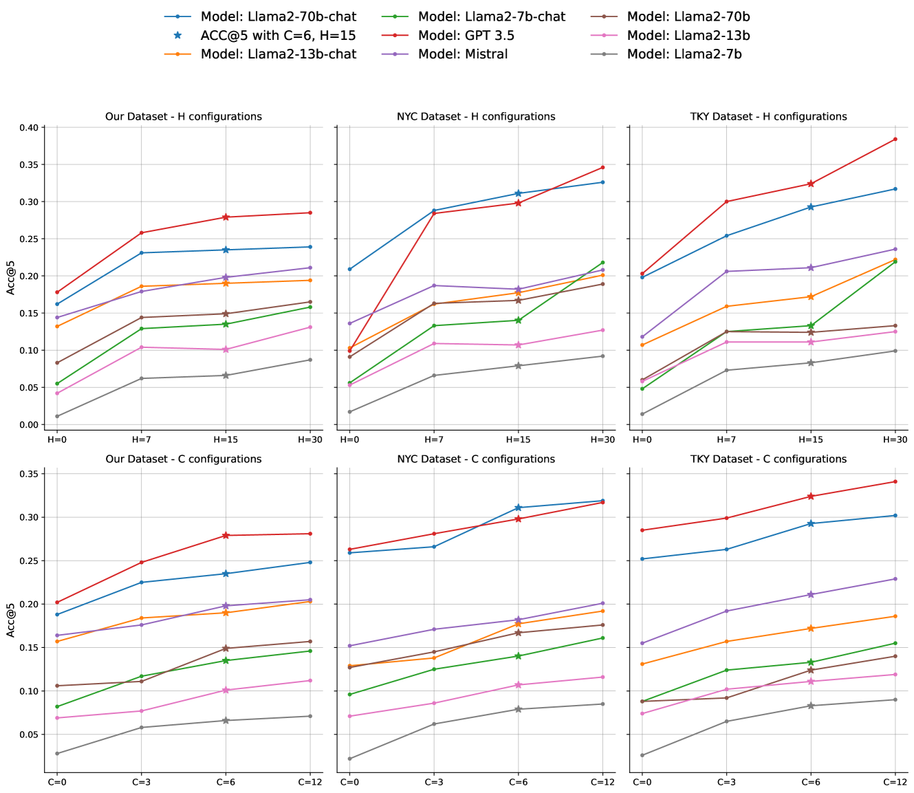

# 大型语言模型具备零-shot 预测下一次位置的能力。

发布时间：2024年05月31日

`LLM应用

这篇论文主要探讨了大型语言模型（LLMs）在零-shot位置预测任务中的应用，评估了Llama、GPT-3.5和Mistral 7B等模型在真实移动数据集上的表现，并提出了一个检测数据污染的框架。这些内容主要集中在LLM的实际应用层面，而非理论研究或Agent的设计与实现，也不是关于检索增强生成（RAG）的讨论。因此，将其归类为LLM应用是合适的。` `公共卫生` `城市规划`

> Large Language Models are Zero-Shot Next Location Predictors

# 摘要

> 预测个人未来的行踪对于解决疾病传播和污染减少等社会问题至关重要。然而，现有的位置预测模型需要大量个体数据，这在某些地区或特定情况下可能难以获取。设计一个能够跨地理区域泛化的预测器仍是一个挑战。得益于自然语言处理的进步，大型语言模型（LLMs）展现出强大的泛化与推理能力，加之它们蕴含丰富的地理信息，使得它们有望成为零-shot位置预测的新工具。本文针对Llama、GPT-3.5和Mistral 7B等LLMs进行了评估，通过精心设计的提示，在三个真实移动数据集上进行了测试。结果表明，这些模型能达到32.4%的准确率，相较于专为人类移动性设计的深度学习模型，性能提升了600%以上。我们还发现，并非所有LLMs都能胜任此任务，并提出了一种检测数据污染的框架以确保结果的公正性。最后，我们探索了LLMs作为文本解释器的潜力，展示了它们能为位置预测提供有效解释，其中7B模型虽解释更通用，但同样可靠。相关代码可在github.com/ssai-trento/LLM-zero-shot-NL获取。

> Predicting the locations an individual will visit in the future is crucial for solving many societal issues like disease diffusion and reduction of pollution among many others. The models designed to tackle next-location prediction, however, require a significant amount of individual-level information to be trained effectively. Such data may be scarce or even unavailable in some geographic regions or peculiar scenarios (e.g., cold-start in recommendation systems). Moreover, the design of a next-location predictor able to generalize or geographically transfer knowledge is still an open research challenge. Recent advances in natural language processing have led to a rapid diffusion of Large Language Models (LLMs) which have shown good generalization and reasoning capabilities. These insights, coupled with the recent findings that LLMs are rich in geographical knowledge, allowed us to believe that these models can act as zero-shot next-location predictors. This paper evaluates the capabilities of many popular LLMs in this role, specifically Llama, GPT-3.5 and Mistral 7B. After designing a proper prompt, we tested the models on three real-world mobility datasets. The results show that LLMs can obtain accuracies up to 32.4%, a significant relative improvement of over 600% when compared to sophisticated DL models specifically designed for human mobility. Moreover, we show that other LLMs are unable to perform the task properly. To prevent positively biased results, we also propose a framework inspired by other studies to test data contamination. Finally, we explored the possibility of using LLMs as text-based explainers for next-location prediction showing that can effectively provide an explanation for their decision. Notably, 7B models provide more generic, but still reliable, explanations compared to larger counterparts. Code: github.com/ssai-trento/LLM-zero-shot-NL

[Arxiv](https://arxiv.org/abs/2405.20962)