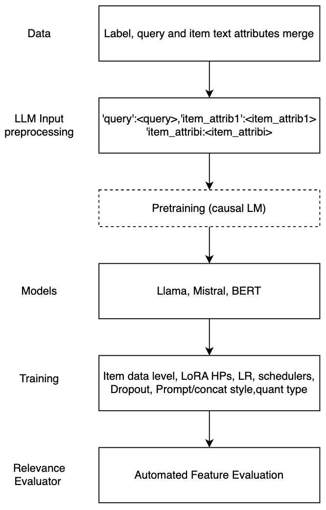

# 大型语言模型助力产品搜索中的相关性评估

发布时间：2024年05月31日

`LLM应用

这篇论文主要介绍了如何利用大型语言模型（LLMs）自动化大规模查询-项目对（QIPs）的相关性评估，特别是在产品搜索领域。论文中提到了使用人类评估者标注的数据集对LLMs进行微调，并测试了不同的超参数和模型配置，以优化相关性评估的准确性。这种方法的应用性质和对LLMs在特定任务（即产品搜索中的相关性评估）中的应用，使得这篇论文适合归类于LLM应用。` `电子商务` `搜索引擎`

> Large Language Models for Relevance Judgment in Product Search

# 摘要

> 在产品搜索中，确保检索和重新排序的项目与搜索查询高度相关至关重要。然而，评估项目与查询间的相关性是一项艰巨任务，且产品搜索的质量极大程度上取决于相关性标记数据的精确度和规模。本文介绍了一系列技术，旨在利用大型语言模型（LLMs）自动化大规模查询-项目对（QIPs）的相关性评估。我们采用了一个由人类评估者标注的数百万QIPs的独特数据集，对十亿参数LLMs进行微调，测试并优化了超参数，包括是否采用低秩适应（LoRA）以及在LLM微调中物品属性连接和提示的不同模式，同时权衡了物品属性包含对相关性预测质量的影响。我们的方法在相关性标注方面显著超越了前代LLMs的基线和现成模型，达到了与人类评估者相媲美的水平。这些发现对产品搜索中相关性判断自动化的研究领域具有重要意义。

> High relevance of retrieved and re-ranked items to the search query is the cornerstone of successful product search, yet measuring relevance of items to queries is one of the most challenging tasks in product information retrieval, and quality of product search is highly influenced by the precision and scale of available relevance-labelled data. In this paper, we present an array of techniques for leveraging Large Language Models (LLMs) for automating the relevance judgment of query-item pairs (QIPs) at scale. Using a unique dataset of multi-million QIPs, annotated by human evaluators, we test and optimize hyper parameters for finetuning billion-parameter LLMs with and without Low Rank Adaption (LoRA), as well as various modes of item attribute concatenation and prompting in LLM finetuning, and consider trade offs in item attribute inclusion for quality of relevance predictions. We demonstrate considerable improvement over baselines of prior generations of LLMs, as well as off-the-shelf models, towards relevance annotations on par with the human relevance evaluators. Our findings have immediate implications for the growing field of relevance judgment automation in product search.

[Arxiv](https://arxiv.org/abs/2406.00247)