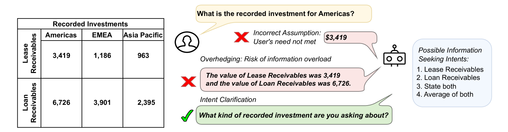
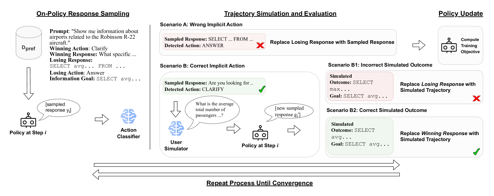
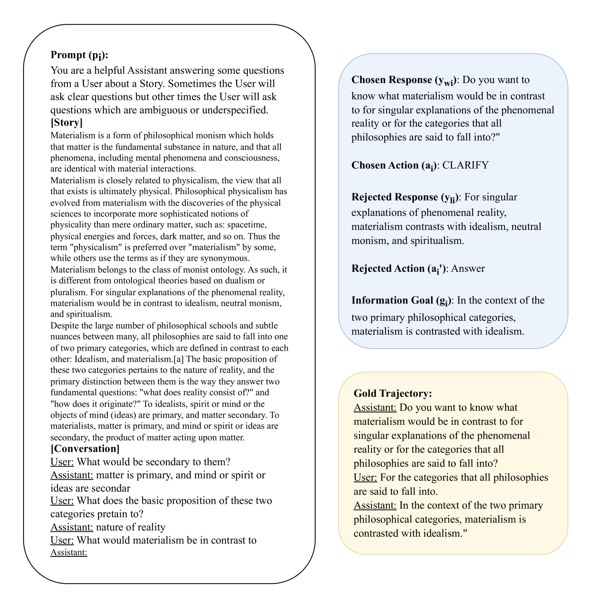

# 学会澄清：通过基于动作的对比自我训练进行多轮对话交流

发布时间：2024年05月31日

`Agent

这篇论文主要讨论了通过人类反馈强化学习（RLHF）调整的大型语言模型（LLMs）在构建智能对话助手中的应用，特别是在处理对话中的歧义和学习对话策略方面的挑战。论文提出了一种名为ACT的新算法，该算法基于直接偏好优化（DPO），旨在提高模型在多轮对话中的表现。此外，论文还通过评估LLMs在识别和推理对话中的歧义的能力，来检验它们作为对话代理的潜力。因此，这篇论文更符合Agent分类，因为它关注的是如何通过算法改进语言模型，使其更好地作为对话代理进行交互。` `对话系统` `问答系统`

> Learning to Clarify: Multi-turn Conversations with Action-Based Contrastive Self-Training

# 摘要

> 通过人类反馈强化学习（RLHF）调整的大型语言模型（LLMs）迅速成为构建智能对话助手的主流方法。尽管这些模型在多项测试中表现优异，但它们在处理对话中的歧义时，往往选择保守猜测而非主动澄清，显示出对话技巧的不足。特别是在高质量对话样本稀缺的特定任务场景下，这限制了模型学习最佳对话策略的能力。为此，我们提出了一种名为ACT的新算法，它基于直接偏好优化（DPO），能够在多轮对话中高效学习对话策略。我们在三个挑战性任务中验证了ACT的效率，包括基于表格的问答、机器阅读理解和AmbigSQL，后者是一项用于澄清文本到SQL生成中信息查询请求歧义的新任务。此外，我们通过评估LLMs是否能识别和推理对话中的歧义，来检验它们作为对话代理的潜力。ACT在对话建模方面相比传统监督微调和DPO方法有了显著提升。

> Large language models (LLMs) aligned through reinforcement learning from human feedback (RLHF) have quickly become one of the dominant paradigms for building intelligent conversational assistant agents. However, despite their strong performance across many benchmarks, LLM-based agents still lack conversational skills such as disambiguation: when generalized assistants are faced with ambiguity, they often overhedge or implicitly guess users' ground-truth intents rather than asking clarification questions, and under task-specific settings, high-quality conversation samples are often limited, affecting models' ability to learn optimal dialogue action policies. We propose Action-Based Contrastive Self-Training (henceforth ACT), a quasi-online preference optimization algorithm based on Direct Preference Optimization (DPO) which allows for sample-efficient dialogue policy learning in multi-turn conversation. We demonstrate ACT's efficacy under sample-efficient conditions in three difficult conversational tasks: tabular-grounded question-answering, machine reading comprehension, and AmbigSQL, a novel task for disambiguating information-seeking requests for text-to-SQL generation. Additionally, we propose evaluating LLMs' ability to function as conversational agents by examining whether they can implicitly recognize and reason about ambiguity in conversation. ACT demonstrates substantial conversation modeling improvements over standard approaches to supervised fine-tuning and DPO.

[Arxiv](https://arxiv.org/abs/2406.00222)