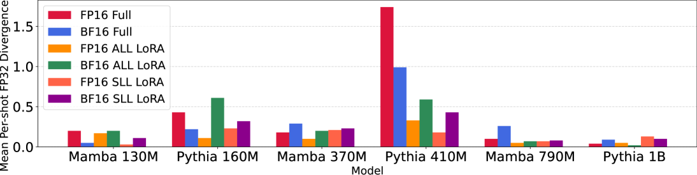
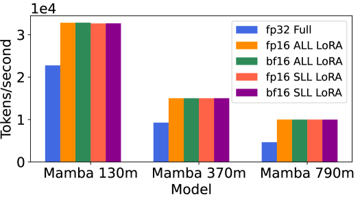
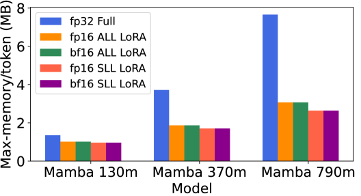
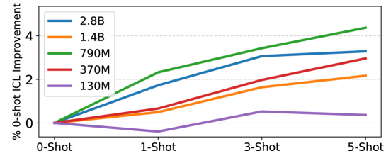
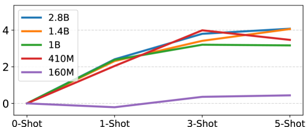
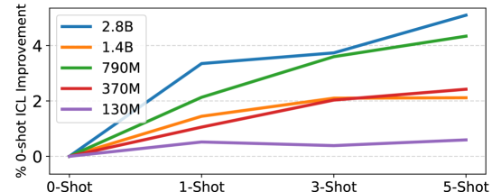
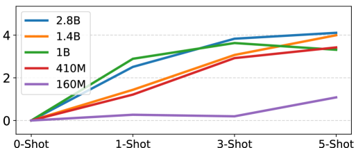
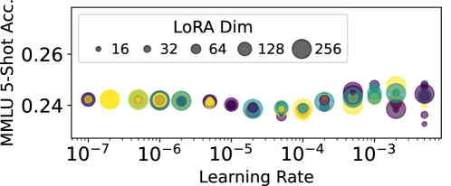
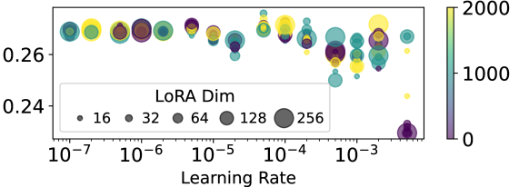

# Mamba 状态空间模型展现出作为下游学习者的强大潜力

发布时间：2024年05月31日

`LLM理论

理由：这篇论文主要探讨了Mamba状态空间模型（SSMs）在混合精度（MPFT）和参数高效微调（PEFT）方面的潜力，以及情境学习（ICL）的评估。它涉及了Mamba模型的架构细节、性能优化以及与Transformer模型的比较，这些都是关于大型语言模型（LLM）的理论研究。因此，它更适合归类于LLM理论。` `机器学习`

> Mamba State-Space Models Can Be Strong Downstream Learners

# 摘要

> Mamba状态空间模型（SSMs）近期在多个任务中超越了顶尖的Transformer大型语言模型（LLMs），并广受欢迎。尽管如此，Mamba在下游学习方面的潜力，如混合精度（MPFT）和参数高效微调（PEFT），尚未充分挖掘，情境学习（ICL）的评估也显不足。最近的研究指出，Mamba的ICL在非标准测试中与顶尖Transformer LLMs不相上下。然而，我们的研究表明，在标准测试中，预训练的Mamba模型仅能实现Transformer模型ICL性能提升的38%。在Mamba架构中实现MPFT和PEFT颇具挑战，这源于其循环动态和定制CUDA内核的复杂性。但我们通过动力系统理论证实，Mamba的循环动态对输入微小变化具有强健性。实证分析显示，Mamba因混合精度而产生的推理和微调性能变化与Transformer LLMs相吻合。此外，我们发现通过调整Mamba定制CUDA内核中的关键内存缓冲区进行低秩适应，能有效规范SSM参数，既保持了加速，又提高了参数效率。我们的研究表明，MPFT与PEFT的结合使得每秒处理的令牌数提升至2.15倍，每个令牌的内存消耗降低65.5%，同时ICL性能提升（相对于零-shot）可达同等微调Transformer的81.5%。

> Mamba state-space models (SSMs) have recently outperformed state-of-the-art (SOTA) Transformer large language models (LLMs) in various tasks and been widely adapted. However, Mamba's downstream learning capabilities remain either unexplored$\unicode{x2013}$e.g., mixed-precision (MPFT) and parameter-efficient fine-tuning (PEFT)--or under-evaluated$\unicode{x2013}$e.g., in-context learning (ICL). For the latter, recent works reported Mamba's ICL rivals SOTA Transformer LLMs using non-standard benchmarks. In contrast, we show that on standard benchmarks, pretrained Mamba models achieve only 38% of the ICL performance improvements (over zero-shot) of comparable Transformers.
  Enabling MPFT and PEFT in Mamba architectures is challenging due to recurrent dynamics and highly customized CUDA kernels, respectively. However, we prove that Mamba's recurrent dynamics are robust to small input changes using dynamical systems theory. Empirically, we show that performance changes in Mamba's inference and fine-tuning due to mixed-precision align with Transformer LLMs. Furthermore, we show that targeting key memory buffers in Mamba's customized CUDA kernels for low-rank adaptation regularizes SSM parameters, thus achieving parameter efficiency while retaining speedups. We show that combining MPFT and PEFT enables up to 2.15 times more tokens-per-second and 65.5% reduced per-token-memory compared to full Mamba fine-tuning, while achieving up to 81.5% of the ICL performance improvements (over zero-shot) of comparably fine-tuned Transformers.

[Arxiv](https://arxiv.org/abs/2406.00209)