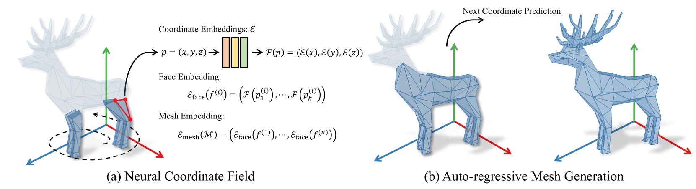
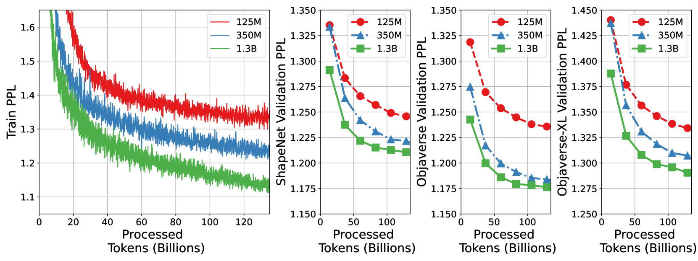
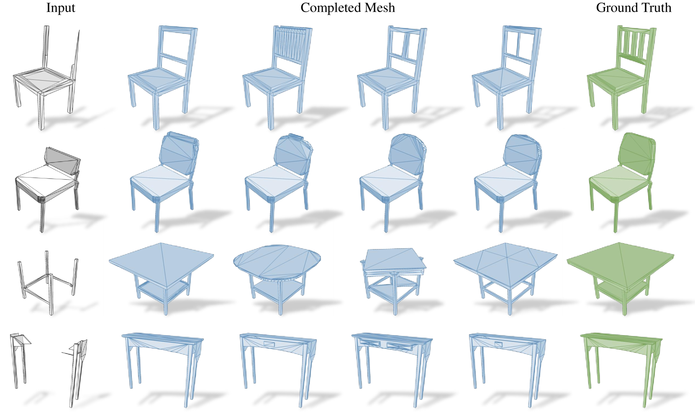
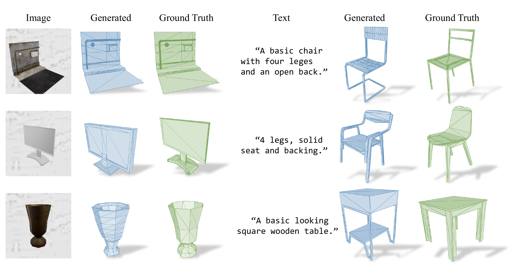
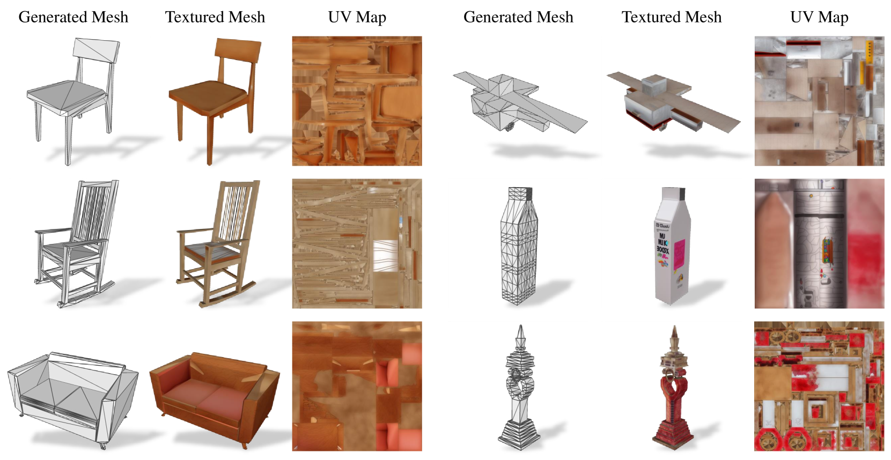
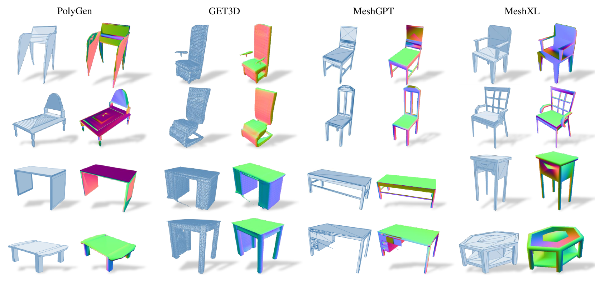

# MeshXL：打造3D基础模型的神经坐标场之光

发布时间：2024年05月31日

`LLM应用

这篇论文主要探讨了如何利用大型语言模型（LLM）技术来生成三维网格数据，具体是通过神经坐标场（NeurCF）和自回归模型MeshXL系列来实现。这种方法将三维网格的生成问题转化为序列生成问题，并利用LLM技术进行处理。因此，这篇论文属于LLM应用类别，因为它展示了LLM技术在三维数据生成领域的实际应用。` `三维建模` `计算机图形学`

> MeshXL: Neural Coordinate Field for Generative 3D Foundation Models

# 摘要

> 三维数据的网格表示因其灵活性、快速渲染和高效存储而备受青睐。然而，其非结构化的图形特性使得高保真网格的直接生成颇具挑战。所幸，借助预设的排序策略，三维网格可转化为序列，其生成过程亦可视为自回归问题。本文证实了神经坐标场（NeurCF）——一种结合显式坐标与隐式神经嵌入的表示法——在大规模序列化网格建模中既简洁又高效。随后，我们推出了MeshXL系列，这是一套采用现代大型语言模型技术的生成式预训练自回归模型，专为三维网格生成而设计。实验结果显示，MeshXL不仅能够产出高质量的三维网格，还能作为多种下游应用的基石模型。

> The polygon mesh representation of 3D data exhibits great flexibility, fast rendering speed, and storage efficiency, which is widely preferred in various applications. However, given its unstructured graph representation, the direct generation of high-fidelity 3D meshes is challenging. Fortunately, with a pre-defined ordering strategy, 3D meshes can be represented as sequences, and the generation process can be seamlessly treated as an auto-regressive problem. In this paper, we validate the Neural Coordinate Field (NeurCF), an explicit coordinate representation with implicit neural embeddings, is a simple-yet-effective representation for large-scale sequential mesh modeling. After that, we present MeshXL, a family of generative pre-trained auto-regressive models, which addresses the process of 3D mesh generation with modern large language model approaches. Extensive experiments show that MeshXL is able to generate high-quality 3D meshes, and can also serve as foundation models for various down-stream applications.

[Arxiv](https://arxiv.org/abs/2405.20853)