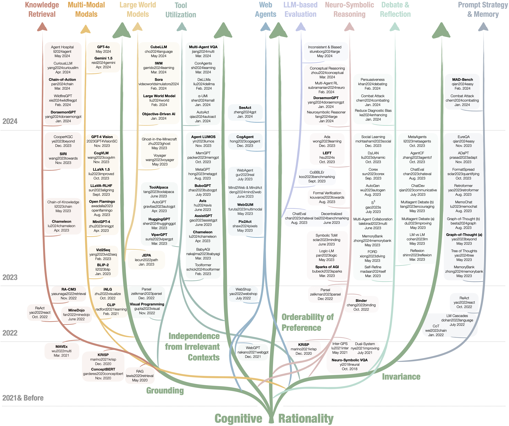

# 理性视角下的多模态与多智能体系统：综合调查

发布时间：2024年05月31日

`Agent

这篇论文主要探讨了通过多代理协同来提升大型语言模型（LLMs）的一致性与可靠性，特别是在处理复杂场景和减少训练数据偏见方面。它关注的是多模态与多代理系统在理性表现上的进展，并与单模态、单代理系统进行比较。因此，这篇论文更符合Agent分类，因为它主要集中在多代理系统的应用和改进上。` `人工智能` `多模态系统`

> Multi-Modal and Multi-Agent Systems Meet Rationality: A Survey

# 摘要

> 理性，这一品质体现在基于证据和逻辑规则的逻辑思维与决策中，对于解决问题至关重要。尽管大型语言模型（LLMs）在生成人类化文本上取得了显著成就，但它们仍受限于训练数据中的偏见、情境间的不一致性，以及处理多层上下文复杂场景的挑战。为此，研究者们正探索通过多代理协同，结合多样数据和工具，以提升系统的一致性与可靠性。本文通过审视最新研究，探讨多模态与多代理系统是否正迈向理性，比较其在理性表现上与单模态、单代理系统的差异，并展望未来的研究方向。我们已在 GitHub 上开设了一个开放仓库，地址为 https://github.com/bowen-upenn/MMMA_Rationality。

> Rationality is the quality of being guided by reason, characterized by logical thinking and decision-making that align with evidence and logical rules. This quality is essential for effective problem-solving, as it ensures that solutions are well-founded and systematically derived. Despite the advancements of large language models (LLMs) in generating human-like text with remarkable accuracy, they present biases inherited from the training data, inconsistency across different contexts, and difficulty understanding complex scenarios involving multiple layers of context. Therefore, recent research attempts to leverage the strength of multiple agents working collaboratively with various types of data and tools for enhanced consistency and reliability. To that end, this paper aims to understand whether multi-modal and multi-agent systems are advancing toward rationality by surveying the state-of-the-art works, identifying advancements over single-agent and single-modal systems in terms of rationality, and discussing open problems and future directions. We maintain an open repository at https://github.com/bowen-upenn/MMMA_Rationality.

[Arxiv](https://arxiv.org/abs/2406.00252)