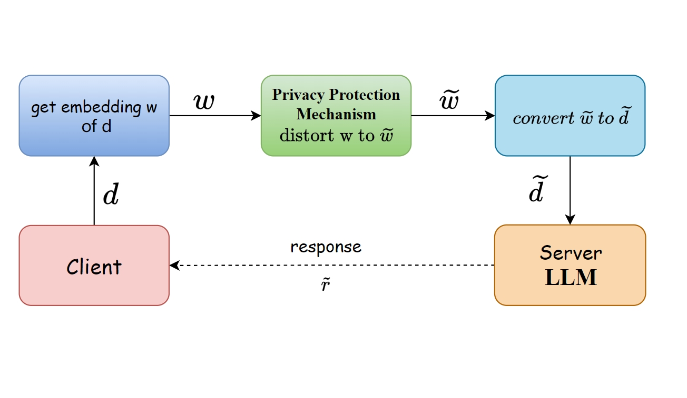
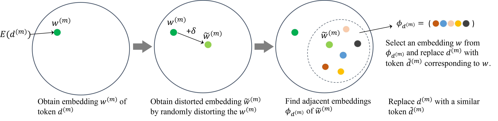

# 大型语言模型隐私保护推理的“无免费午餐”定理

发布时间：2024年05月31日

`LLM理论

这篇论文主要探讨了大型语言模型（LLMs）在应用中涉及的隐私问题，并提出了一种框架来推断隐私保护的LLMs。研究重点在于如何在保护隐私的同时保持模型的效用，这涉及到理论层面的权衡和分析。因此，这篇论文更适合归类于LLM理论，因为它不仅关注实际应用中的隐私问题，还深入探讨了隐私与效用之间的理论关系，特别是通过NFL定理来阐述这一关系。这与Agent、RAG或LLM应用分类不符，因为后三者更多关注的是模型或系统的具体应用、架构或代理行为，而不是理论分析。` `隐私保护` `人工智能`

> No Free Lunch Theorem for Privacy-Preserving LLM Inference

# 摘要

> 大型语言模型（如PaLM、Gemini和ChatGPT）极大地惠及了个人和企业，不仅提升了生产效率、降低了成本，还让我们能专注于更有价值的工作。这些模型能深入挖掘大数据，揭示隐藏模式，为科技和科学的发展提供关键洞察。然而，随之而来的隐私问题不容忽视。用户与这些模型的互动可能无意中泄露敏感信息。缺乏强有力的隐私保护措施和法律框架，可能导致个人数据被滥用，增加隐私侵犯和身份盗窃的风险。为此，我们必须减少共享提示与私人信息之间的关联，并采用随机化方法保护提示隐私，尽管这可能带来一定的效用损失。因此，在设计保护机制时，需权衡隐私泄露风险与效用损失。本研究构建了一个框架，用于推断隐私保护的LLMs，并奠定了研究隐私与效用相互作用的理论基础，其核心见解体现在NFL定理中。

> Individuals and businesses have been significantly benefited by Large Language Models (LLMs) including PaLM, Gemini and ChatGPT in various ways. For example, LLMs enhance productivity, reduce costs, and enable us to focus on more valuable tasks. Furthermore, LLMs possess the capacity to sift through extensive datasets, uncover underlying patterns, and furnish critical insights that propel the frontiers of technology and science. However, LLMs also pose privacy concerns. Users' interactions with LLMs may expose their sensitive personal or company information. A lack of robust privacy safeguards and legal frameworks could permit the unwarranted intrusion or improper handling of individual data, thereby risking infringements of privacy and the theft of personal identities. To ensure privacy, it is essential to minimize the dependency between shared prompts and private information. Various randomization approaches have been proposed to protect prompts' privacy, but they may incur utility loss compared to unprotected LLMs prompting. Therefore, it is essential to evaluate the balance between the risk of privacy leakage and loss of utility when conducting effective protection mechanisms. The current study develops a framework for inferring privacy-protected Large Language Models (LLMs) and lays down a solid theoretical basis for examining the interplay between privacy preservation and utility. The core insight is encapsulated within a theorem that is called as the NFL (abbreviation of the word No-Free-Lunch) Theorem.

[Arxiv](https://arxiv.org/abs/2405.20681)