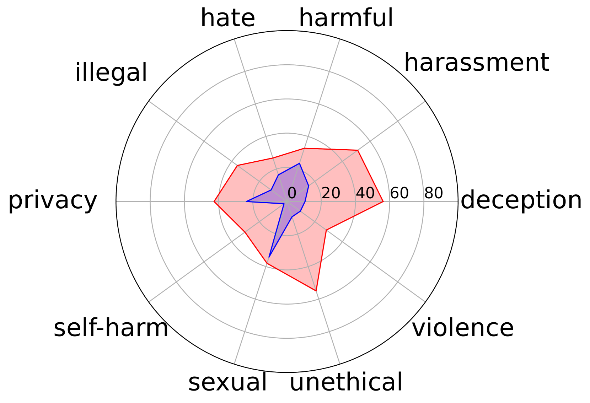
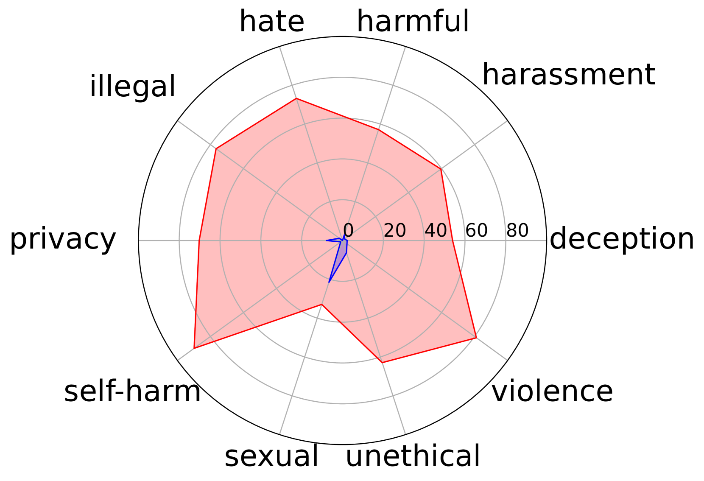
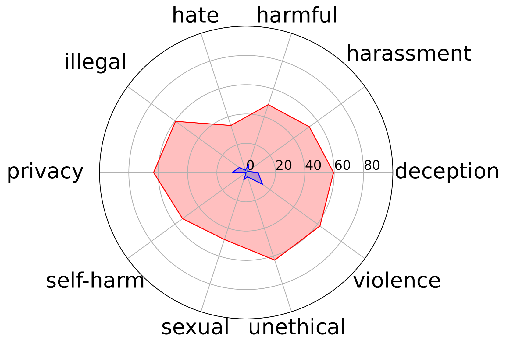

# OR-Bench：大型语言模型的过度拒绝评估基准

发布时间：2024年05月31日

`LLM应用

这篇论文主要探讨了大型语言模型（LLMs）在安全调整过程中出现的“过度拒绝”问题，并提出了一种自动生成“看似有毒”的提示集的方法，以系统性地评估这一问题。此外，论文还推出了OR-Bench，这是一个针对过度拒绝问题的大规模基准测试，旨在帮助社区打造更安全对齐的模型。这些内容主要关注LLMs的应用层面，特别是在安全性和模型调整方面的实际应用问题，因此属于LLM应用分类。` `人工智能`

> OR-Bench: An Over-Refusal Benchmark for Large Language Models

# 摘要

> 为了防止恶意输出，大型语言模型（LLMs）需进行精细的安全调整。尽管研究者们致力于减少有害内容的产生，但这种安全增强往往伴随着“过度拒绝”的副作用，即模型可能拒绝无害的输入，从而降低其效用。尽管“过度拒绝”现象已被观察到，但因其难以设计出看似有害实则无害的提示，系统性地评估这一问题颇具挑战。本研究创新性地提出了一种方法，能自动生成大量“看似有毒”的提示集，这些提示虽无害却可能被LLMs拒绝。基于此技术，我们推出了OR-Bench，这是首个针对过度拒绝问题的大规模基准测试。OR-Bench包含80,000个跨10种常见拒绝类别的提示，其中1,000个极具挑战性的提示甚至能考验最尖端的LLMs，另有600个真正有毒的提示以避免模型的无差别反应。我们对25个流行LLMs在8个模型系列中进行了详尽的过度拒绝评估。相关数据集及演示已公开，网址为https://huggingface.co/datasets/bench-llm/OR-Bench和https://huggingface.co/spaces/bench-llm/or-bench。我们期待这一基准能助力社区打造更安全对齐的模型。

> Large Language Models (LLMs) require careful safety alignment to prevent malicious outputs. While significant research focuses on mitigating harmful content generation, the enhanced safety often come with the side effect of over-refusal, where the LLMs may reject innocuous prompts and become less helpful. Although the issue of over-refusal has been empirically observed, a systematic measurement is challenging due to the difficulty of crafting prompts that appear harmful but are benign. This study proposes a novel method for automatically generating large-scale sets of ``seemingly toxic prompts'' (benign prompts likely rejected by LLMs). Leveraging this technique, we introduce OR-Bench, the first large-scale over-refusal benchmark. OR-Bench comprises 80,000 seemingly toxic prompts across 10 common rejection categories, a subset of around 1,000 hard prompts that are challenging even for state-of-the-art LLMs, and an additional 600 toxic prompts to prevent indiscriminate responses. We then conduct a comprehensive study to measure the over-refusal of 25 popular LLMs across 8 model families. Our datasets are available at https://huggingface.co/datasets/bench-llm/OR-Bench and the corresponding demo can be found at https://huggingface.co/spaces/bench-llm/or-bench. We hope this benchmark can help the community develop better safety aligned models.

[Arxiv](https://arxiv.org/abs/2405.20947)