# Ovis：多模态大型语言模型的结构嵌入精准对齐

发布时间：2024年05月31日

`LLM应用

这篇论文介绍了一种新型的多模态大型语言模型（MLLM）架构Ovis，它通过创新的方式统一了视觉与文本嵌入，以提高视觉与文本信息的融合效果。这种架构的设计和实证结果表明其在多模态学习任务中的优越性能，特别是在多模态基准测试中超越了其他模型。因此，这篇论文属于LLM应用类别，因为它专注于改进和应用现有的LLM技术来解决多模态学习中的具体问题。` `人工智能` `多模态学习`

> Ovis: Structural Embedding Alignment for Multimodal Large Language Model

# 摘要

> 当前的多模态大型语言模型（MLLMs）通过连接器（如MLP）将预训练的语言模型与视觉转换器结合，赋予其视觉能力。但两种嵌入策略的不匹配——结构化文本嵌入与连续视觉嵌入——阻碍了视觉与文本信息的深度融合。为此，我们设计了Ovis，一种新型MLLM架构，旨在结构上统一视觉与文本嵌入。Ovis在视觉编码过程中引入了一个可学习的视觉嵌入表，每个图像块通过多次索引该表，生成最终的概率组合视觉嵌入，这与文本嵌入的生成方式相呼应。实证结果显示，Ovis在多个多模态基准测试中超越了同规模的开源模型，甚至优于专有模型Qwen-VL-Plus。这证明了Ovis的结构化视觉表示在推动MLLM设计和提升多模态学习效果方面的潜力。Ovis的源代码及训练数据将对外开放。

> Current Multimodal Large Language Models (MLLMs) typically integrate a pre-trained LLM with another pre-trained vision transformer through a connector, such as an MLP, endowing the LLM with visual capabilities. However, the misalignment between two embedding strategies in MLLMs -- the structural textual embeddings based on an embedding look-up table and the continuous embeddings generated directly by the vision encoder -- makes challenges for a more seamless fusion of visual and textual information. We propose Ovis, a novel MLLM architecture designed to structurally align visual and textual embeddings. Ovis integrates an additional learnable visual embedding table into the visual encoder's process. To capture rich visual semantics, each image patch indexes the visual embedding table multiple times, resulting in a final visual embedding that is a probabilistic combination of the indexed embeddings. This structural approach mirrors the method used for generating textual embeddings. Empirical evaluations on various multimodal benchmarks demonstrate that Ovis outperforms open-source MLLMs of similar parameter scales and even surpasses the proprietary model Qwen-VL-Plus overall. These results highlight the potential of Ovis' structured visual representation for advancing MLLM architectural design and promoting more effective multimodal learning. Both the source code and the training dataset of Ovis will be made publicly available.

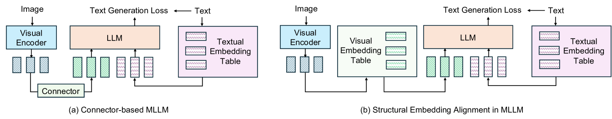

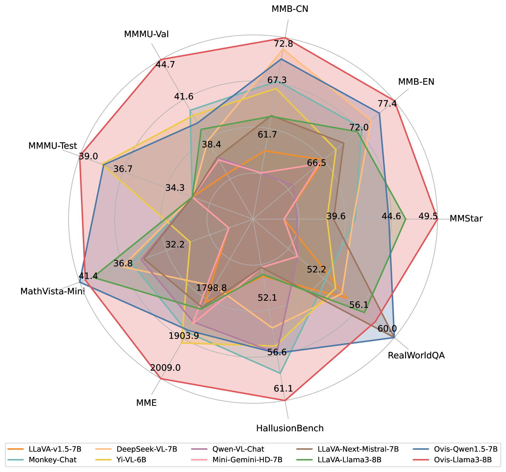

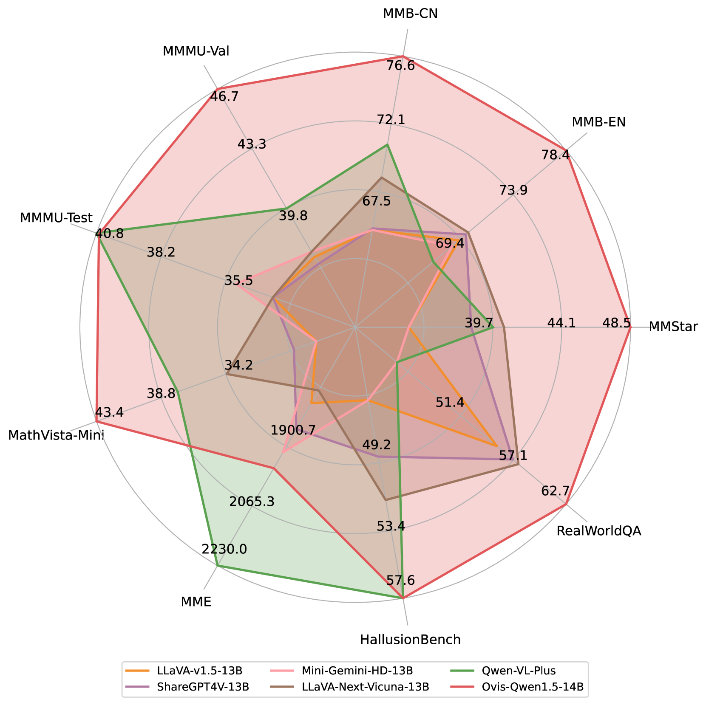

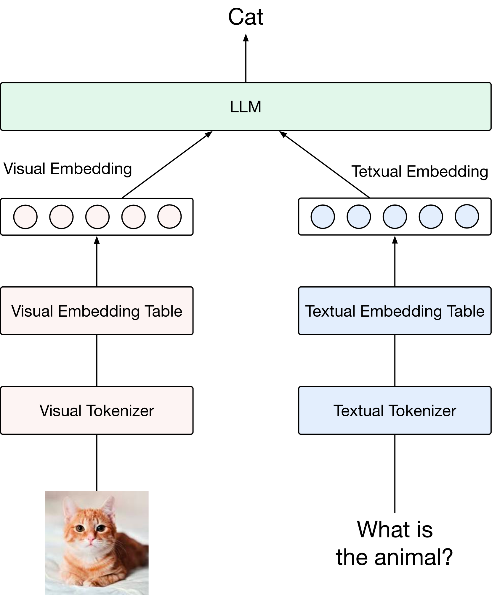

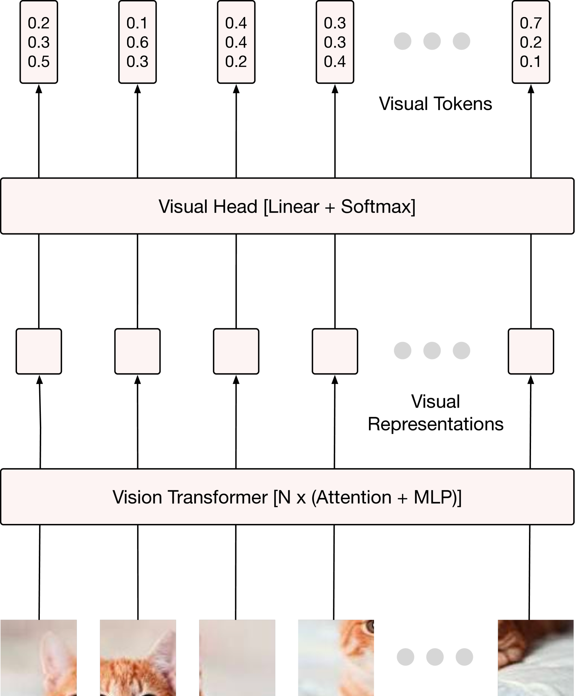

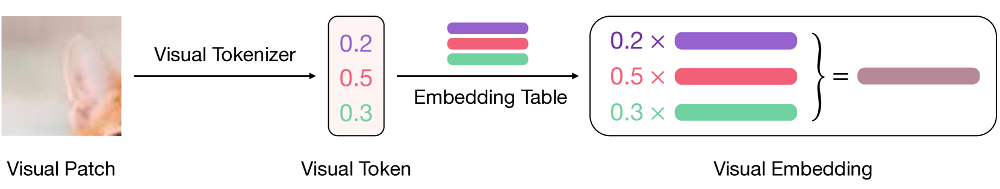

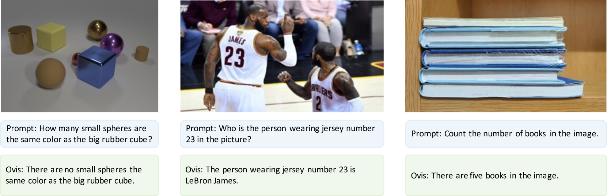

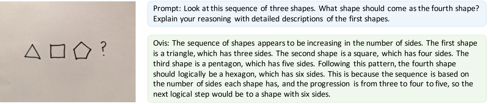

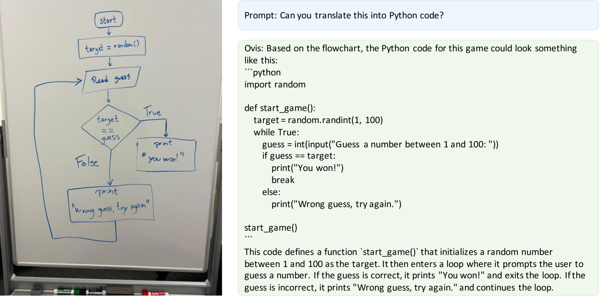

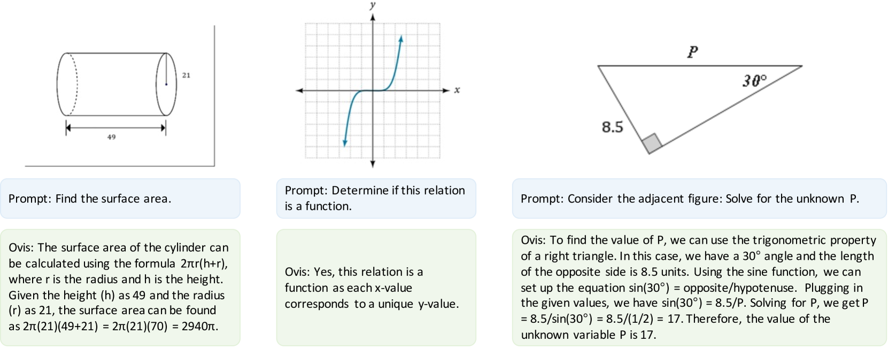

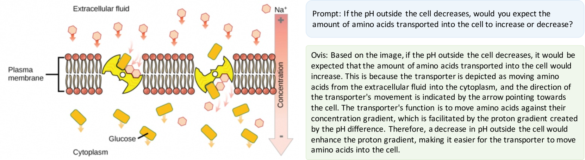

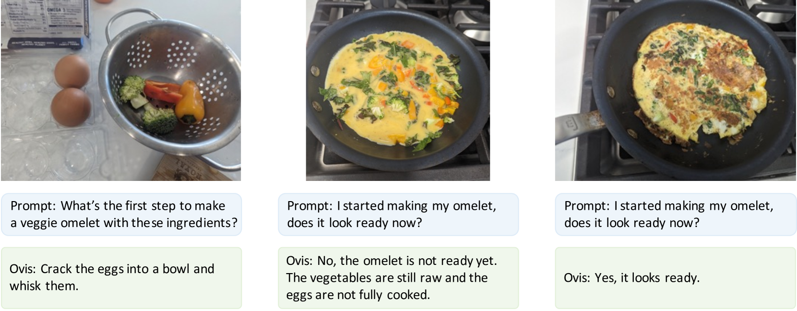

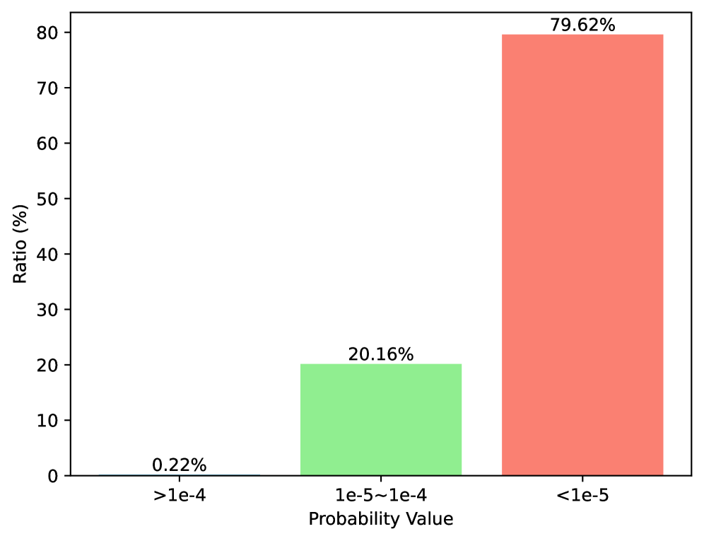

[Arxiv](https://arxiv.org/abs/2405.20797)