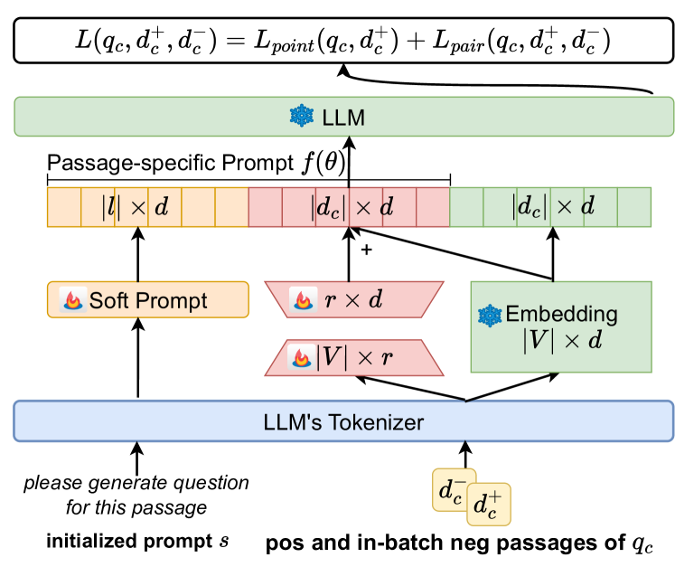
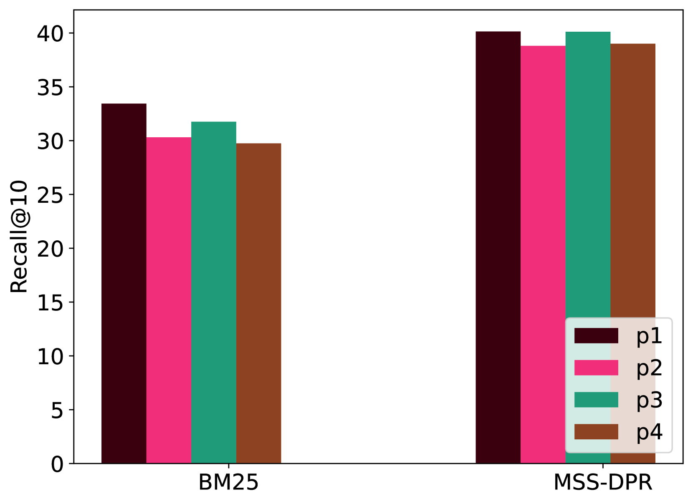
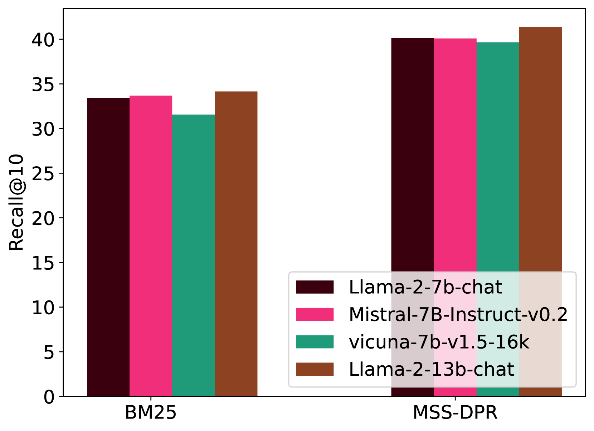
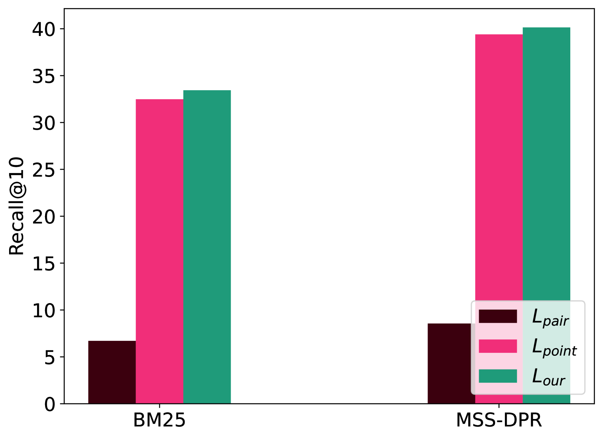
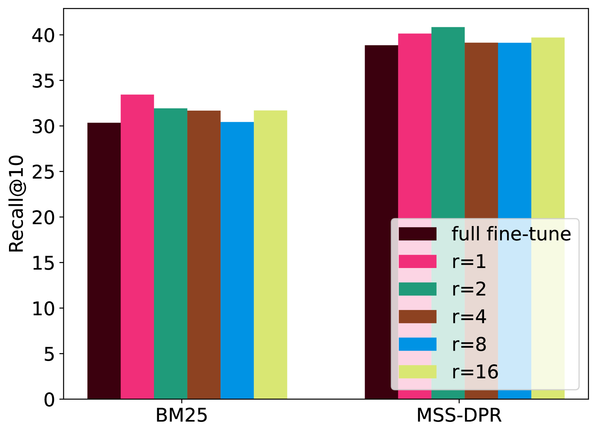

# 大型语言模型问答中的段落重排序：特定段落提示调整策略

发布时间：2024年05月31日

`LLM应用

这篇论文摘要描述了一种名为PSPT的新方法，用于改进开放域问答任务中的段落重排序。该方法通过微调段落特定的软提示来利用问题与段落间的相关性及段落特定知识，以提升排序效果。这种方法涉及对大型语言模型（LLMs）的微调和应用，特别是在Llama-2-chat-7B模型上的实验验证了其有效性。因此，这篇论文属于LLM应用类别，因为它专注于开发和应用LLM技术来解决特定的实际问题。` `问答系统`

> Passage-specific Prompt Tuning for Passage Reranking in Question Answering with Large Language Models

# 摘要

> 在开放域问答任务中，通过LLMs基于问题相对于各段落的条件对数似然进行段落重排序的方法已取得进展，但这些方法对人工提示极为敏感，且微调LLMs成本高昂。此外，现有方法未能充分利用问题与段落间的相关性及段落特定知识来提升排序效果。为此，我们提出了一种名为PSPT的新方法，它通过微调段落特定的软提示，有效利用了有限的问题-段落相关性对中的知识。我们的方法根据模型生成问题的条件对数似然及学习的软提示对段落进行排序。实验结果显示，使用Llama-2-chat-7B模型在三个公开数据集上的表现证明了PSPT的有效性。

> Effective passage retrieval and reranking methods have been widely utilized to identify suitable candidates in open-domain question answering tasks, recent studies have resorted to LLMs for reranking the retrieved passages by the log-likelihood of the question conditioned on each passage. Although these methods have demonstrated promising results, the performance is notably sensitive to the human-written prompt (or hard prompt), and fine-tuning LLMs can be computationally intensive and time-consuming. Furthermore, this approach limits the leverage of question-passage relevance pairs and passage-specific knowledge to enhance the ranking capabilities of LLMs. In this paper, we propose passage-specific prompt tuning for reranking in open-domain question answering (PSPT): a parameter-efficient method that fine-tunes learnable passage-specific soft prompts, incorporating passage-specific knowledge from a limited set of question-passage relevance pairs. The method involves ranking retrieved passages based on the log-likelihood of the model generating the question conditioned on each passage and the learned soft prompt. We conducted extensive experiments utilizing the Llama-2-chat-7B model across three publicly available open-domain question answering datasets and the results demonstrate the effectiveness of the proposed approach.

[Arxiv](https://arxiv.org/abs/2405.20654)