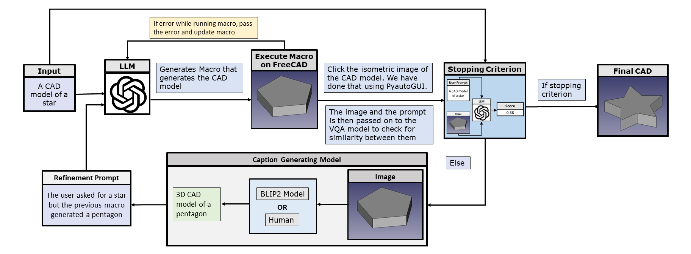
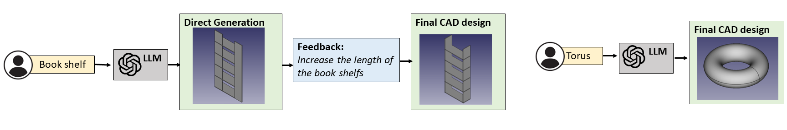
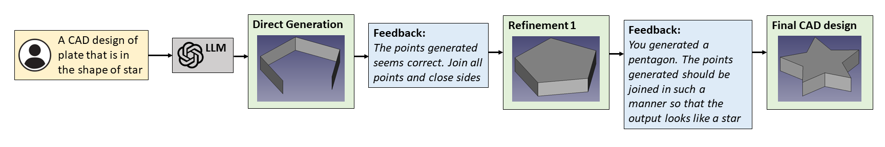
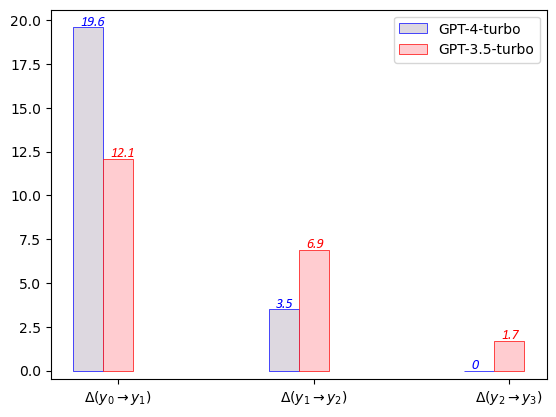
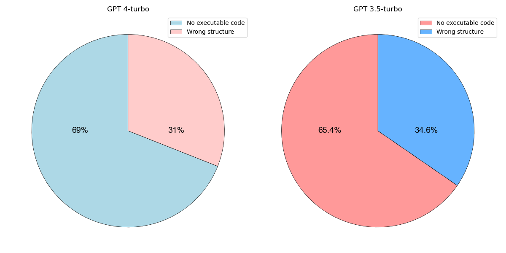

# Query2CAD：通过自然语言查询轻松生成CAD模型

发布时间：2024年05月31日

`LLM应用

理由：这篇论文介绍了一个名为Query2CAD的框架，该框架利用大型语言模型（LLM）来自动生成CAD宏，并通过自我改进循环优化设计。这个应用直接利用了LLM的能力来辅助CAD工程师的工作，属于LLM在特定领域（CAD设计）的应用。因此，它被归类为LLM应用。` `CAD设计` `自动化工具`

> Query2CAD: Generating CAD models using natural language queries

# 摘要

> CAD工程师通常不会在一次尝试中达到最佳设计，而是通过多次迭代和改进来寻求最优解。尽管这种方法有效，但耗时且依赖于工程师的专业技能。为此，我们开发了Query2CAD框架，它利用大型语言模型自动生成CAD宏，并通过自我改进循环不断优化设计。该框架无需额外训练或监督数据，同时结合了BLIP2模型的反馈和人工反馈，以减少错误。我们还创建了一个包含CAD设计常用操作的数据集，并使用它评估了框架性能。结果显示，使用GPT-4 Turbo模型时，首次尝试的成功率为53.6%，经过改进后提升至76.7%。值得注意的是，第一次改进带来了最大的成功率提升，后续改进对准确性的提升有限。我们已将数据、模型和代码开源（github.com/akshay140601/Query2CAD）。

> Computer Aided Design (CAD) engineers typically do not achieve their best prototypes in a single attempt. Instead, they iterate and refine their designs to achieve an optimal solution through multiple revisions. This traditional approach, though effective, is time-consuming and relies heavily on the expertise of skilled engineers. To address these challenges, we introduce Query2CAD, a novel framework to generate CAD designs. The framework uses a large language model to generate executable CAD macros. Additionally, Query2CAD refines the generation of the CAD model with the help of its self-refinement loops. Query2CAD operates without supervised data or additional training, using the LLM as both a generator and a refiner. The refiner leverages feedback generated by the BLIP2 model, and to address false negatives, we have incorporated human-in-the-loop feedback into our system. Additionally, we have developed a dataset that encompasses most operations used in CAD model designing and have evaluated our framework using this dataset. Our findings reveal that when we used GPT-4 Turbo as our language model, the architecture achieved a success rate of 53.6\% on the first attempt. With subsequent refinements, the success rate increased by 23.1\%. In particular, the most significant improvement in the success rate was observed with the first iteration of the refinement. With subsequent refinements, the accuracy of the correct designs did not improve significantly. We have open-sourced our data, model, and code (github.com/akshay140601/Query2CAD).

[Arxiv](https://arxiv.org/abs/2406.00144)