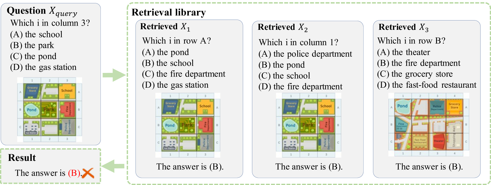
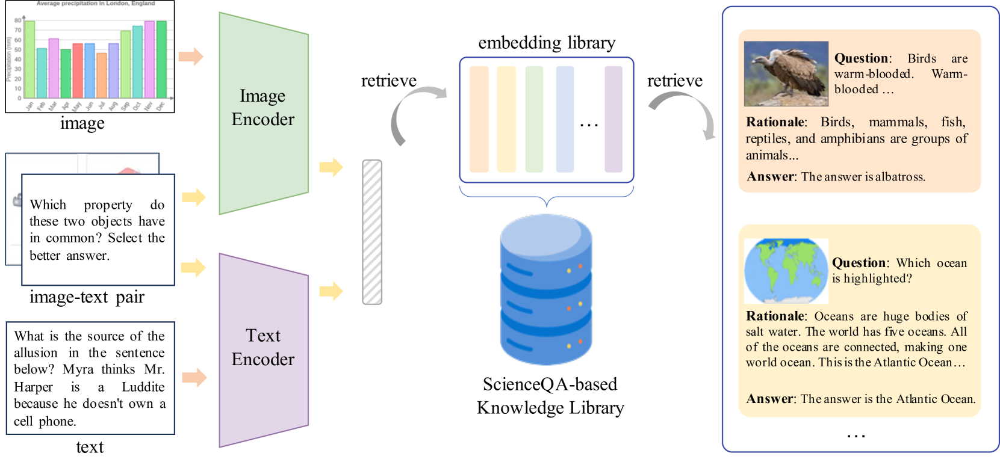
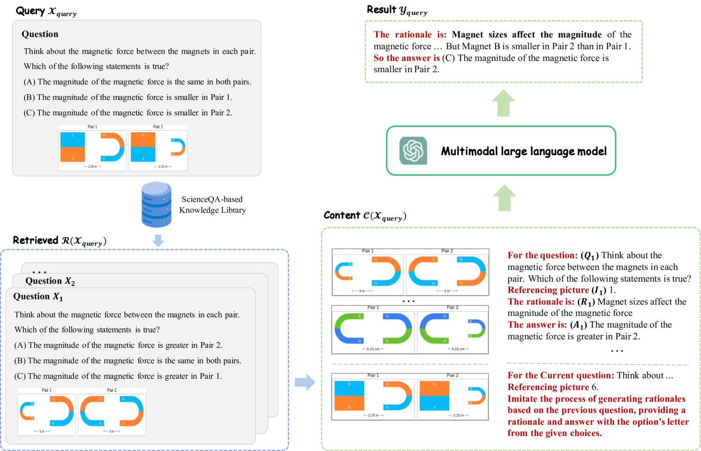
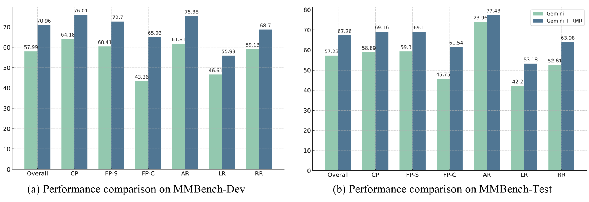
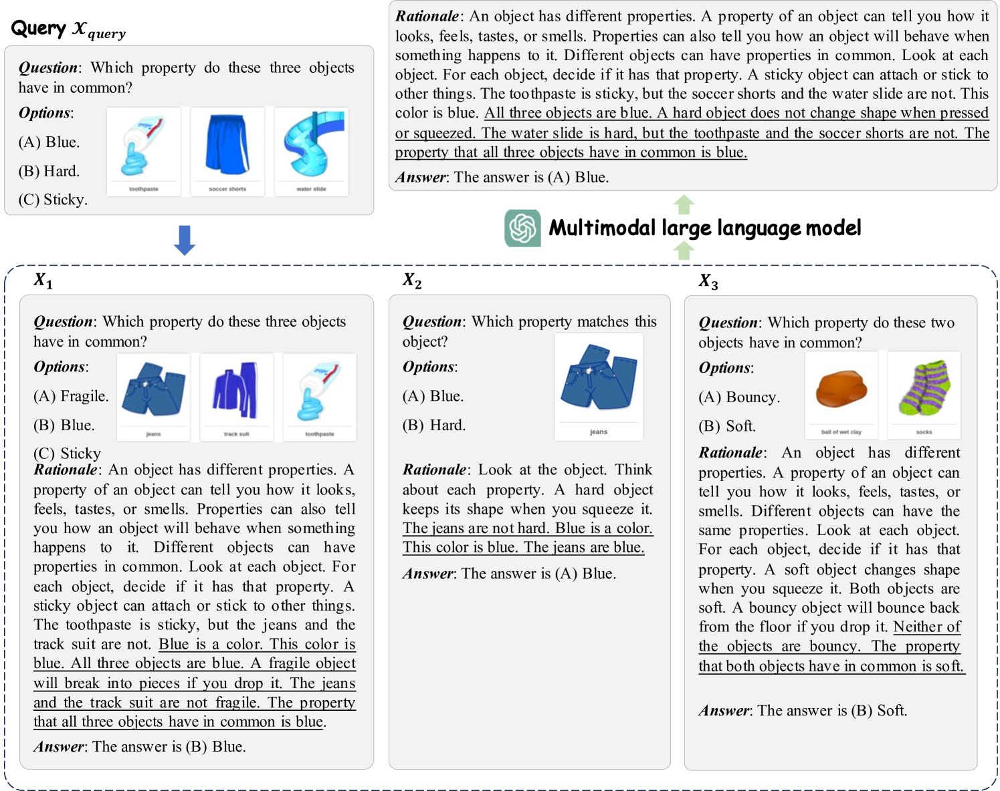
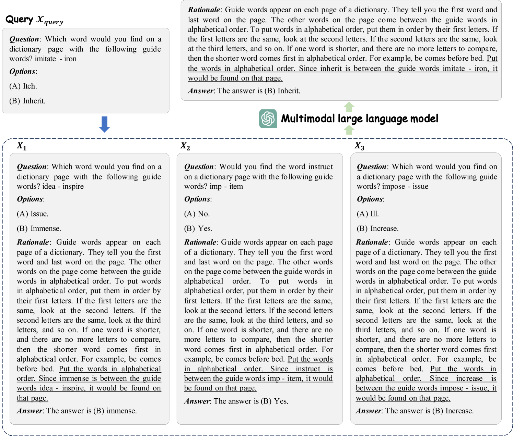
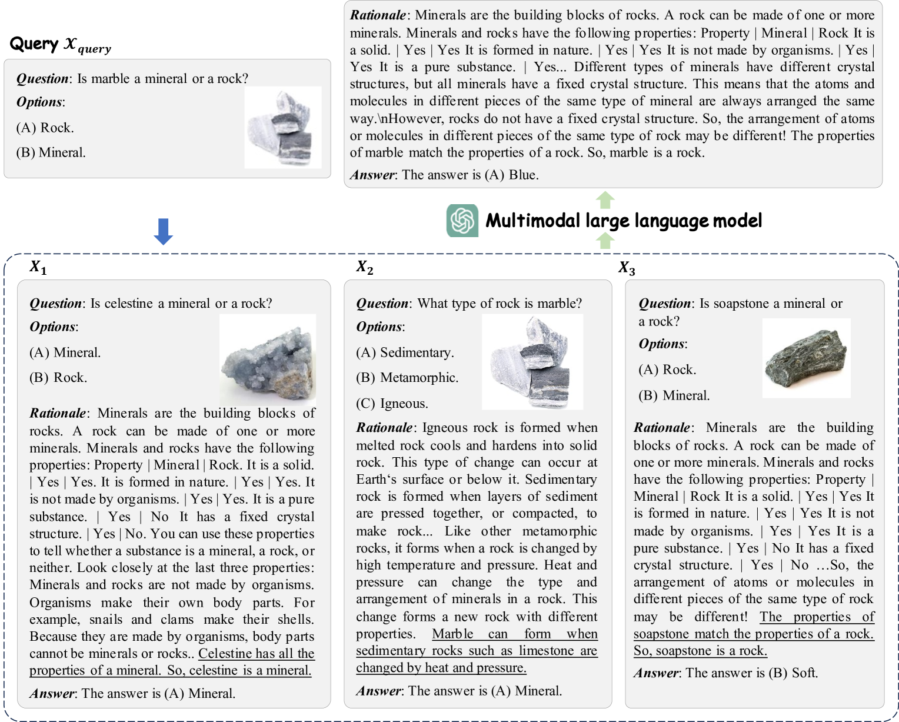
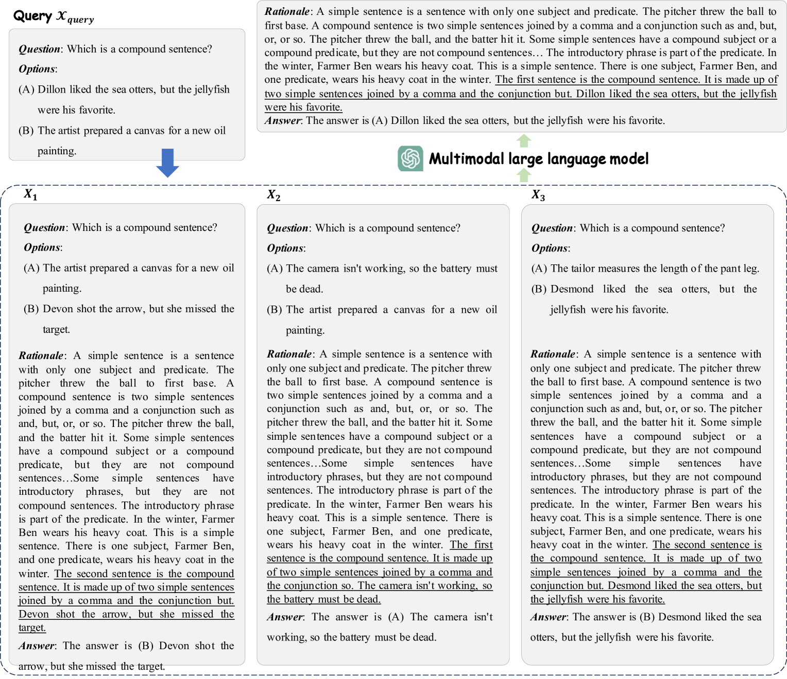

# 知识检索与推理的结合：高中课本知识亦能助力多模态推理的深化

发布时间：2024年05月31日

`RAG

这篇论文主要探讨了检索增强生成（RAG）技术在多模态视觉-语言模型中的应用，特别是通过引入名为RMR的新框架来增强模型的推理能力。论文的核心贡献在于展示了RAG技术如何通过双模态检索模块提升多模态模型的性能，特别是在处理视觉-语言任务时的推理能力。因此，这篇论文更符合RAG分类，因为它专注于RAG技术的应用和改进，而不是LLM的理论研究或Agent的设计与应用。` `多模态学习` `视觉-语言模型`

> Retrieval Meets Reasoning: Even High-school Textbook Knowledge Benefits Multimodal Reasoning

# 摘要

> 配备检索增强生成（RAG）的大型语言模型正崭露头角，旨在借助外部知识库提升回答能力。尽管RAG与纯语言模型的结合已广受研究，但其在多模态视觉-语言模型中的应用尚属初探。多模态RAG不仅限于生成答案，更着重于培养模型对查询进行推理的能力。为此，我们推出了名为RMR（检索与推理相遇）的新框架，它通过双模态检索模块精准匹配问题与答案，为多模态推理提供支撑。这种无需额外训练的方法，不仅深化了模型对检索内容的推理理解，还生成了既精确又易于理解的答案。令人瞩目的是，仅凭ScienceQA数据集，RMR便显著提升了多个视觉-语言模型在A-OKVQA、MMBench和SEED等基准上的表现，彰显了我们的多模态检索与推理机制在提升视觉-语言模型推理能力上的巨大潜力。

> Large language models equipped with retrieval-augmented generation (RAG) represent a burgeoning field aimed at enhancing answering capabilities by leveraging external knowledge bases. Although the application of RAG with language-only models has been extensively explored, its adaptation into multimodal vision-language models remains nascent. Going beyond mere answer generation, the primary goal of multimodal RAG is to cultivate the models' ability to reason in response to relevant queries. To this end, we introduce a novel multimodal RAG framework named RMR (Retrieval Meets Reasoning). The RMR framework employs a bi-modal retrieval module to identify the most relevant question-answer pairs, which then serve as scaffolds for the multimodal reasoning process. This training-free approach not only encourages the model to engage deeply with the reasoning processes inherent in the retrieved content but also facilitates the generation of answers that are precise and richly interpretable. Surprisingly, utilizing solely the ScienceQA dataset, collected from elementary and high school science curricula, RMR significantly boosts the performance of various vision-language models across a spectrum of benchmark datasets, including A-OKVQA, MMBench, and SEED. These outcomes highlight the substantial potential of our multimodal retrieval and reasoning mechanism to improve the reasoning capabilities of vision-language models.

[Arxiv](https://arxiv.org/abs/2405.20834)