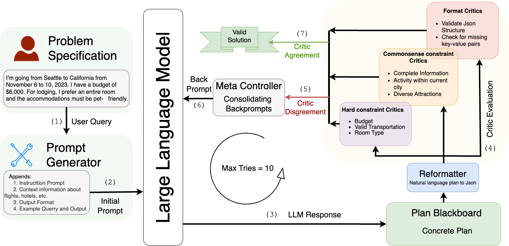
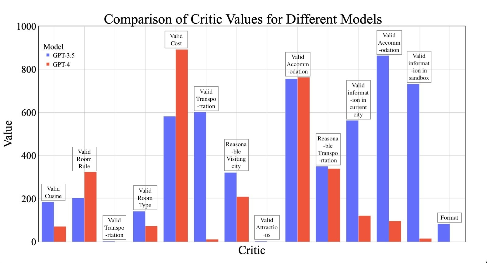
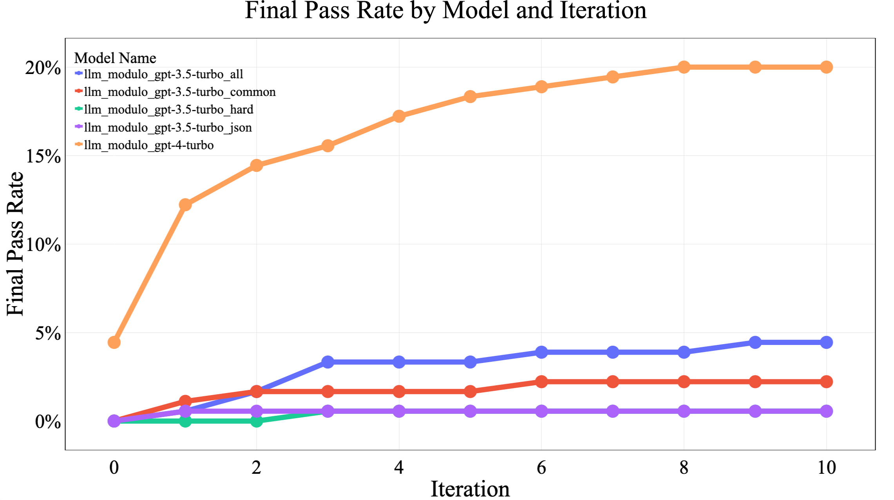
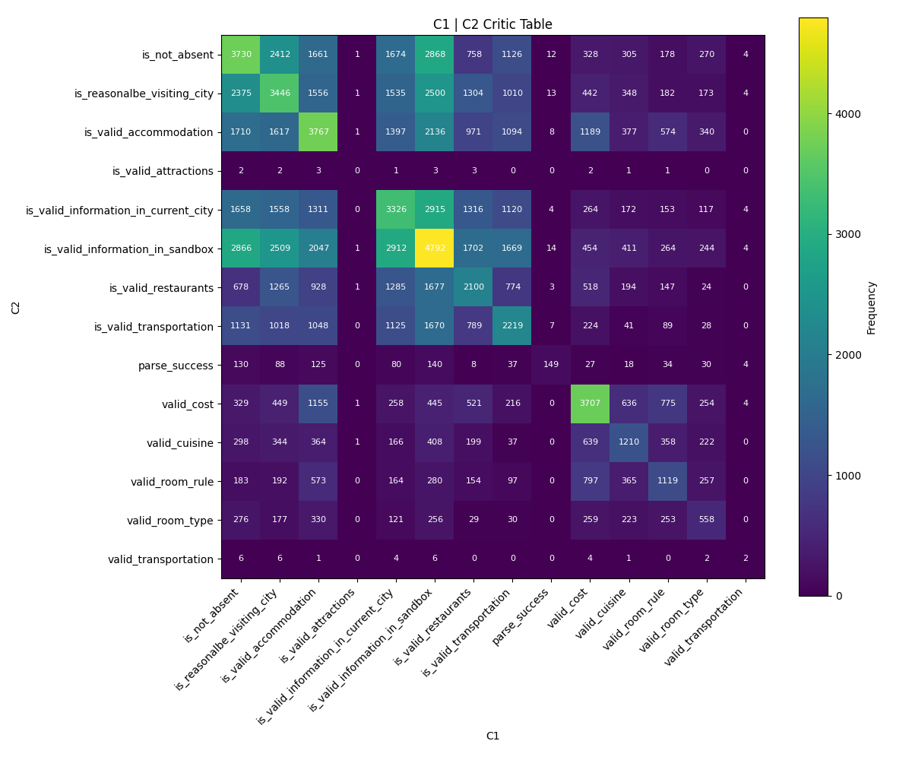

# 利用LLM-Modulo框架进行稳健旅行规划：一项案例研究

发布时间：2024年05月31日

`LLM应用

理由：这篇论文主要探讨了大型语言模型（LLMs）在规划与推理任务中的应用，特别是在旅行规划领域的实际应用。它介绍了一个新的框架（LLM Modulo），并展示了该框架如何提升LLMs在特定任务中的性能。这与LLM的应用直接相关，而非理论研究或Agent、RAG的特定领域。因此，将其归类为LLM应用是合适的。` `旅行规划`

> Robust Planning with LLM-Modulo Framework: Case Study in Travel Planning

# 摘要

> 随着大型语言模型（LLMs）的应用超越传统文本处理，其在规划与推理任务中的潜力备受瞩目，这些任务传统上属于系统2认知领域。尽管LLMs的多功能性被广泛认可，但如何在这些复杂领域有效利用它们仍是研究的热点。LLM Modulo论文提出的新框架，为LLMs在多样规划与推理活动中的应用提供了新的视角。本研讨会论文聚焦于该框架在旅行规划中的实际应用，并展示了具体案例。我们采用俄亥俄州立大学NLP小组的旅行规划基准，评估LLMs根据自然语言查询生成有效行程的能力。尽管如思维链、ReAct和反射等方法在GPT3.5-Turbo上的表现平平，但我们的LLM-Modulo框架在旅行规划领域的应用显著提升了性能，GPT4-Turbo的基准性能提升了4.6倍，GPT3.5-Turbo也从0%跃升至5%。此外，我们还展示了LLMs在规划流程中的其他关键角色，如批评提取和改述，这些功能在LLM-Modulo框架下得到了有效实现。

> As the applicability of Large Language Models (LLMs) extends beyond traditional text processing tasks, there is a burgeoning interest in their potential to excel in planning and reasoning assignments, realms traditionally reserved for System 2 cognitive competencies. Despite their perceived versatility, the research community is still unraveling effective strategies to harness these models in such complex domains. The recent discourse introduced by the paper on LLM Modulo marks a significant stride, proposing a conceptual framework that enhances the integration of LLMs into diverse planning and reasoning activities. This workshop paper delves into the practical application of this framework within the domain of travel planning, presenting a specific instance of its implementation. We are using the Travel Planning benchmark by the OSU NLP group, a benchmark for evaluating the performance of LLMs in producing valid itineraries based on user queries presented in natural language. While popular methods of enhancing the reasoning abilities of LLMs such as Chain of Thought, ReAct, and Reflexion achieve a meager 0%, 0.6%, and 0% with GPT3.5-Turbo respectively, our operationalization of the LLM-Modulo framework for TravelPlanning domain provides a remarkable improvement, enhancing baseline performances by 4.6x for GPT4-Turbo and even more for older models like GPT3.5-Turbo from 0% to 5%. Furthermore, we highlight the other useful roles of LLMs in the planning pipeline, as suggested in LLM-Modulo, which can be reliably operationalized such as extraction of useful critics and reformulator for critics.

[Arxiv](https://arxiv.org/abs/2405.20625)