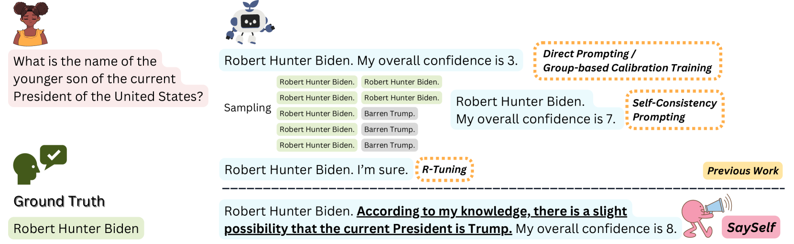

# SaySelf：培养大型语言模型通过自我反思的理性来表达自信

发布时间：2024年05月31日

`LLM应用

理由：这篇论文介绍了一种名为SaySelf的新框架，旨在提高大型语言模型（LLMs）表达置信度的能力，并引导其生成自我反思的解释。该框架通过训练LLMs来分析多重推理链的不一致性，自动总结知识不确定性，并使用强化学习来校准置信度。这种方法直接应用于改进LLMs的实际应用性能，特别是在提高置信度和准确性方面，因此属于LLM应用类别。` `人工智能`

> SaySelf: Teaching LLMs to Express Confidence with Self-Reflective Rationales

# 摘要

> 大型语言模型（LLMs）常产生不实信息且难以表达置信度，限制了其应用范围。以往方法通过提示或监督微调获取置信度，但效果有限。我们提出的SaySelf框架，通过训练使LLMs能更精确地表达置信度，并引导其生成自我反思的解释，揭示知识盲点及不确定性。此方法利用LLM分析多重推理链的不一致性，自动总结知识不确定性，并用于监督微调。我们还采用强化学习，通过精细设计的奖励函数校准置信度，确保LLMs提供高置信且准确的预测，同时抑制错误输出中的过度自信。实验证明，SaySelf在不同数据集上均有效降低了置信度校准误差，并保持了任务性能。生成的自我反思解释合理，有助于进一步校准。相关代码已公开于\url{https://github.com/xu1868/SaySelf}。

> Large language models (LLMs) often generate inaccurate or fabricated information and generally fail to indicate their confidence, which limits their broader applications. Previous work elicits confidence from LLMs by direct or self-consistency prompting, or constructing specific datasets for supervised finetuning. The prompting-based approaches have inferior performance, and the training-based approaches are limited to binary or inaccurate group-level confidence estimates. In this work, we present the advanced SaySelf, a training framework that teaches LLMs to express more accurate fine-grained confidence estimates. In addition, beyond the confidence scores, SaySelf initiates the process of directing LLMs to produce self-reflective rationales that clearly identify gaps in their parametric knowledge and explain their uncertainty. This is achieved by using an LLM to automatically summarize the uncertainties in specific knowledge via natural language. The summarization is based on the analysis of the inconsistency in multiple sampled reasoning chains, and the resulting data is utilized for supervised fine-tuning. Moreover, we utilize reinforcement learning with a meticulously crafted reward function to calibrate the confidence estimates, motivating LLMs to deliver accurate, high-confidence predictions and to penalize overconfidence in erroneous outputs. Experimental results in both in-distribution and out-of-distribution datasets demonstrate the effectiveness of SaySelf in reducing the confidence calibration error and maintaining the task performance. We show that the generated self-reflective rationales are reasonable and can further contribute to the calibration. The code is made public at \url{https://github.com/xu1868/SaySelf}.

[Arxiv](https://arxiv.org/abs/2405.20974)