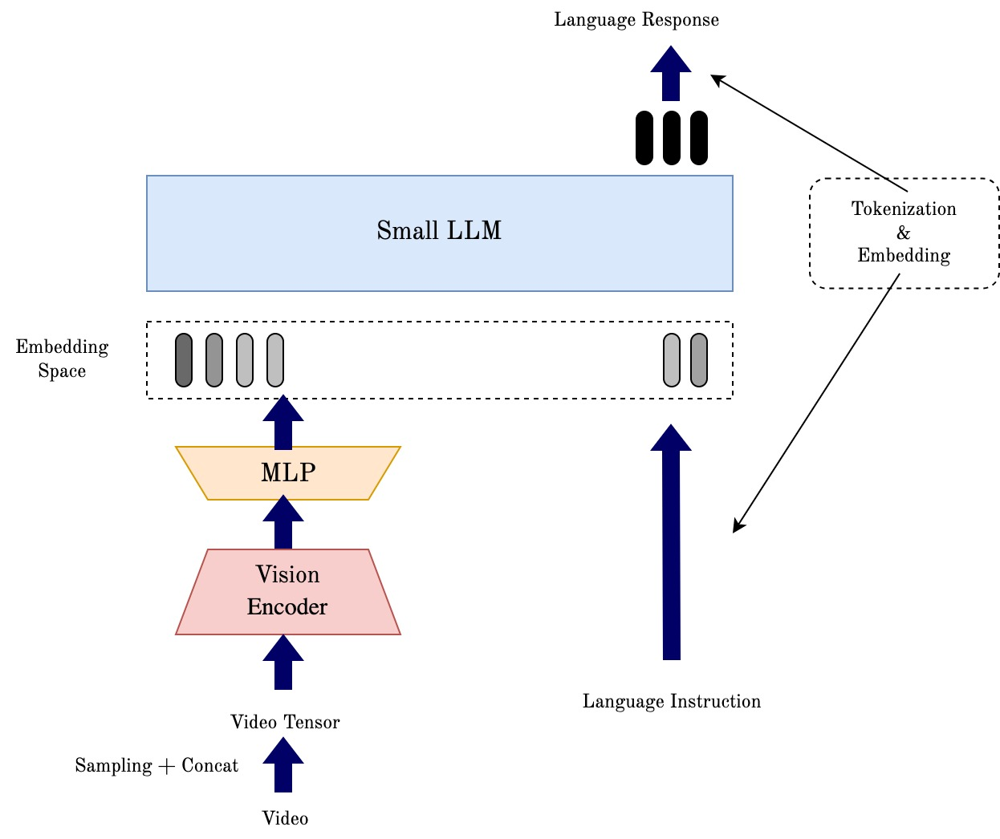

# Shotluck Holmes：专为视频字幕与摘要设计的高效小型语言视觉模型家族

发布时间：2024年05月31日

`Agent

理由：这篇论文介绍了一个名为 Shotluck Holmes 的高效大型语言视觉模型家族，该模型旨在提升视频摘要与字幕生成。这个模型可以被视为一个Agent，因为它能够处理视频数据，理解视觉和听觉信息，并生成视频摘要或字幕。这与Agent的定义相符，即一个能够感知环境并采取行动以达到目标的系统。此外，论文中提到的模型优化和数据收集策略，以及其在特定任务（如Shot2Story）中的应用，进一步强调了其作为Agent的特性。` `视频处理` `内容摘要`

> Shotluck Holmes: A Family of Efficient Small-Scale Large Language Vision Models For Video Captioning and Summarization

# 摘要

> 视频作为信息丰富的媒介日益重要，但给语言模型带来了挑战。视频由一系列镜头组成，每个镜头如同句子中的词汇，需同时处理视觉和听觉信息。要理解整个视频，模型不仅要解读每个镜头的视听内容，还需串联镜头间的思想，编织成一个宏大的故事。尽管领域内已有显著进展，但视频的逐镜头语义细节常被忽视。为此，我们开发了名为Shotluck Holmes的高效大型语言视觉模型家族，旨在提升视频摘要与字幕生成。通过优化预训练和数据收集策略，Shotluck Holmes不仅能够理解单张图片，更能洞察连续帧的序列。实证表明，在Shot2Story任务中，Shotluck Holmes以更小、更高效的模型超越了现有技术的性能。

> Video is an increasingly prominent and information-dense medium, yet it poses substantial challenges for language models. A typical video consists of a sequence of shorter segments, or shots, that collectively form a coherent narrative. Each shot is analogous to a word in a sentence where multiple data streams of information (such as visual and auditory data) must be processed simultaneously. Comprehension of the entire video requires not only understanding the visual-audio information of each shot but also requires that the model links the ideas between each shot to generate a larger, all-encompassing story. Despite significant progress in the field, current works often overlook videos' more granular shot-by-shot semantic information. In this project, we propose a family of efficient large language vision models (LLVMs) to boost video summarization and captioning called Shotluck Holmes. By leveraging better pretraining and data collection strategies, we extend the abilities of existing small LLVMs from being able to understand a picture to being able to understand a sequence of frames. Specifically, we show that Shotluck Holmes achieves better performance than state-of-the-art results on the Shot2Story video captioning and summary task with significantly smaller and more computationally efficient models.

[Arxiv](https://arxiv.org/abs/2405.20648)