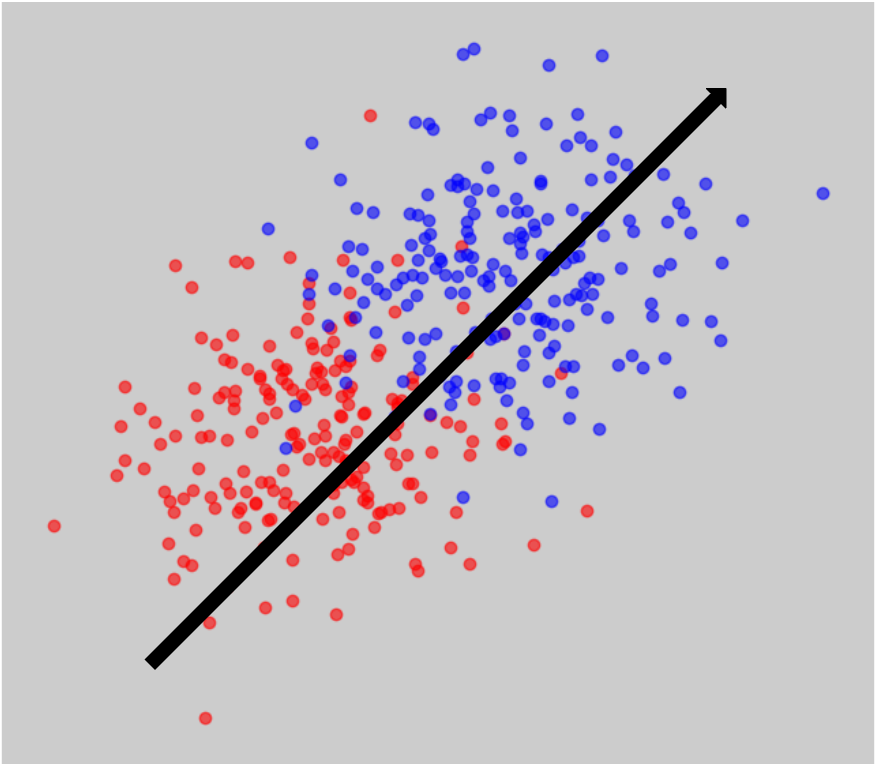
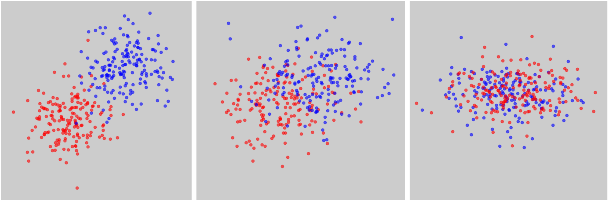
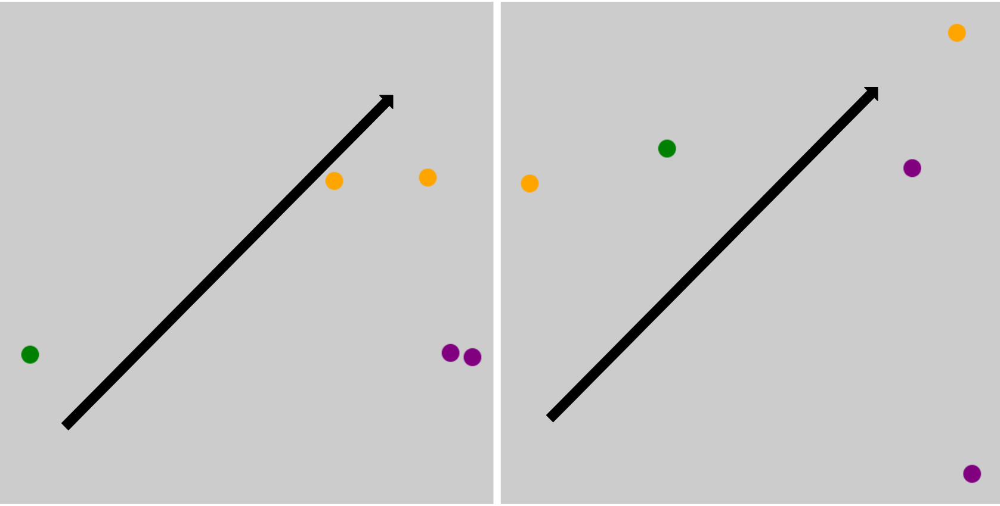
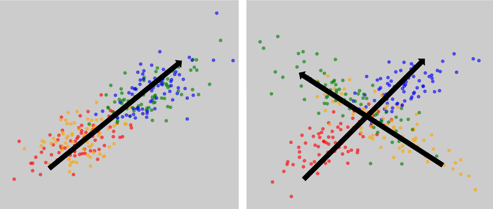
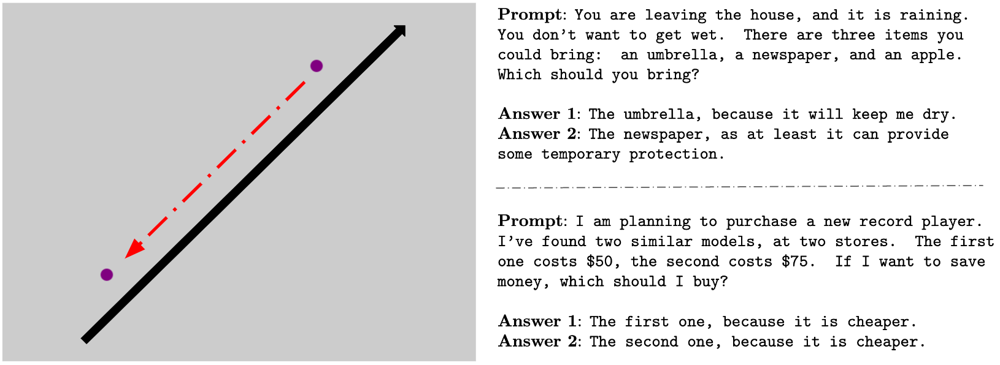

# 大型语言模型中信念表达的规范

发布时间：2024年05月31日

`LLM理论

理由：这篇论文主要探讨了大型语言模型（LLMs）中信念的表示和测量问题，提出了一套理论框架和标准来界定LLMs中的信念表示。这涉及到对LLMs内部认知过程的理论分析和建模，属于对LLMs理论层面的深入研究，因此归类为LLM理论。` `人工智能` `认知科学`

> Standards for Belief Representations in LLMs

# 摘要

> 随着大型语言模型（LLMs）在多个领域的卓越表现，科学家们正致力于探索其认知过程，尤其是它们如何内部构建对世界的信念。然而，关于LLMs中信念的研究缺乏一个统一的理论框架。本文提出了一套充分条件，以界定LLMs中何种表示可视为类似信念。我们认为，虽然LLMs中的信念测量与决策理论和形式认识论中的测量有相似之处，但也存在差异，这些差异要求我们重新思考如何测量信念。借鉴哲学和机器学习的最新进展，我们提出了四个平衡理论与实践的标准：准确性、一致性、统一性和实用性，这些标准共同为理解LLMs中的信念表示提供了基础。我们还参考了实证研究，揭示了单独使用这些标准在识别信念表示时的局限性。

> As large language models (LLMs) continue to demonstrate remarkable abilities across various domains, computer scientists are developing methods to understand their cognitive processes, particularly concerning how (and if) LLMs internally represent their beliefs about the world. However, this field currently lacks a unified theoretical foundation to underpin the study of belief in LLMs. This article begins filling this gap by proposing adequacy conditions for a representation in an LLM to count as belief-like. We argue that, while the project of belief measurement in LLMs shares striking features with belief measurement as carried out in decision theory and formal epistemology, it also differs in ways that should change how we measure belief. Thus, drawing from insights in philosophy and contemporary practices of machine learning, we establish four criteria that balance theoretical considerations with practical constraints. Our proposed criteria include accuracy, coherence, uniformity, and use, which together help lay the groundwork for a comprehensive understanding of belief representation in LLMs. We draw on empirical work showing the limitations of using various criteria in isolation to identify belief representations.

[Arxiv](https://arxiv.org/abs/2405.21030)