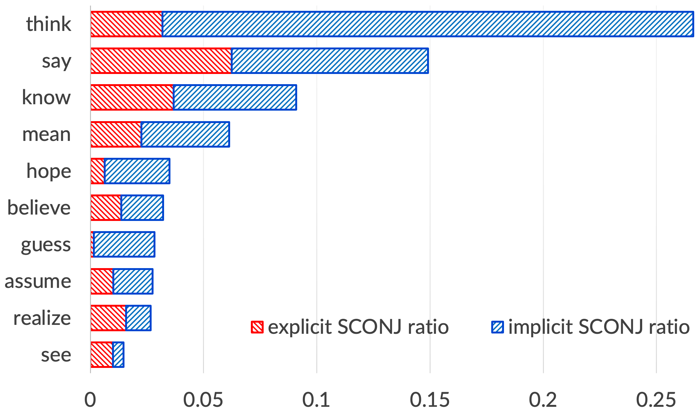
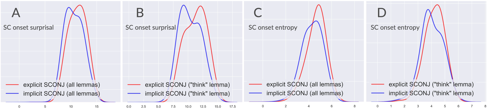
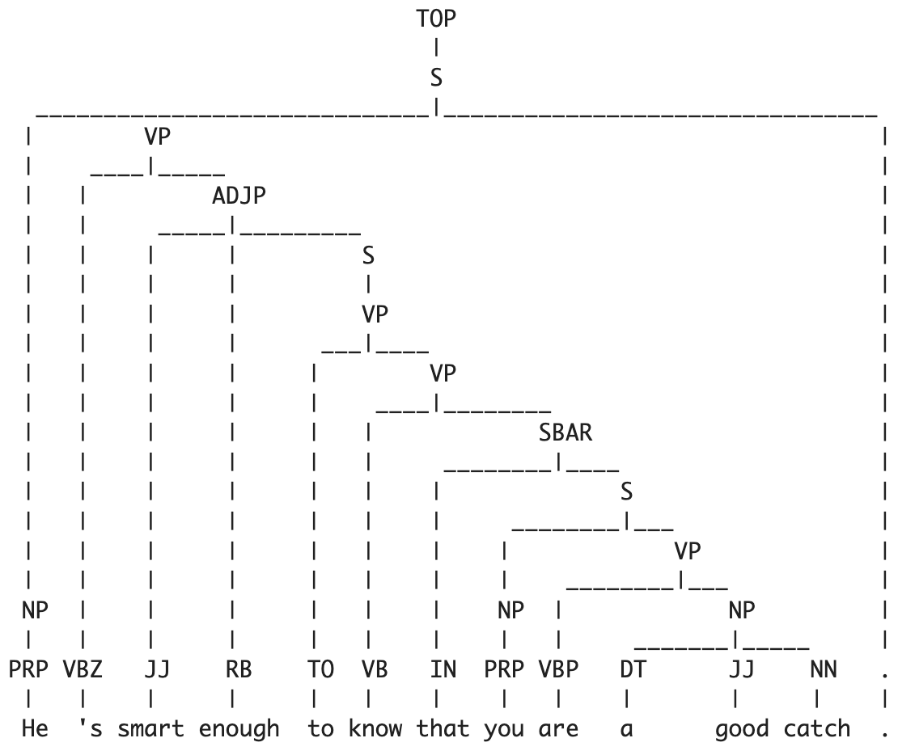
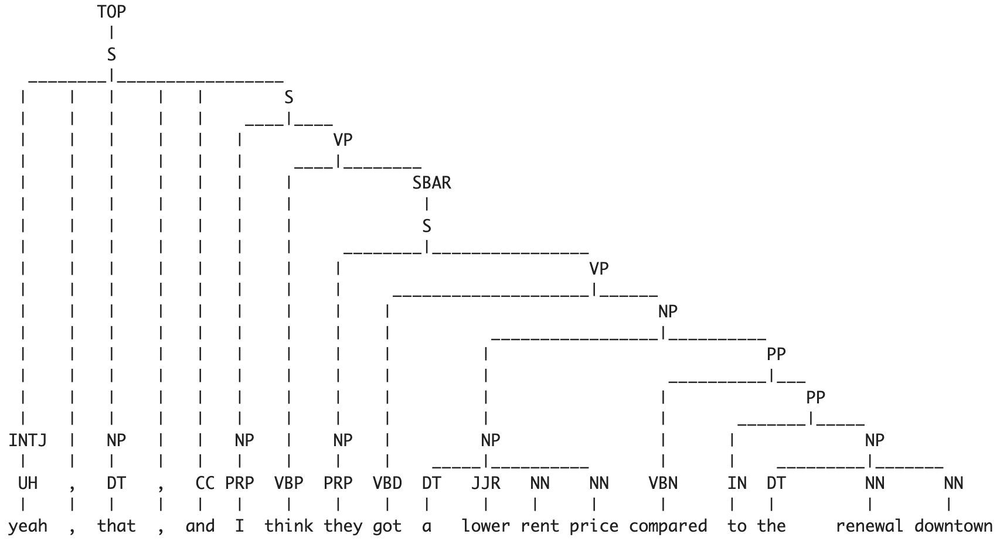

# 《“that”可省略：当代英语从句中“that”省略现象的现代探索》

发布时间：2024年05月31日

`LLM理论

理由：这篇论文探讨了统一信息密度（UID）假说及其在英语句子中“that”省略现象中的应用，同时利用大型语言模型（LLMs）和熵的概念来深化对信息均匀性的理解。这表明论文主要关注的是语言模型在理论层面的应用，特别是在理解和评估语法简化决策中的UID效应。因此，它属于LLM理论分类。` `语言学`

> That's Optional: A Contemporary Exploration of "that" Omission in English Subordinate Clauses

# 摘要

> 统一信息密度（UID）假说指出，说话者通过避免信息峰值，力求在交流中保持信息分布的均匀性。本文深入探讨了这一原则如何影响英语句子中“that”这一连接词的省略现象，并基于先前研究，扩大了研究范围至更广泛的书面英语语料库。同时，借助现代大型语言模型（LLMs），并引入熵的概念来深化对信息均匀性的理解，以更精确地评估语法简化决策中的UID效应。

> The Uniform Information Density (UID) hypothesis posits that speakers optimize the communicative properties of their utterances by avoiding spikes in information, thereby maintaining a relatively uniform information profile over time. This paper investigates the impact of UID principles on syntactic reduction, specifically focusing on the optional omission of the connector "that" in English subordinate clauses. Building upon previous research, we extend our investigation to a larger corpus of written English, utilize contemporary large language models (LLMs) and extend the information-uniformity principles by the notion of entropy, to estimate the UID manifestations in the usecase of syntactic reduction choices.

[Arxiv](https://arxiv.org/abs/2405.20833)