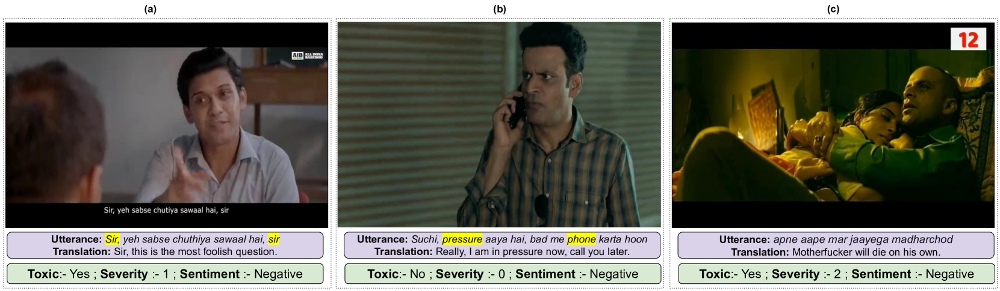
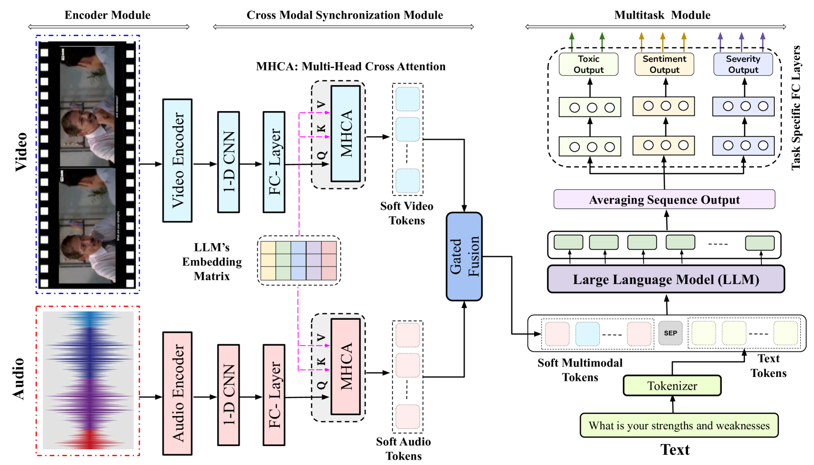
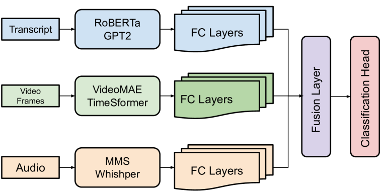
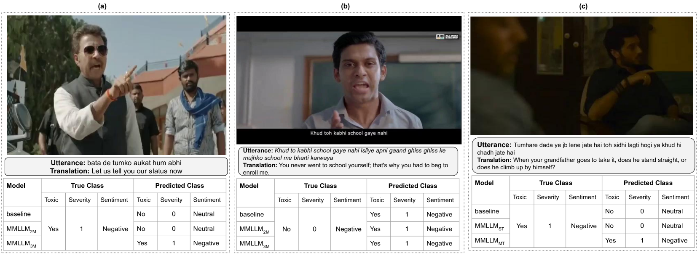

# ToxVidLLM：一款基于多模态LLM的框架，专为识别混合代码视频中的毒性而设计

发布时间：2024年05月31日

`LLM应用

这篇论文介绍了一个利用大型语言模型（LLM）进行视频内容有害性检测的框架ToxVidLLM，并针对印地语-英语混合语音片段进行了详细的研究。该框架不仅检测有害内容，还同时进行情感和严重性分析，显示了LLM在多模态内容分析中的应用潜力。因此，这篇论文属于LLM应用类别。` `视频内容安全` `多模态分析`

> ToxVidLLM: A Multimodal LLM-based Framework for Toxicity Detection in Code-Mixed Videos

# 摘要

> 在互联网技术飞速发展的今天，视频等多模态内容的激增极大地丰富了在线交流的形式。然而，在资源匮乏的混合代码语言环境中检测有害内容，仍是一大挑战。尽管文本数据中的有害内容检测已有深入研究，但视频内容，尤其是非英语视频，研究相对较少。本文首次推出一个包含931个YouTube视频和4021个印地语-英语混合语音片段的基准数据集，每个片段均详细标注了有害性、严重性和情感信息。我们构建了一个先进的多元多任务框架ToxVidLLM，利用大型语言模型进行视频内容的有害性检测，并同时进行情感和严重性分析。该框架包含编码器、跨模态同步和多任务三大模块，专为复杂的视频分类任务定制。实验结果显示，通过整合视频中的多种模态信息，有害内容检测的准确率和加权F1分数分别达到了94.29%和94.35%。

> In an era of rapidly evolving internet technology, the surge in multimodal content, including videos, has expanded the horizons of online communication. However, the detection of toxic content in this diverse landscape, particularly in low-resource code-mixed languages, remains a critical challenge. While substantial research has addressed toxic content detection in textual data, the realm of video content, especially in non-English languages, has been relatively underexplored. This paper addresses this research gap by introducing a benchmark dataset, the first of its kind, consisting of 931 videos with 4021 code-mixed Hindi-English utterances collected from YouTube. Each utterance within this dataset has been meticulously annotated for toxicity, severity, and sentiment labels. We have developed an advanced Multimodal Multitask framework built for Toxicity detection in Video Content by leveraging Large Language Models (LLMs), crafted for the primary objective along with the additional tasks of conducting sentiment and severity analysis. ToxVidLLM incorporates three key modules the Encoder module, Cross-Modal Synchronization module, and Multitask module crafting a generic multimodal LLM customized for intricate video classification tasks. Our experiments reveal that incorporating multiple modalities from the videos substantially enhances the performance of toxic content detection by achieving an Accuracy and Weighted F1 score of 94.29% and 94.35%, respectively.

[Arxiv](https://arxiv.org/abs/2405.20628)