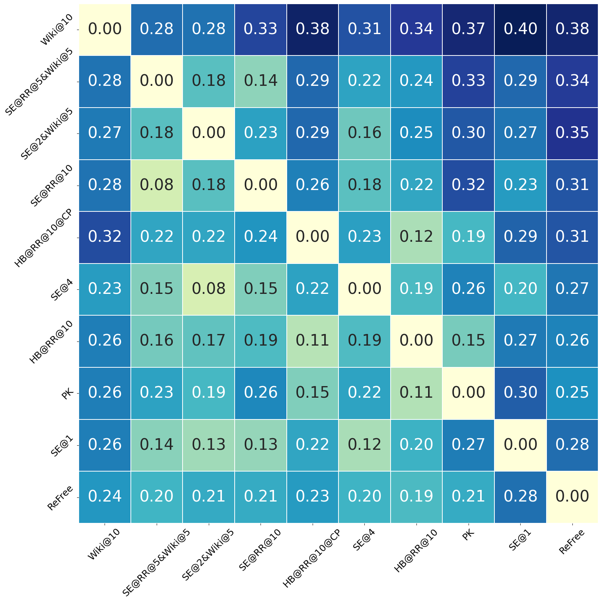
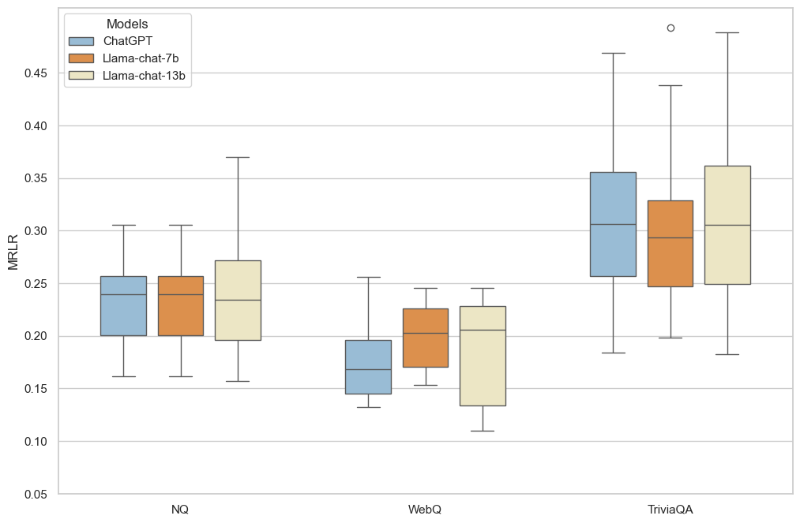
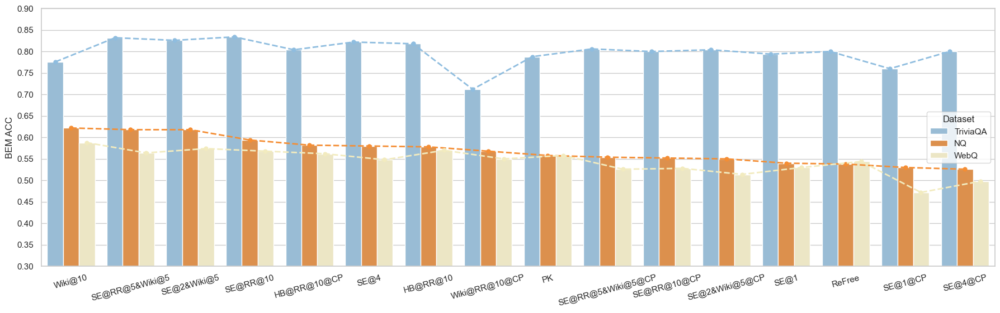
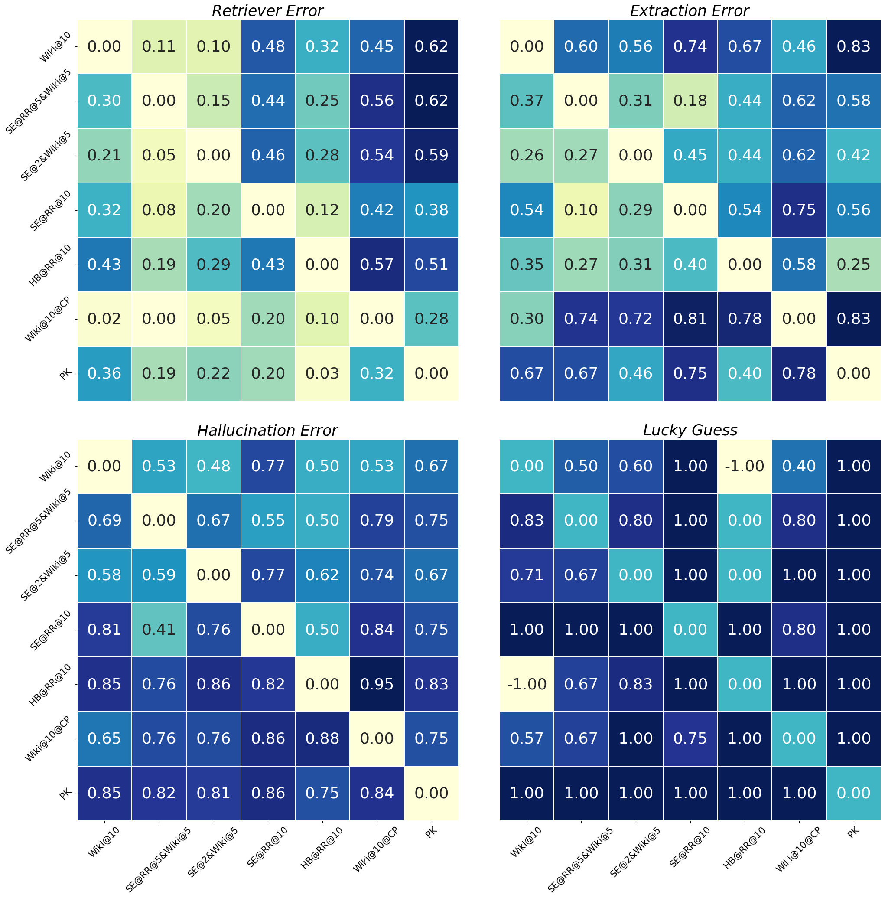
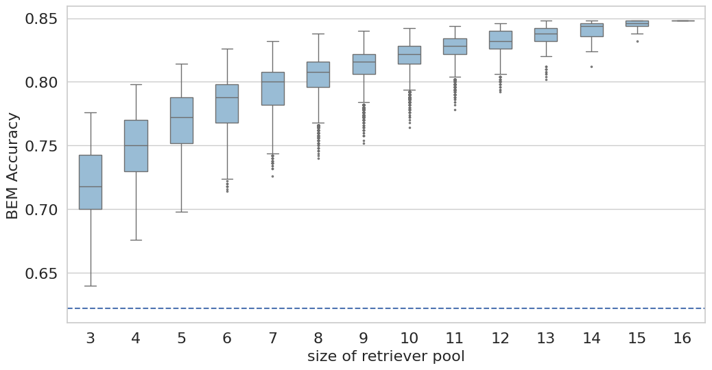
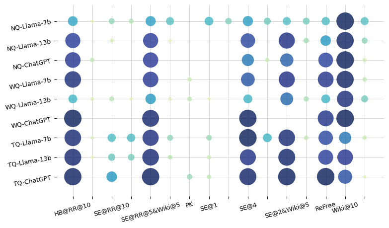
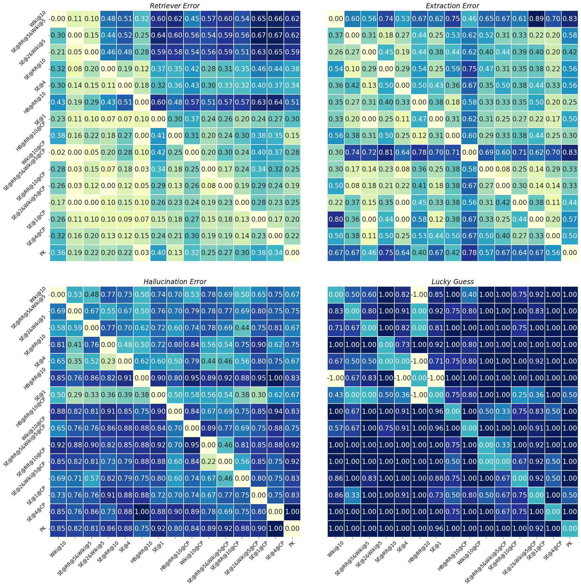
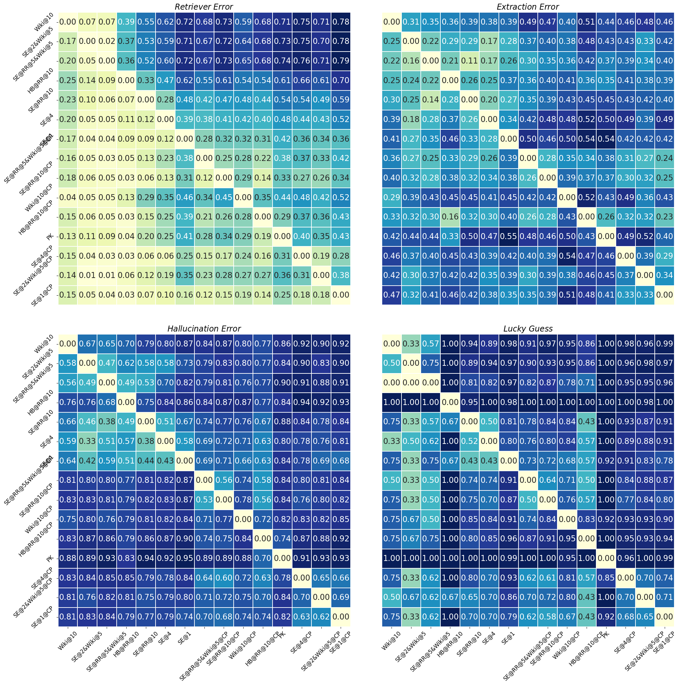
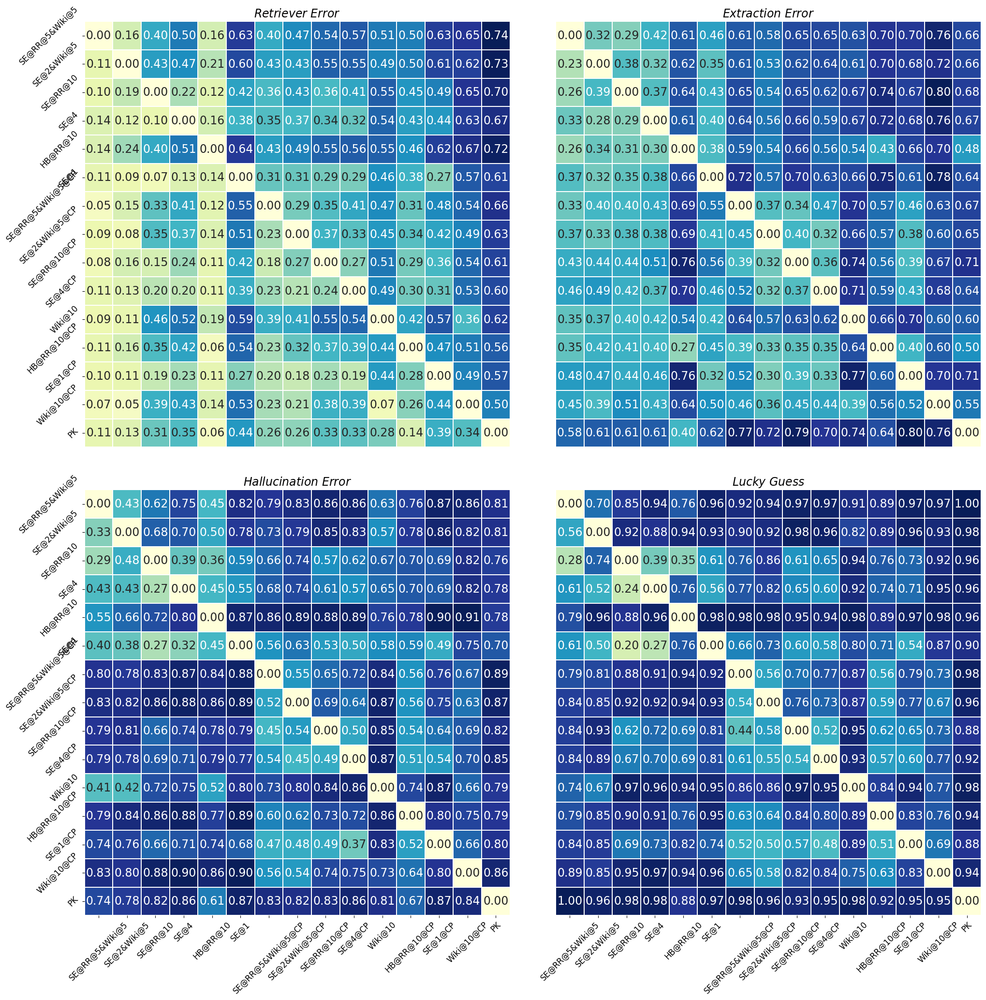

# 探究与解决大型语言模型中检索增强机制的检索器不一致问题

发布时间：2024年05月31日

`RAG

理由：这篇论文主要探讨了检索增强的大型语言模型（RALMs）的性能问题，并提出了一个名为检索器集成（EoR）的新框架来解决这些问题。这涉及到检索机制的改进和优化，因此属于RAG分类，即与检索增强生成（Retrieval-Augmented Generation）相关的研究。` `问答系统` `知识管理`

> Unraveling and Mitigating Retriever Inconsistencies in Retrieval-Augmented Large Language Models

# 摘要

> 检索增强的大型语言模型（RALMs）虽然在事实性上表现出色，但并未始终超越无检索的语言模型（LMs）。实验发现，这种性能上的不一致不仅存在于有无检索的模型之间，也横跨不同的检索机制。为了探究这一现象，我们深入分析了RALMs的退化行为，并将其理论分解为四个层面。进一步的研究揭示，知识源的本质差异及阅读模型的不可预测退化是导致不一致的主因。基于此，我们提出了检索器集成（EoR）框架，该框架能灵活地从多源知识中检索，并有效降低阅读错误的不确定性。在开放域问答任务中，EoR显著提升了性能，通过减少不一致行为，超越了仅依赖单一检索器的RALM。

> Although Retrieval-Augmented Large Language Models (RALMs) demonstrate their superiority in terms of factuality, they do not consistently outperform the original retrieval-free Language Models (LMs). Our experiments reveal that this example-level performance inconsistency exists not only between retrieval-augmented and retrieval-free LM but also among different retrievers. To understand this phenomenon, we investigate the degeneration behavior of RALMs and theoretically decompose it into four categories. Further analysis based on our decomposition reveals that the innate difference in knowledge sources and the unpredictable degeneration of the reader model contribute most to the inconsistency. Drawing from our analysis, we introduce Ensemble of Retrievers (EoR), a trainable framework that can adaptively retrieve from different knowledge sources and effectively decrease unpredictable reader errors. Our experiments on Open Domain Question Answering show that EoR substantially improves performance over the RALM with a single retriever by considerably reducing inconsistent behaviors.

[Arxiv](https://arxiv.org/abs/2405.20680)