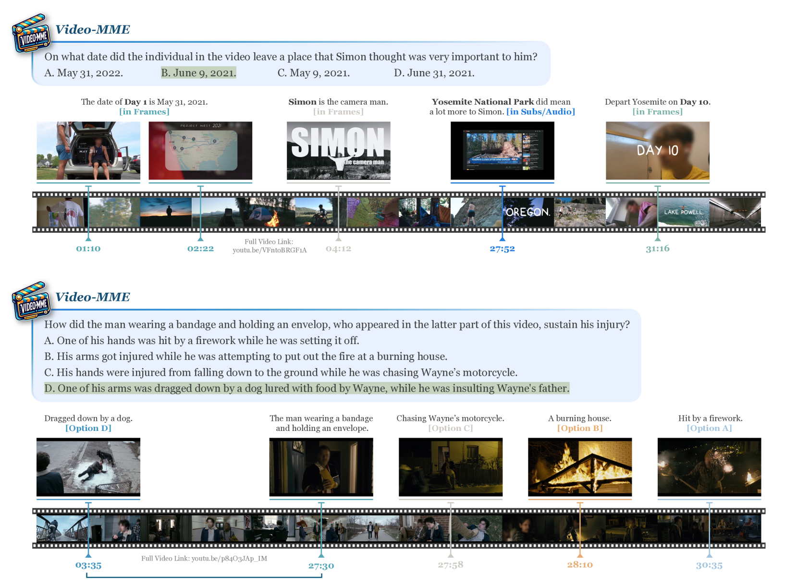

# 视频-MME：开创性全面评估多模态LLMs在视频分析领域的基准

发布时间：2024年05月31日

`LLM应用

理由：这篇论文主要介绍了Video-MME，一个针对视频分析的多模态大型语言模型（MLLMs）的评估基准。它专注于评估MLLMs在处理连续视觉数据方面的性能，包括视频、字幕和音频等多模态输入。这表明论文的重点是应用层面的评估和改进，而不是理论研究或Agent的设计与实现，也不是关于检索增强生成（RAG）的讨论。因此，最合适的分类是LLM应用。` `视频分析` `人工智能评估`

> Video-MME: The First-Ever Comprehensive Evaluation Benchmark of Multi-modal LLMs in Video Analysis

# 摘要

> 在探索通用人工智能的道路上，多模态大型语言模型（MLLMs）已成为研究的热点。尽管目前主要集中在静态图像理解能力的提升上，但MLLMs在处理连续视觉数据方面的潜力仍未被充分挖掘，这揭示了对其性能进行全面、高质量评估的迫切需求。为此，我们推出了Video-MME，这是首个针对视频分析的MLLMs全谱多模态评估基准，具有四大特色：1) 视频类型的广泛覆盖，涉及6大视觉领域及30个子领域，确保了场景的普遍适用性；2) 时间跨度的全面性，涵盖了从11秒到1小时的短、中、长期视频，以捕捉丰富的上下文动态；3) 数据模态的多样性，除了视频帧，还整合了字幕和音频等多模态输入，全面展现MLLMs的能力；4) 标注的高质量，通过专家的手动标注，确保了模型评估的精确性和可靠性。我们精心挑选并标注了900个视频，总时长达256小时，生成了2,700个问答对。通过Video-MME，我们评估了包括GPT-4系列和Gemini 1.5 Pro在内的顶尖MLLMs，以及开源模型如InternVL-Chat-V1.5和LLaVA-NeXT-Video。实验表明，Gemini 1.5 Pro在商业模型中表现最佳，远超开源模型。我们的研究强调了在处理长序列和多模态数据方面，MLLMs仍有提升空间。项目详情请访问：https://video-mme.github.io

> In the quest for artificial general intelligence, Multi-modal Large Language Models (MLLMs) have emerged as a focal point in recent advancements. However, the predominant focus remains on developing their capabilities in static image understanding. The potential of MLLMs in processing sequential visual data is still insufficiently explored, highlighting the absence of a comprehensive, high-quality assessment of their performance. In this paper, we introduce Video-MME, the first-ever full-spectrum, Multi-Modal Evaluation benchmark of MLLMs in Video analysis. Our work distinguishes from existing benchmarks through four key features: 1) Diversity in video types, spanning 6 primary visual domains with 30 subfields to ensure broad scenario generalizability; 2) Duration in temporal dimension, encompassing both short-, medium-, and long-term videos, ranging from 11 seconds to 1 hour, for robust contextual dynamics; 3) Breadth in data modalities, integrating multi-modal inputs besides video frames, including subtitles and audios, to unveil the all-round capabilities of MLLMs; 4) Quality in annotations, utilizing rigorous manual labeling by expert annotators to facilitate precise and reliable model assessment. 900 videos with a total of 256 hours are manually selected and annotated by repeatedly viewing all the video content, resulting in 2,700 question-answer pairs. With Video-MME, we extensively evaluate various state-of-the-art MLLMs, including GPT-4 series and Gemini 1.5 Pro, as well as open-source image models like InternVL-Chat-V1.5 and video models like LLaVA-NeXT-Video. Our experiments reveal that Gemini 1.5 Pro is the best-performing commercial model, significantly outperforming the open-source models. Our dataset along with these findings underscores the need for further improvements in handling longer sequences and multi-modal data. Project Page: https://video-mme.github.io

[Arxiv](https://arxiv.org/abs/2405.21075)