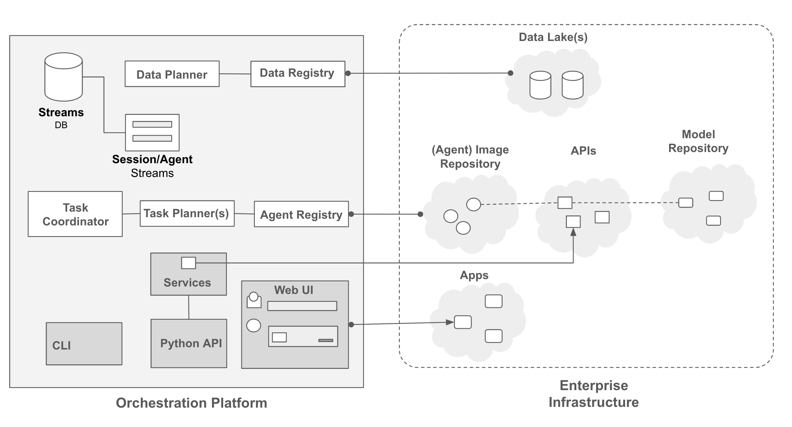
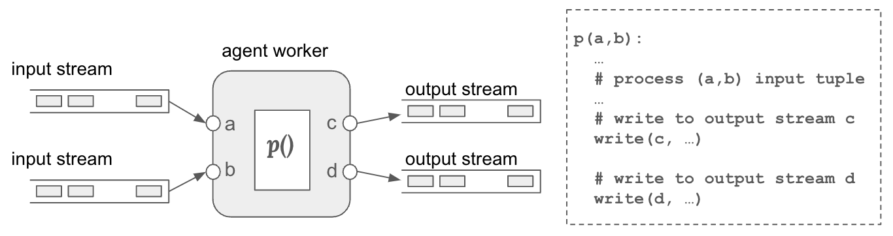
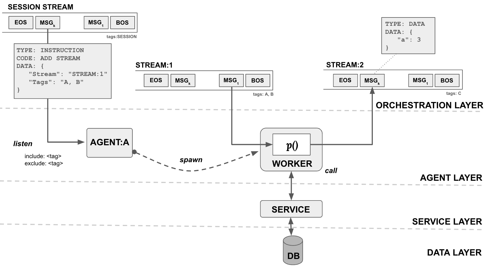

# 企业复合AI系统架构蓝图

发布时间：2024年06月01日

`Agent

这篇论文主要讨论了构建一个复合AI系统的架构蓝图，该系统整合了大型语言模型（LLMs）和其他组件如模型、检索器、数据库和工具，以形成一个企业级的复合AI系统。该系统的核心是“流”协调理念，确保数据和指令在各个代理和组件之间流畅传递。这种架构设计强调了代理（Agent）在系统中的作用，即代理负责处理和传递数据与指令，以及根据生产需求优化任务和数据的分配。因此，这篇论文更适合归类为Agent。` `企业软件` `人工智能`

> A Blueprint Architecture of Compound AI Systems for Enterprise

# 摘要

> 大型语言模型（LLMs）已超越传统NLP挑战，为实际应用开辟新机遇。为此，我们正转向构建复合AI系统，将LLMs融入包含多组件（如模型、检索器、数据库和工具）的广泛软件基础设施。本文提出了一种企业级复合AI系统的架构蓝图，旨在高效且可行地整合现有计算与数据资源。该架构以“流”为核心协调理念，确保数据与指令在各代理及组件间流畅传递。任务与数据规划者则根据生产需求（如准确性与延迟），将任务与数据优化分配至注册表中指定的代理与数据源。

> Large Language Models (LLMs) have showcased remarkable capabilities surpassing conventional NLP challenges, creating opportunities for use in production use cases. Towards this goal, there is a notable shift to building compound AI systems, wherein LLMs are integrated into an expansive software infrastructure with many components like models, retrievers, databases and tools. In this paper, we introduce a blueprint architecture for compound AI systems to operate in enterprise settings cost-effectively and feasibly. Our proposed architecture aims for seamless integration with existing compute and data infrastructure, with ``stream'' serving as the key orchestration concept to coordinate data and instructions among agents and other components. Task and data planners, respectively, break down, map, and optimize tasks and data to available agents and data sources defined in respective registries, given production constraints such as accuracy and latency.

[Arxiv](https://arxiv.org/abs/2406.00584)