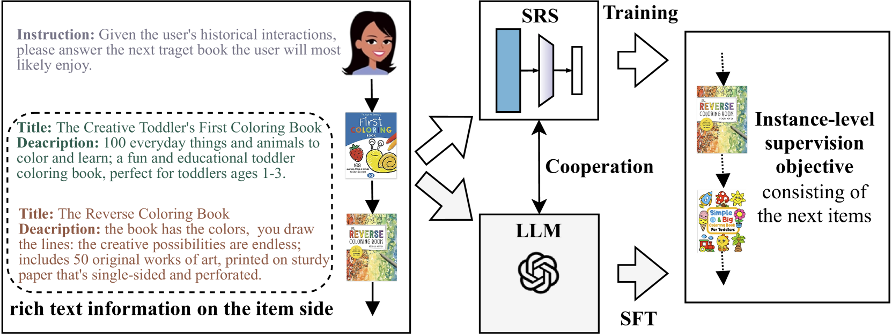
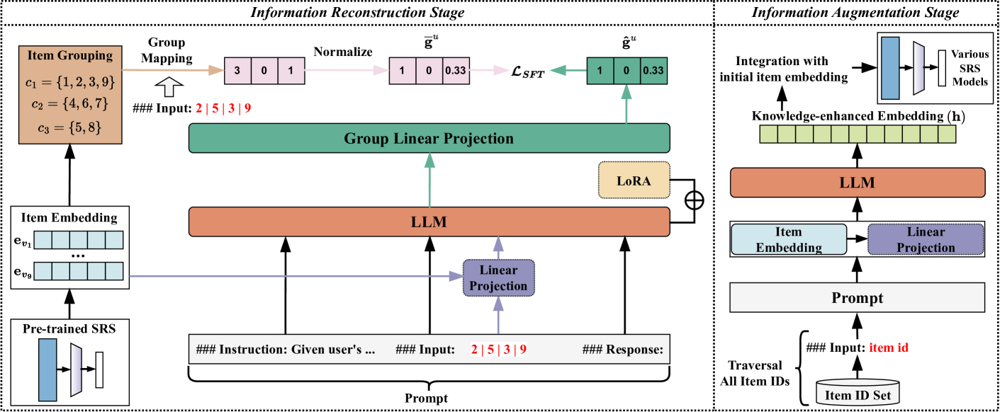
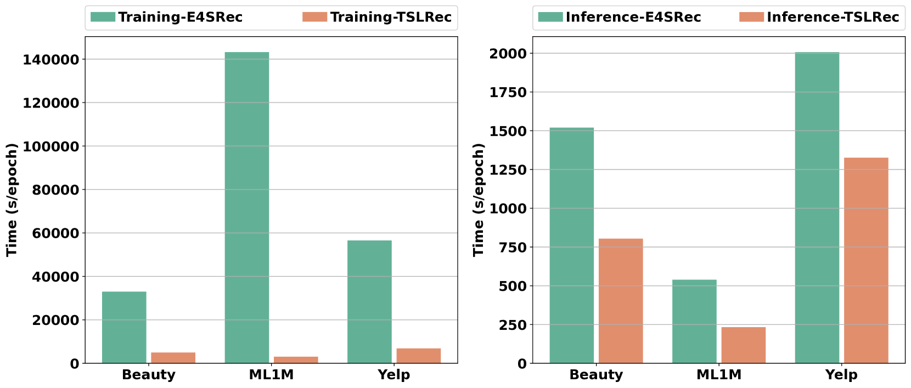
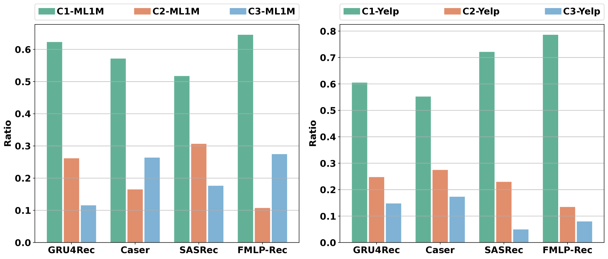

# 一种便于实践的两阶段大型语言模型增强序列推荐模式

发布时间：2024年06月01日

`LLM应用

这篇论文主要探讨了如何利用大型语言模型（LLM）来增强序列推荐系统（SRS）的实用性。通过提出一种新颖的两阶段LLM增强范式（TSLRec），该研究在信息重建阶段利用预训练SRS模型进行用户级监督微调（SFT），并在信息增强阶段生成结合协作信息和推理能力的增强嵌入。这种方法旨在提高SRS的效率和实用性，尤其是在文本信息有限的情况下。因此，这篇论文属于LLM应用类别，因为它展示了LLM在实际推荐系统中的应用和改进。` `推荐系统` `用户行为分析`

> A Practice-Friendly Two-Stage LLM-Enhanced Paradigm in Sequential Recommendation

# 摘要

> 大型语言模型（LLM）的集成训练范式正逐步改变序列推荐系统（SRS），并展现出潜力。但现有方法多依赖于物品侧的丰富文本信息和实例级监督微调（SFT），这在实际应用中效率不高且受限。为此，本文提出了一种新颖的两阶段LLM增强范式（TSLRec），旨在提升SRS的实用性。在信息重建阶段，我们利用预训练SRS模型，设计了用户级SFT任务，更高效地注入协作信息，即使文本信息有限。我们让LLM推断物品的潜在类别，并重建用户基于交互序列的类别偏好分布。在信息增强阶段，LLM为每个物品生成结合协作信息和推理能力的增强嵌入，这些嵌入将助力未来SRS模型的训练。最终，我们在三个SRS基准数据集上验证了TSLRec的有效性与效率。

> The training paradigm integrating large language models (LLM) is gradually reshaping sequential recommender systems (SRS) and has shown promising results. However, most existing LLM-enhanced methods rely on rich textual information on the item side and instance-level supervised fine-tuning (SFT) to inject collaborative information into LLM, which is inefficient and limited in many applications. To alleviate these problems, this paper proposes a novel practice-friendly two-stage LLM-enhanced paradigm (TSLRec) for SRS. Specifically, in the information reconstruction stage, we design a new user-level SFT task for collaborative information injection with the assistance of a pre-trained SRS model, which is more efficient and compatible with limited text information. We aim to let LLM try to infer the latent category of each item and reconstruct the corresponding user's preference distribution for all categories from the user's interaction sequence. In the information augmentation stage, we feed each item into LLM to obtain a set of enhanced embeddings that combine collaborative information and LLM inference capabilities. These embeddings can then be used to help train various future SRS models. Finally, we verify the effectiveness and efficiency of our TSLRec on three SRS benchmark datasets.

[Arxiv](https://arxiv.org/abs/2406.00333)