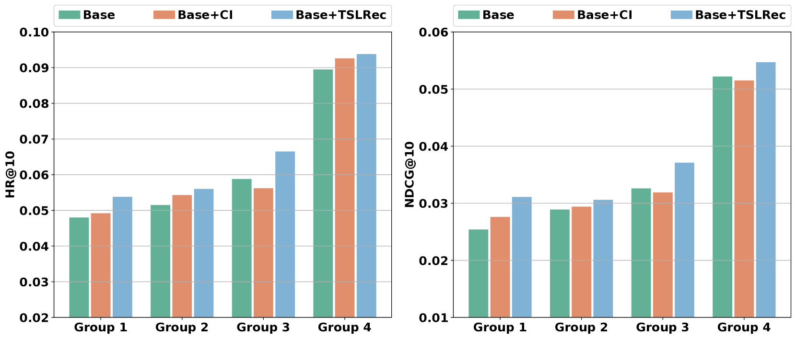

# 实践友好的两阶段 LLM 增强序列推荐范式

发布时间：2024年06月01日

`LLM应用

这篇论文主要探讨了如何通过两阶段的方法（TSLRec）来增强序列推荐系统（SRS）的性能，利用大型语言模型（LLM）的能力来优化推荐系统的实践体验。这种方法涉及在信息重建阶段使用用户级监督微调（SFT）任务，以及在信息增强阶段生成融合协作信息与LLM推理能力的增强嵌入。这些操作都是针对LLM在实际应用中的使用，特别是在推荐系统领域的应用，因此属于LLM应用类别。` `推荐系统` `电子商务`

> A Practice-Friendly Two-Stage LLM-Enhanced Paradigm in Sequential Recommendation

# 摘要

> 大型语言模型（LLM）的集成训练范式正逐步革新序列推荐系统（SRS），并已初露锋芒。但多数LLM增强方法仍依赖于物品侧的丰富文本信息和实例级监督微调（SFT），以注入协作信息，这在多场景下显得力不从心。为此，本文创新性地提出了一种两阶段LLM增强范式（TSLRec），旨在优化SRS的实践体验。首先，在信息重建阶段，我们借助预训练的SRS模型，设计了一种用户级SFT任务，以更高效且兼容有限文本信息的方式注入协作信息。我们的目标是让LLM洞察每个物品的潜在类别，并基于用户的交互序列，重构其对各类别的偏好分布。随后，在信息增强阶段，我们将物品输入LLM，生成融合协作信息与LLM推理能力的增强嵌入，这些嵌入将成为未来SRS模型训练的助力。最终，我们在三个SRS基准数据集上验证了TSLRec的卓越效能与效率。

> The training paradigm integrating large language models (LLM) is gradually reshaping sequential recommender systems (SRS) and has shown promising results. However, most existing LLM-enhanced methods rely on rich textual information on the item side and instance-level supervised fine-tuning (SFT) to inject collaborative information into LLM, which is inefficient and limited in many applications. To alleviate these problems, this paper proposes a novel practice-friendly two-stage LLM-enhanced paradigm (TSLRec) for SRS. Specifically, in the information reconstruction stage, we design a new user-level SFT task for collaborative information injection with the assistance of a pre-trained SRS model, which is more efficient and compatible with limited text information. We aim to let LLM try to infer the latent category of each item and reconstruct the corresponding user's preference distribution for all categories from the user's interaction sequence. In the information augmentation stage, we feed each item into LLM to obtain a set of enhanced embeddings that combine collaborative information and LLM inference capabilities. These embeddings can then be used to help train various future SRS models. Finally, we verify the effectiveness and efficiency of our TSLRec on three SRS benchmark datasets.

[Arxiv](https://arxiv.org/abs/2406.00333)