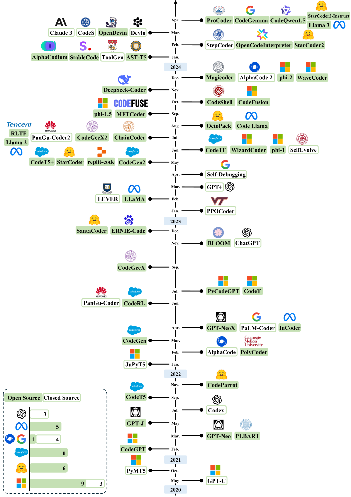
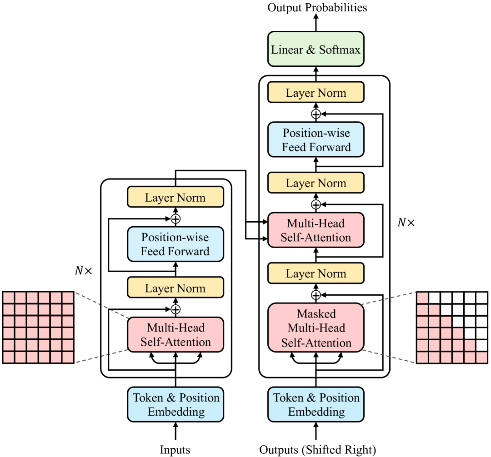
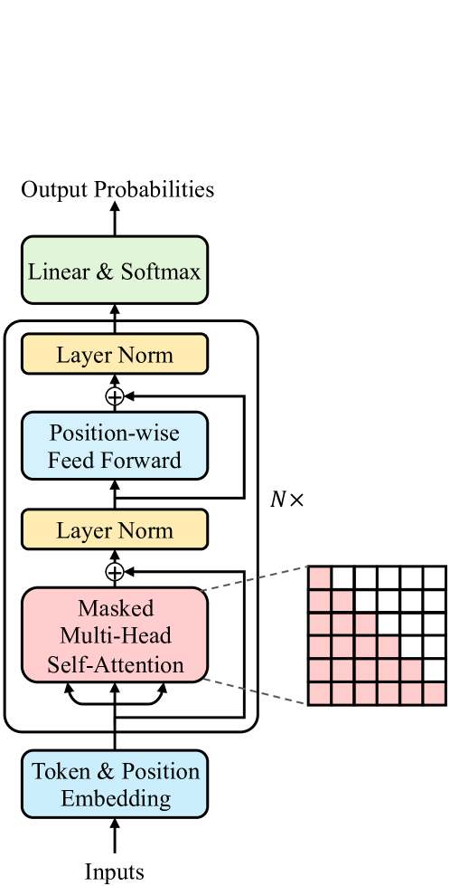
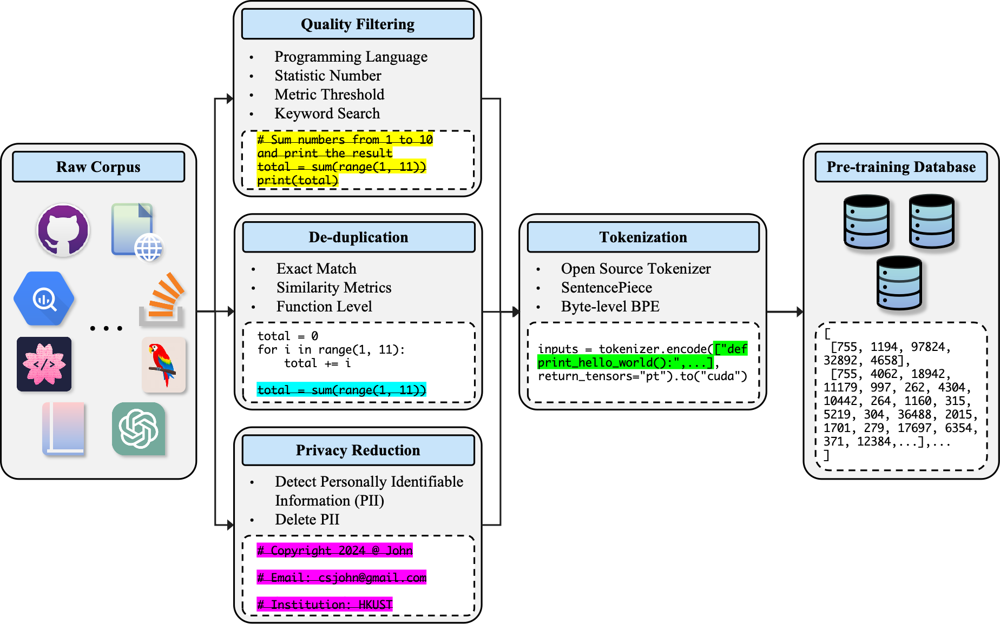
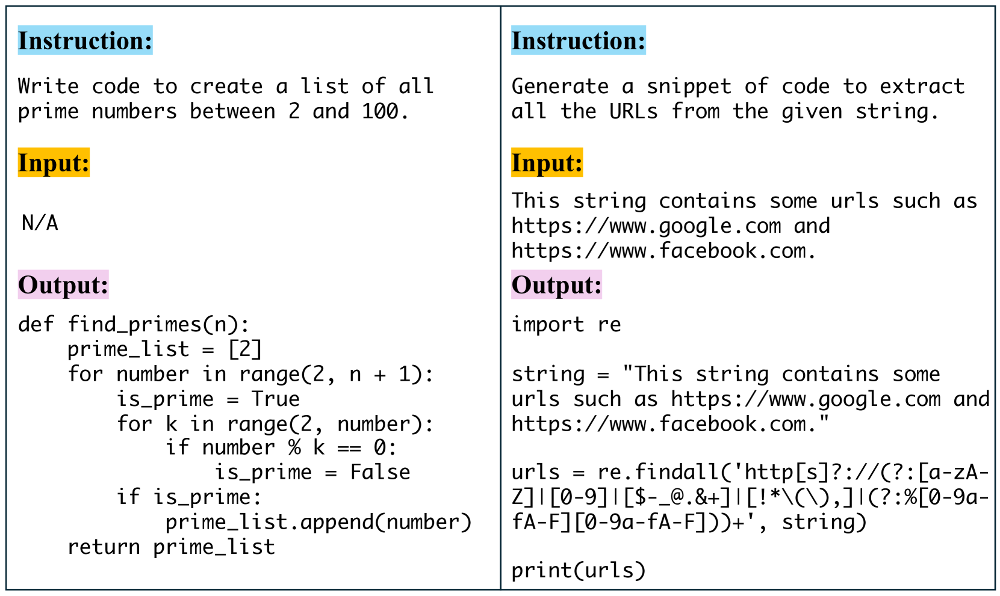
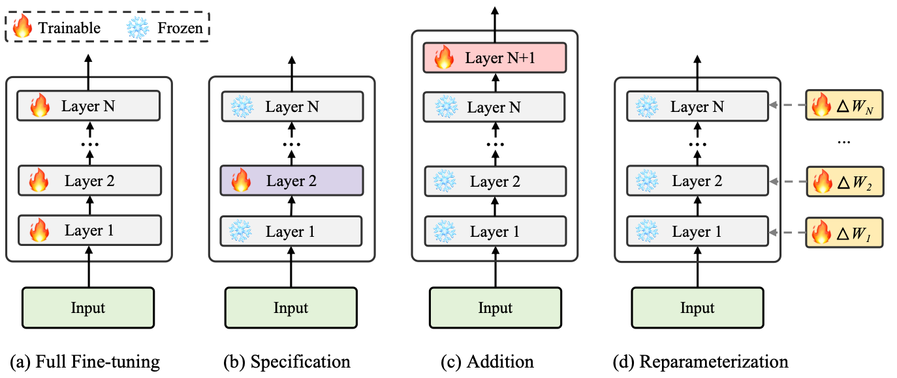
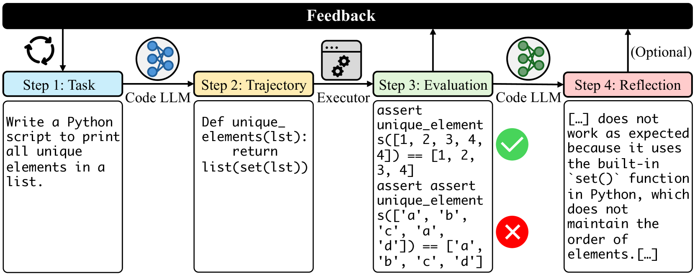
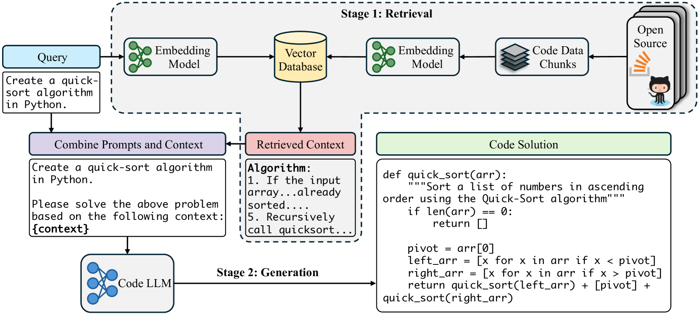
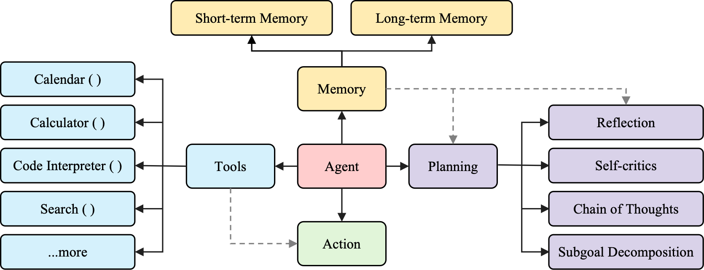

# 大型语言模型在代码生成领域的综述

发布时间：2024年06月01日

`LLM应用

理由：这篇论文摘要主要讨论了大型语言模型（LLMs）在代码生成领域的应用，包括其在软件开发中的实际应用（如GitHub Copilot），以及相关的技术进步和性能评估。此外，论文还提供了一个系统性的文献回顾，旨在为研究者提供参考，并探讨了学术研究与实际开发之间的挑战与机遇。这些内容都直接关联到LLMs的具体应用，而非理论研究或Agent、RAG相关的研究，因此最合适的分类是LLM应用。` `软件开发` `人工智能`

> A Survey on Large Language Models for Code Generation

# 摘要

> 大型语言模型（LLMs）在代码生成等多样化代码相关任务中展现出卓越能力，尤其能从自然语言描述中生成源代码，这一领域因其在软件开发中的实际应用（如GitHub Copilot）而备受瞩目。尽管LLMs在代码任务上的应用研究蓬勃发展，但目前尚缺一份全面且及时的文献综述，专注于LLMs在代码生成上的应用。本综述旨在填补此空白，提供系统性的文献回顾，为探索LLMs代码生成前沿的研究者提供重要参考。我们通过分类法梳理并讨论了LLMs在代码生成领域的最新进展，涉及数据整理、技术进步、性能评估及实际应用等多个方面。同时，我们回顾了LLMs在代码生成技术上的发展历程，并利用HumanEval和MBPP等权威基准进行实证分析，凸显LLMs在代码生成能力上的持续提升。我们探讨了学术研究与实际开发之间的关键挑战与机遇，并创建了专门的资源网站（https://codellm.github.io），以持续更新并分享该领域的最新动态。

> Large Language Models (LLMs) have garnered remarkable advancements across diverse code-related tasks, known as Code LLMs, particularly in code generation that generates source code with LLM from natural language descriptions. This burgeoning field has captured significant interest from both academic researchers and industry professionals due to its practical significance in software development, e.g., GitHub Copilot. Despite the active exploration of LLMs for a variety of code tasks, either from the perspective of natural language processing (NLP) or software engineering (SE) or both, there is a noticeable absence of a comprehensive and up-to-date literature review dedicated to LLM for code generation. In this survey, we aim to bridge this gap by providing a systematic literature review that serves as a valuable reference for researchers investigating the cutting-edge progress in LLMs for code generation. We introduce a taxonomy to categorize and discuss the recent developments in LLMs for code generation, covering aspects such as data curation, latest advances, performance evaluation, and real-world applications. In addition, we present a historical overview of the evolution of LLMs for code generation and offer an empirical comparison using the widely recognized HumanEval and MBPP benchmarks to highlight the progressive enhancements in LLM capabilities for code generation. We identify critical challenges and promising opportunities regarding the gap between academia and practical development. Furthermore, we have established a dedicated resource website (https://codellm.github.io) to continuously document and disseminate the most recent advances in the field.

[Arxiv](https://arxiv.org/abs/2406.00515)