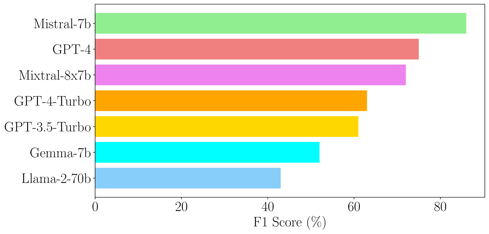
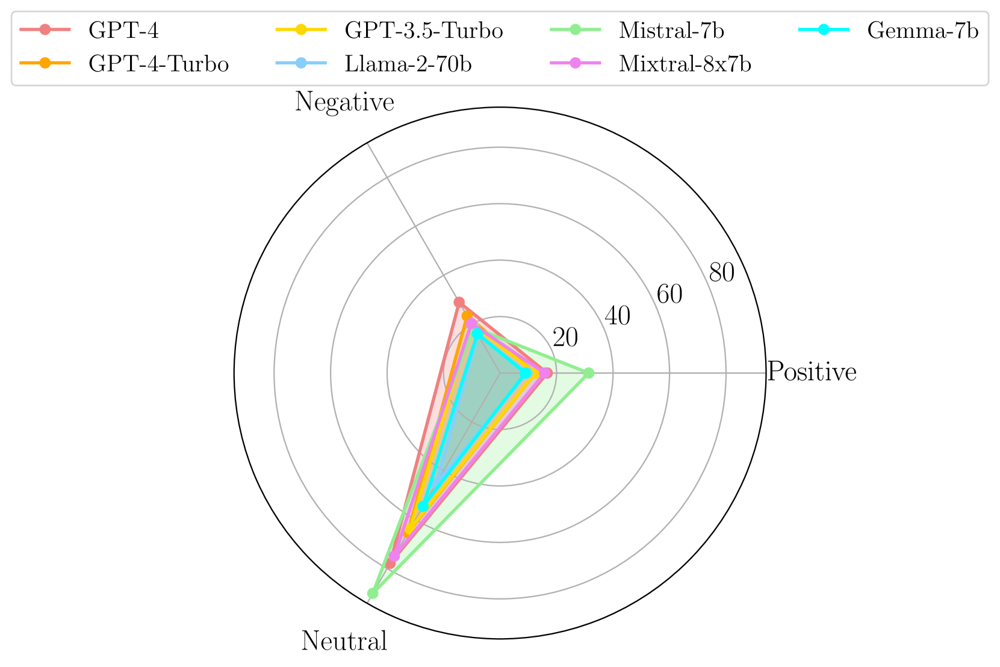
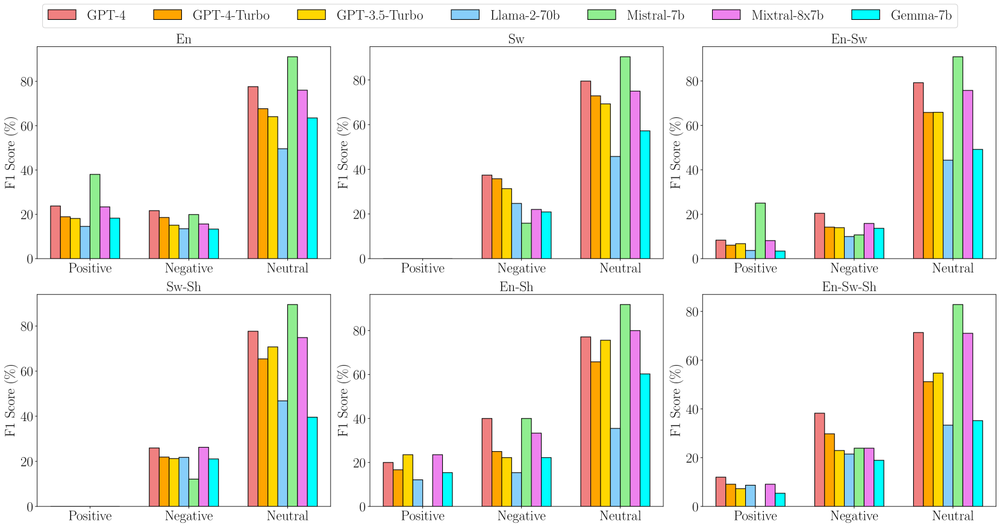

# 深入文化细腻与资源稀缺的真实世界：探索大型语言模型之效能

发布时间：2024年06月01日

`LLM应用

这篇论文主要探讨了大型语言模型（LLMs）在多语言和代码混合通信环境中的应用，特别是在一个包含斯瓦希里语、英语和Sheng语的多语言WhatsApp聊天数据集上的情感分析评估。研究不仅关注了模型的性能指标如F1分数，还分析了模型对其预测的解释能力，即定性分析。这表明论文的重点在于LLMs的实际应用和性能评估，特别是在多语言环境下的应用，因此属于LLM应用分类。` `社交媒体分析` `情感分析`

> Beyond Metrics: Evaluating LLMs' Effectiveness in Culturally Nuanced, Low-Resource Real-World Scenarios

# 摘要

> 大型语言模型（LLMs）在实际应用中既带来机遇也带来挑战，尤其是在多语言和代码混合的通信环境中。本研究针对七种领先的LLMs，在包含斯瓦希里语、英语和Sheng语的多语言WhatsApp聊天数据集上进行了情感分析评估。评估不仅包括F1分数等定量指标，还涉及LLMs对其预测的解释的定性分析。研究发现，尽管Mistral-7b和Mixtral-8x7b的F1分数较高，但它们与GPT-3.5-Turbo、Llama-2-70b、Gemma-7b等模型在理解语言和上下文细微差别方面存在挑战，且决策过程缺乏透明度。相反，GPT-4和GPT-4-Turbo在处理多样语言输入和上下文信息方面表现卓越，决策过程与人类一致且透明。然而，LLMs在非英语环境中融入文化细微差别时遇到困难，GPT-4的表现不一致。这些发现凸显了持续改进LLMs以应对文化细微差别的低资源现实世界挑战的必要性。

> The deployment of Large Language Models (LLMs) in real-world applications presents both opportunities and challenges, particularly in multilingual and code-mixed communication settings. This research evaluates the performance of seven leading LLMs in sentiment analysis on a dataset derived from multilingual and code-mixed WhatsApp chats, including Swahili, English and Sheng. Our evaluation includes both quantitative analysis using metrics like F1 score and qualitative assessment of LLMs' explanations for their predictions. We find that, while Mistral-7b and Mixtral-8x7b achieved high F1 scores, they and other LLMs such as GPT-3.5-Turbo, Llama-2-70b, and Gemma-7b struggled with understanding linguistic and contextual nuances, as well as lack of transparency in their decision-making process as observed from their explanations. In contrast, GPT-4 and GPT-4-Turbo excelled in grasping diverse linguistic inputs and managing various contextual information, demonstrating high consistency with human alignment and transparency in their decision-making process. The LLMs however, encountered difficulties in incorporating cultural nuance especially in non-English settings with GPT-4s doing so inconsistently. The findings emphasize the necessity of continuous improvement of LLMs to effectively tackle the challenges of culturally nuanced, low-resource real-world settings.

[Arxiv](https://arxiv.org/abs/2406.00343)