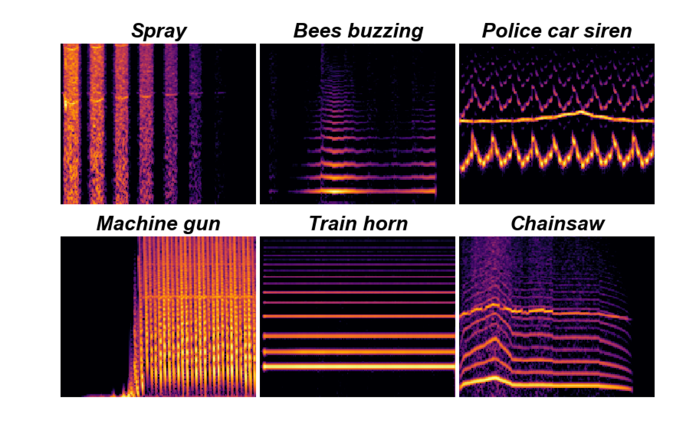
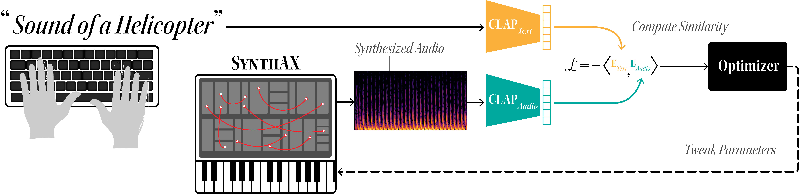
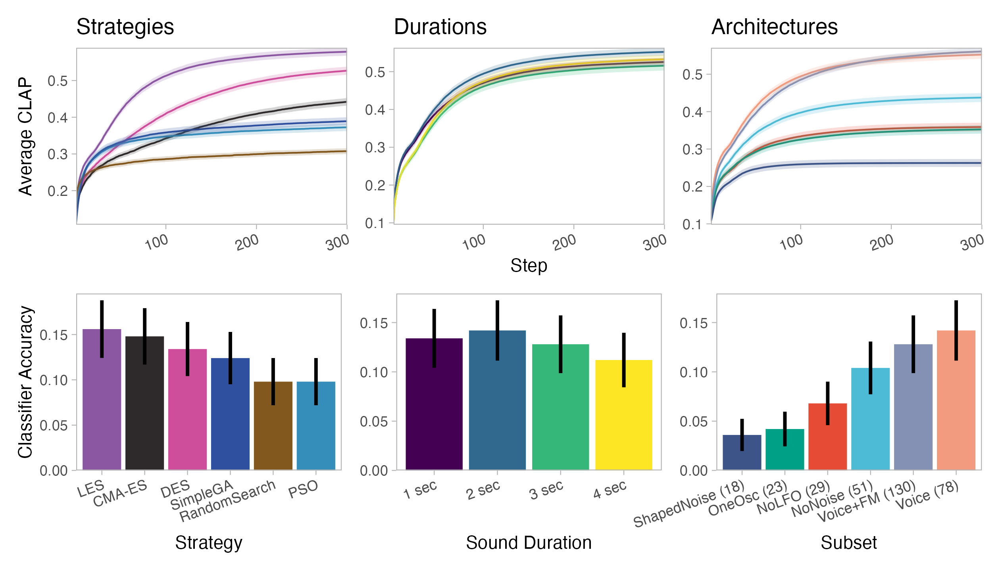
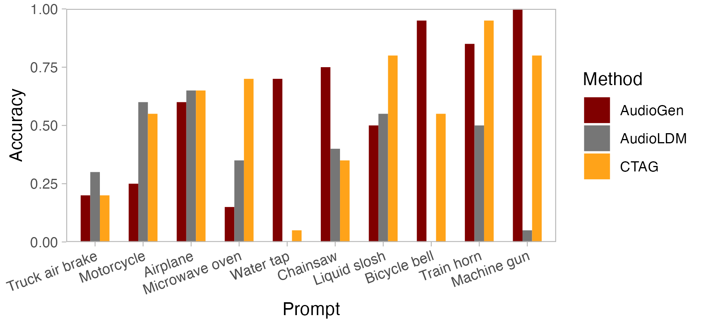
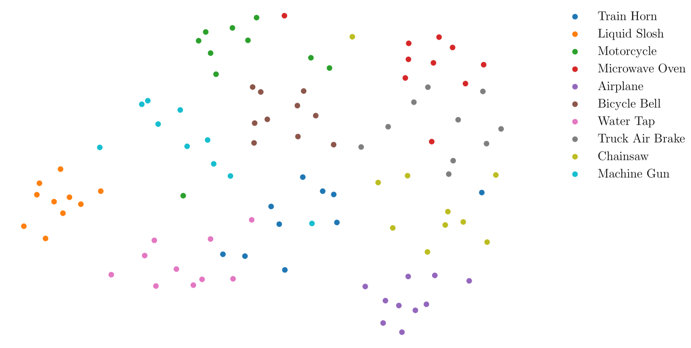

# 借助合成器编程，创意文本转音频的生成得以实现

发布时间：2024年06月01日

`LLM应用

理由：这篇论文介绍了一种新颖的文本至音频生成技术——CTAG，它通过一个参数较少的虚拟模块化声音合成器来生成音频。这种方法虽然涉及语言模型的应用，但主要关注的是音频合成的实际应用，而不是语言模型本身的理论研究或Agent的设计与应用。因此，它更适合归类于“LLM应用”类别。`

> Creative Text-to-Audio Generation via Synthesizer Programming

# 摘要

> 神经音频合成技术现已支持通过自然语言来指定创意。然而，这些技术所生成的音频难以微调，因其依赖于庞大的潜在空间和数十亿难以解释的参数。我们提出了一种新颖的文本至音频生成技术——CTAG，它运用了一个仅含78个参数的虚拟模块化声音合成器。合成器因其灵活性和直观操控，一直是音乐和电影等媒体领域专业声音设计师的得力工具。CTAG通过迭代调整合成器参数，能够生成易于审视和调整的高质量文本驱动音频。这种音频更具抽象美，捕捉了核心概念而非琐碎的声学细节，如同简洁的草图能生动传达视觉理念。我们的研究表明，CTAG生成的音频独具艺术魅力，且与现有神经音频合成模型同样易于识别，证明了它是一个宝贵且互补的工具。

> Neural audio synthesis methods now allow specifying ideas in natural language. However, these methods produce results that cannot be easily tweaked, as they are based on large latent spaces and up to billions of uninterpretable parameters. We propose a text-to-audio generation method that leverages a virtual modular sound synthesizer with only 78 parameters. Synthesizers have long been used by skilled sound designers for media like music and film due to their flexibility and intuitive controls. Our method, CTAG, iteratively updates a synthesizer's parameters to produce high-quality audio renderings of text prompts that can be easily inspected and tweaked. Sounds produced this way are also more abstract, capturing essential conceptual features over fine-grained acoustic details, akin to how simple sketches can vividly convey visual concepts. Our results show how CTAG produces sounds that are distinctive, perceived as artistic, and yet similarly identifiable to recent neural audio synthesis models, positioning it as a valuable and complementary tool.

[Arxiv](https://arxiv.org/abs/2406.00294)