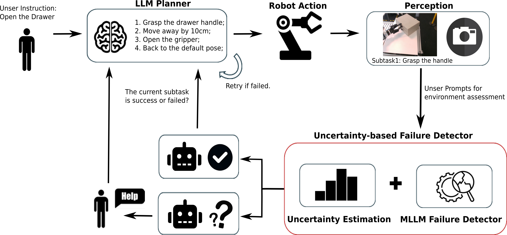
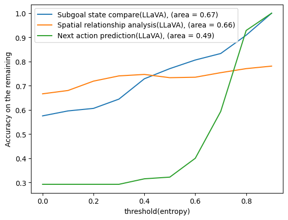
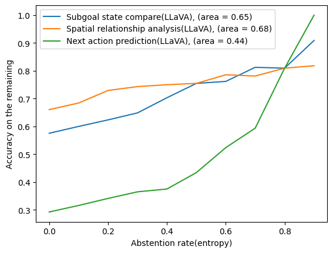
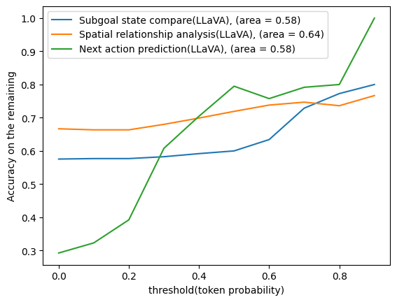
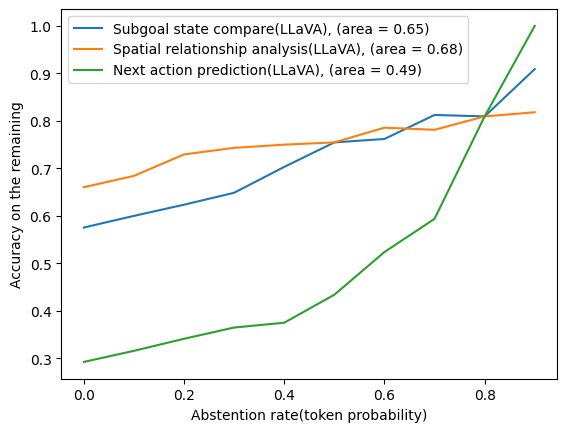
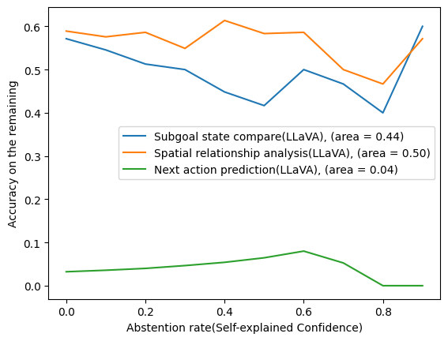

# 评估闭环 LLM 规划器中基于不确定性的故障检测机制

发布时间：2024年06月01日

`Agent

这篇论文主要介绍了一种基于闭环LLM的规划方法，即KnowLoop框架，并结合了基于不确定性的MLLMs失败检测器。这种方法旨在提高机器人操作任务中的规划准确性和鲁棒性，通过量化MLLMs的不确定性并采取相应的策略来优化失败检测。因此，这篇论文更符合Agent分类，因为它涉及到了智能体（Agent）在特定任务中的规划和决策过程，以及如何通过技术手段提高这些过程的效率和可靠性。` `机器人技术` `自动化`

> Evaluating Uncertainty-based Failure Detection for Closed-Loop LLM Planners

# 摘要

> 近期，大型语言模型（LLMs）在机器人操作任务的零-shot规划上表现出色，但因开环特性，其规划易错且脆弱。闭环规划的失败检测常受限于特定任务的启发式或不切实际的假设——预测始终可靠。尽管LLMs和多模态大型语言模型（MLLMs）作为通用推理机器在失败检测上颇具潜力，但因幻觉问题，这一假设的合理性大打折扣。为此，我们提出了KnowLoop框架，一种基于闭环LLM的规划方法，并辅以基于不确定性的MLLMs失败检测器，该检测器对任何MLLMs或LLMs均保持中立。我们评估了三种量化MLLMs不确定性的方法：令牌概率、熵和自我解释的信心，并基于三种精心设计的提示策略进行测试。通过自收集的数据集，涵盖多种操作任务和基于LLM的机器人系统，实验显示令牌概率和熵在反映不确定性上优于自我解释的信心。通过设定阈值过滤不确定预测并主动寻求人类介入，我们显著提升了失败检测的准确性，从而加强了闭环规划的效能和任务的整体成功率。

> Recently, Large Language Models (LLMs) have witnessed remarkable performance as zero-shot task planners for robotic manipulation tasks. However, the open-loop nature of previous works makes LLM-based planning error-prone and fragile. On the other hand, failure detection approaches for closed-loop planning are often limited by task-specific heuristics or following an unrealistic assumption that the prediction is trustworthy all the time. As a general-purpose reasoning machine, LLMs or Multimodal Large Language Models (MLLMs) are promising for detecting failures. However, However, the appropriateness of the aforementioned assumption diminishes due to the notorious hullucination problem. In this work, we attempt to mitigate these issues by introducing a framework for closed-loop LLM-based planning called KnowLoop, backed by an uncertainty-based MLLMs failure detector, which is agnostic to any used MLLMs or LLMs. Specifically, we evaluate three different ways for quantifying the uncertainty of MLLMs, namely token probability, entropy, and self-explained confidence as primary metrics based on three carefully designed representative prompting strategies. With a self-collected dataset including various manipulation tasks and an LLM-based robot system, our experiments demonstrate that token probability and entropy are more reflective compared to self-explained confidence. By setting an appropriate threshold to filter out uncertain predictions and seek human help actively, the accuracy of failure detection can be significantly enhanced. This improvement boosts the effectiveness of closed-loop planning and the overall success rate of tasks.

[Arxiv](https://arxiv.org/abs/2406.00430)