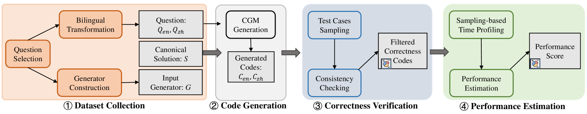
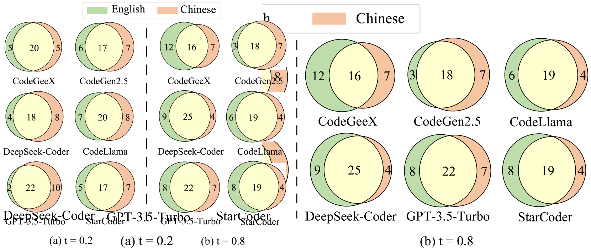
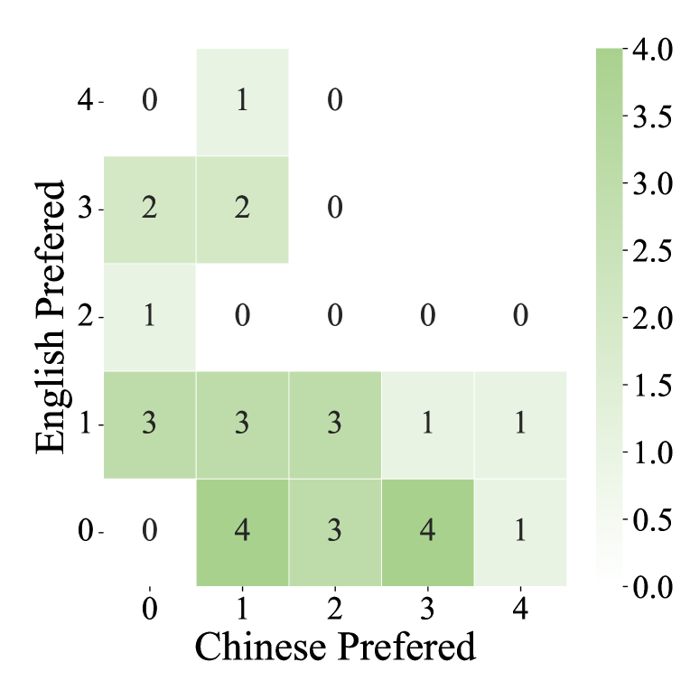
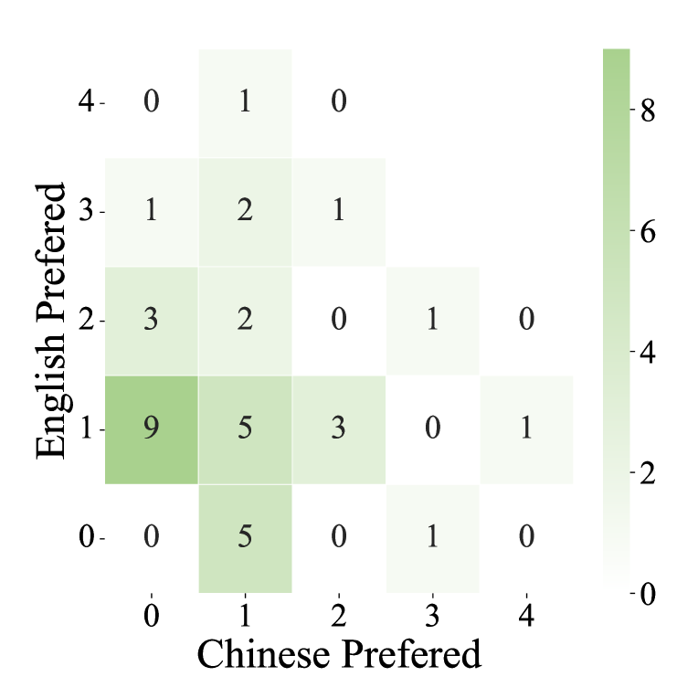
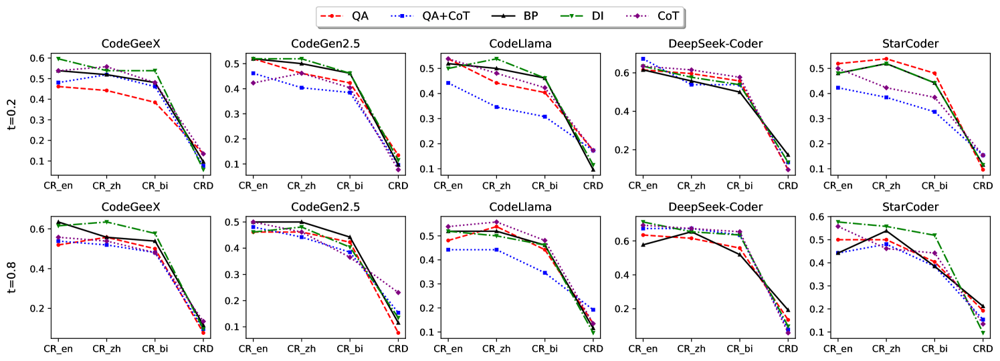
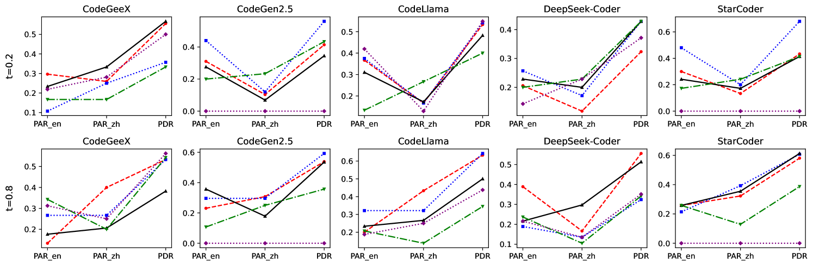
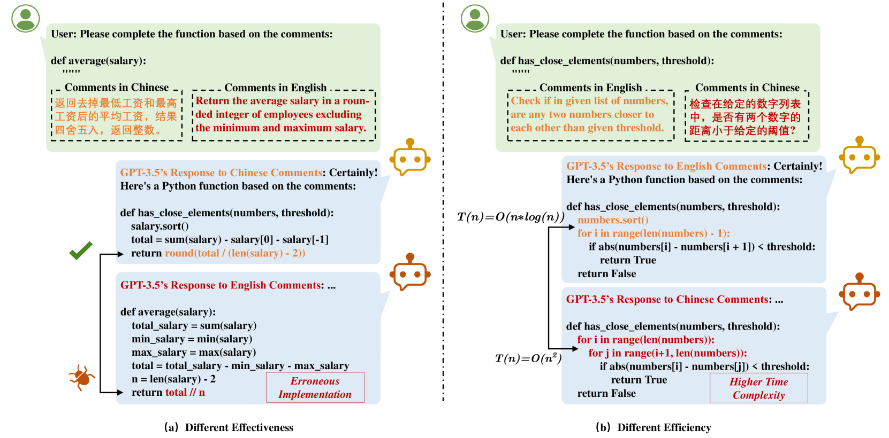

# 从有效性到效率：双语编程问题中，语言模型生成代码的比较评估

发布时间：2024年06月01日

`LLM应用

这篇论文主要关注大型代码生成模型（LCGMs）在不同语言输入下的性能差异，特别是在中文和英语环境下的代码生成质量和效率。研究通过构建双语编程问题测试套件和开发自动输入生成工具，评估了LCGMs在双语环境下的表现。这种研究属于应用层面的探讨，即如何优化和改进大型语言模型在特定应用场景（如代码生成）中的性能，因此应归类为LLM应用。` `软件开发`

> From Effectiveness to Efficiency: Comparative Evaluation of Code Generated by LCGMs for Bilingual Programming Questions

# 摘要

> 大型代码生成模型（LCGMs）在编程领域备受瞩目，成绩斐然。但当输入非英语提示时，其性能引发疑虑，因这些模型多基于英语语料库训练，且编程语言令牌多与英语相似。现有评估多依赖英语编程问题及少量手动单元测试，难以全面衡量LCGM生成的代码质量。本文聚焦中文与英语，探讨不同语言输入下的代码质量差异，尤其是其有效性与效率。面对双语输入评估的三大挑战：缺乏优质双语编程数据集、单元测试不足、性能比较支持有限，我们构建了包含52个双语编程问题的测试套件，并开发了自动输入生成工具。通过扩大单元测试样本并分析执行时间与输入规模的关系，我们提升了正确性验证并评估了代码性能。基于此，我们对六款顶尖LCGMs进行了实证研究，发现LCGM生成的代码在10.5%的任务上双语正确性不一，39.5%的正确代码在双语性能上呈现差异。这表明LCGMs在不同语言间生成高质量代码的能力并不一致，为未来研究指明了方向。

> Large Code Generation Models (LCGMs) have garnered significant attention and achieved promising results across various programming tasks. However, concerns arise regarding performance when using non-English prompts, as these models are primarily trained on English-centric corpora, and most programming language tokens resemble English. Existing benchmarks often rely on English programming questions and limited manual unit test cases, inadequately assessing LCGM-generated code quality. This paper investigates code quality differences, specifically effectiveness and efficiency, when employing different natural languages as inputs, focusing on Chinese and English due to their prominent corpora and LCGM availability. Evaluating LCGM-generated code quality under bilingual inputs presents three challenges: (1) lack of high-quality bilingual programming question datasets, (2) insufficient unit test cases for comprehensive correctness verification, and (3) limited support for comparing generated code performance. To address these challenges, we curated a test suite of 52 bilingual programming questions and developed automated input generators for each. We enhanced correctness verification by sampling larger unit test cases and estimated code performance by profiling execution time relative to input size growth. Using this framework, we conducted an empirical study on six state-of-the-art LCGMs. The results revealed that LCGM-generated code exhibits varying bilingual correctness on an average of 10.5% of tasks, with 39.5% of correct code showing diverse bilingual performance differences. Our findings suggested LCGMs may not consistently generate high-quality code across different languages, providing insights for future research directions.

[Arxiv](https://arxiv.org/abs/2406.00602)