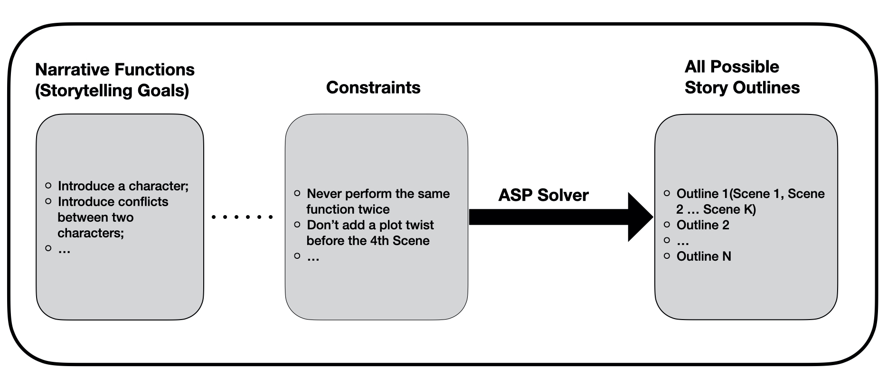
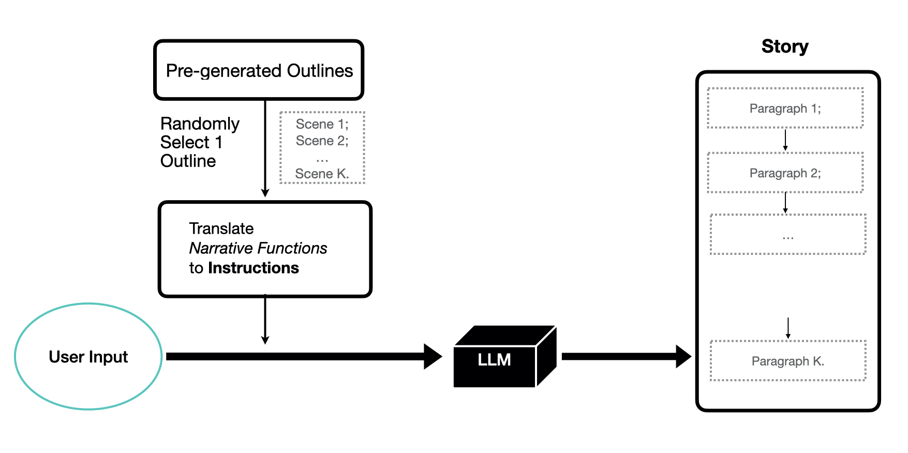
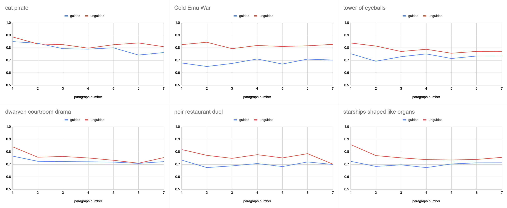

# 利用答案集编程引导并丰富基于大型语言模型的故事创作

发布时间：2024年06月01日

`Agent

理由：这篇论文探讨了如何结合大型语言模型（LLM）和符号方法（如答案集编程ASP）来提高故事创作的多样性。这种方法涉及使用高层次的符号规范来引导LLM的创作过程，从而生成更加多样化的故事。这种结合了LLM和符号方法的系统可以被视为一个智能代理（Agent），因为它能够根据特定的输入（符号规范）执行任务（创作故事），并产生有意义的结果。因此，这篇论文更适合归类为Agent。` `文学创作` `人工智能`

> Guiding and Diversifying LLM-Based Story Generation via Answer Set Programming

# 摘要

> 指令调优的LLMs虽能应答开放式请求创作故事，但故事多样性不足。传统的符号方法（如故事规划）虽能产出多样化的情节大纲，却受限于固定的角色动作模板。我们能否融合两者的长处，同时克服各自的短板？我们的方案是利用高层次、抽象的符号规范——通过答案集编程（ASP）实现——来引导和丰富基于LLM的故事创作。语义相似性分析显示，我们的方法产出的故事比未受指导的LLM更为多样。代码摘录则展示了ASP生成的大纲在紧凑性和灵活性上超越了传统的叙事规划。

> Instruction-tuned large language models (LLMs) are capable of generating stories in response to open-ended user requests, but the resulting stories tend to be limited in their diversity. Older, symbolic approaches to story generation (such as planning) can generate substantially more diverse plot outlines, but are limited to producing stories that recombine a fixed set of hand-engineered character action templates. Can we combine the strengths of these approaches while mitigating their weaknesses? We propose to do so by using a higher-level and more abstract symbolic specification of high-level story structure -- implemented via answer set programming (ASP) -- to guide and diversify LLM-based story generation. Via semantic similarity analysis, we demonstrate that our approach produces more diverse stories than an unguided LLM, and via code excerpts, we demonstrate the improved compactness and flexibility of ASP-based outline generation over full-fledged narrative planning.

[Arxiv](https://arxiv.org/abs/2406.00554)