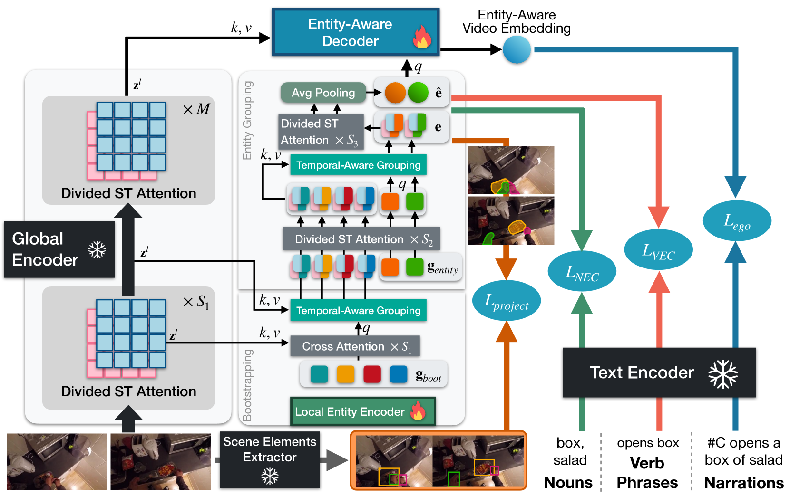
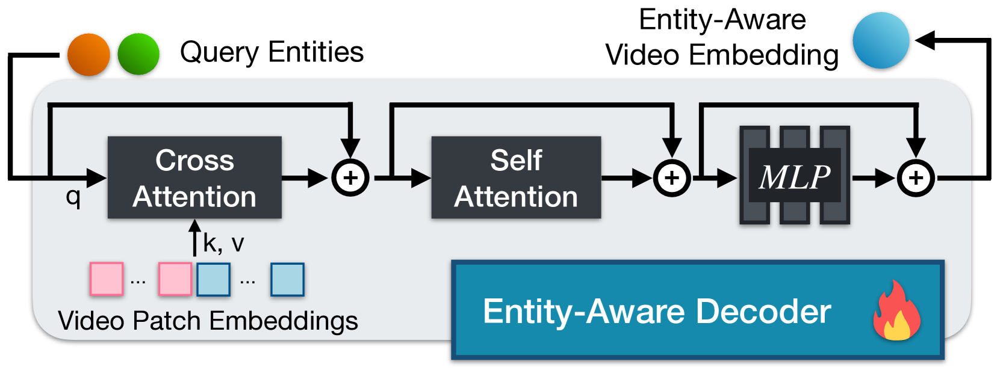

# HENASY：掌握场景实体组装，赋能第一人称视频语言模型

发布时间：2024年06月01日

`LLM应用

这篇论文介绍了一种名为HENASY的创新框架，专门用于第一人称视频分析，以提升视频内容表示的精细度。该框架通过增强的槽注意和分组机制，动态组装视频片段中的实体，并结合局部实体编码器、全局编码器及实体感知解码器，实现了视频场景动态的精细建模与视觉实体与文本间的精准对齐。此外，HENASY通过创新的对比损失，在实体与活动识别上取得了显著成果，并在多个测试中刷新了记录。这些特性表明，该论文主要关注于大型语言模型（LLM）的应用，特别是在视频-语言多模态领域的应用，因此应归类为LLM应用。` `视频分析` `多模态研究`

> HENASY: Learning to Assemble Scene-Entities for Egocentric Video-Language Model

# 摘要

> 视频-语言模型（VLMs）虽已在大规模视频-标题数据集上预训练，成为视觉-语言表示和下游任务的标杆，但其全局对比对齐的依赖限制了对视觉与文本元素间细微交互的捕捉。为此，我们推出了HENASY（层次实体组装），这一创新框架专为第一人称视频分析量身打造，旨在提升视频内容表示的精细度。HENASY运用增强的槽注意和分组机制，从视频片段中动态组装实体，并结合局部实体编码器、全局编码器及实体感知解码器，实现了视频场景动态的精细建模与视觉实体与文本间的精准对齐。通过创新的对比损失，HENASY在实体与活动识别上大放异彩，不仅在Ego4D和EpicKitchen等测试中刷新记录，更在零-shot及广泛视频理解任务中树立了新标杆。HENASY的卓越表现，无疑为视频-语言多模态研究领域带来了重大突破。

> Video-Language Models (VLMs), pre-trained on large-scale video-caption datasets, are now standard for robust visual-language representation and downstream tasks. However, their reliance on global contrastive alignment limits their ability to capture fine-grained interactions between visual and textual elements. To address these challenges, we introduce HENASY (Hierarchical ENtities ASsemblY), a novel framework designed for egocentric video analysis that enhances the granularity of video content representations. HENASY employs a compositional approach using an enhanced slot-attention and grouping mechanisms for videos, assembling dynamic entities from video patches. It integrates a local entity encoder for dynamic modeling, a global encoder for broader contextual understanding, and an entity-aware decoder for late-stage fusion, enabling effective video scene dynamics modeling and granular-level alignment between visual entities and text. By incorporating innovative contrastive losses, HENASY significantly improves entity and activity recognition, delivering superior performance on benchmarks such as Ego4D and EpicKitchen, and setting new standards in both zero-shot and extensive video understanding tasks. Our results confirm groundbreaking capabilities of HENASY and establish it as a significant advancement in video-language multimodal research.

[Arxiv](https://arxiv.org/abs/2406.00307)