# 借助合成标题，提升图像文本生成能力

发布时间：2024年06月01日

`Agent

理由：这篇论文主要探讨了如何通过微调技术改善潜在扩散模型在图像内生成文本的能力，特别是在使用SDXL模型时。论文提出了一种经济高效的方法，通过微调来提高文本生成的准确性，而不依赖于额外的多模态编码器。这种方法涉及对模型的调整和优化，以适应特定的任务（即图像内文本的生成），这符合Agent类别的定义，即关注于模型的应用和调整以解决特定问题。此外，论文中的研究重点在于模型的实际应用和性能提升，而不是理论研究或模型架构的深入分析，因此更适合归类为Agent。` `图像处理` `机器学习`

> Improving Text Generation on Images with Synthetic Captions

# 摘要

> 潜在扩散模型SDXL和SD 1.5近期崭露头角，它们在生成细腻逼真的图像上展现出卓越能力。然而，图像内文本的精确生成依旧是一大难题。本文深入探讨了微调技术在图像内生成清晰文本的可行性，并提出了一种经济高效的方法，利用SDXL无需繁琐的大数据集训练。我们的策略通过微调技术，探究了数据精炼程度与合成标题的影响，并展示了小规模微调如何在不依赖额外多模态编码器的情况下，提升不同场景下文本生成的准确性。实验结果显示，向原始数据集添加随机字母能显著增强模型生成规范视觉文本的能力。

> The recent emergence of latent diffusion models such as SDXL and SD 1.5 has shown significant capability in generating highly detailed and realistic images. Despite their remarkable ability to produce images, generating accurate text within images still remains a challenging task. In this paper, we examine the validity of fine-tuning approaches in generating legible text within the image. We propose a low-cost approach by leveraging SDXL without any time-consuming training on large-scale datasets. The proposed strategy employs a fine-tuning technique that examines the effects of data refinement levels and synthetic captions. Moreover, our results demonstrate how our small scale fine-tuning approach can improve the accuracy of text generation in different scenarios without the need of additional multimodal encoders. Our experiments show that with the addition of random letters to our raw dataset, our model's performance improves in producing well-formed visual text.

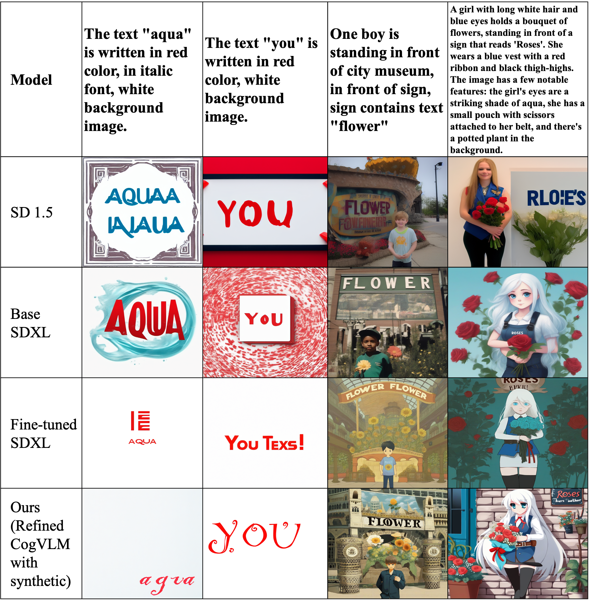

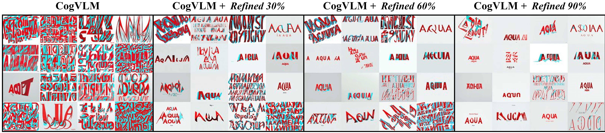

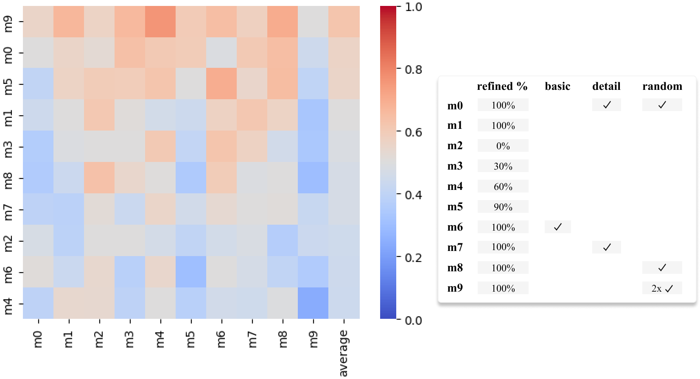

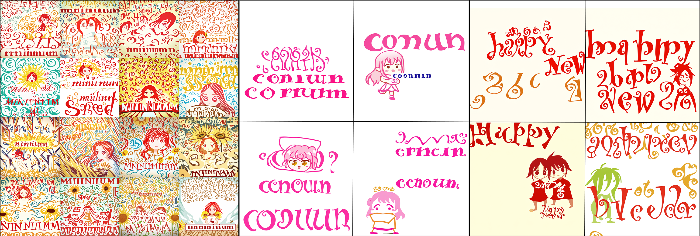

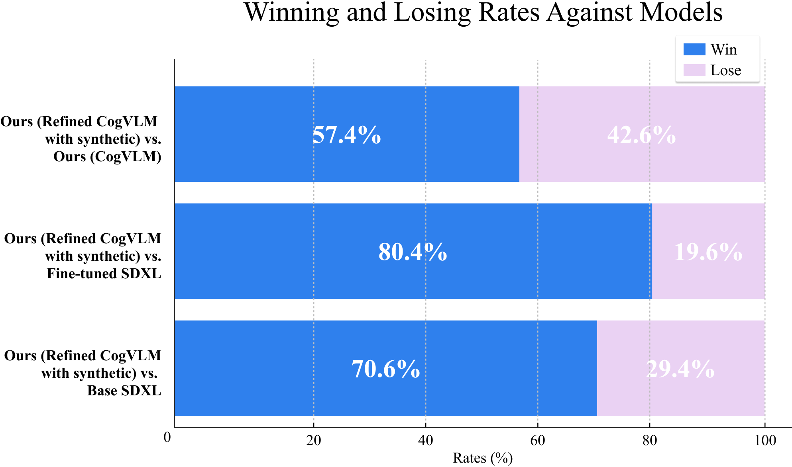

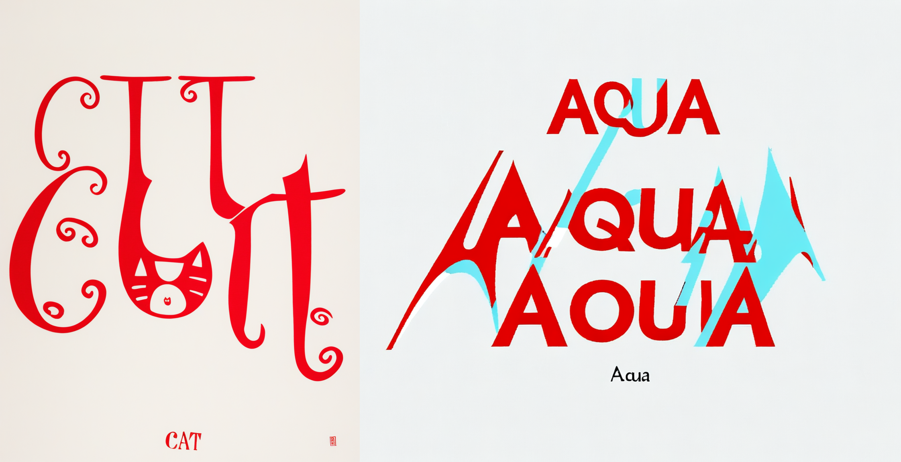

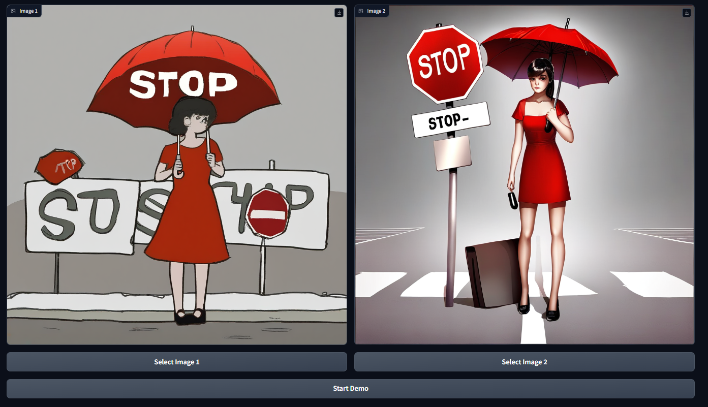

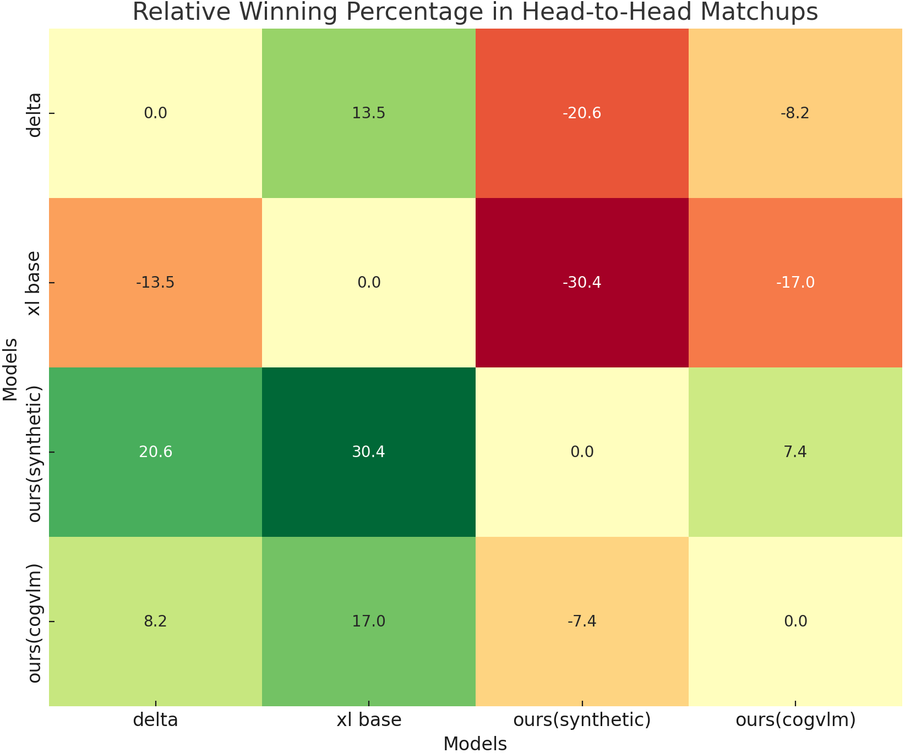

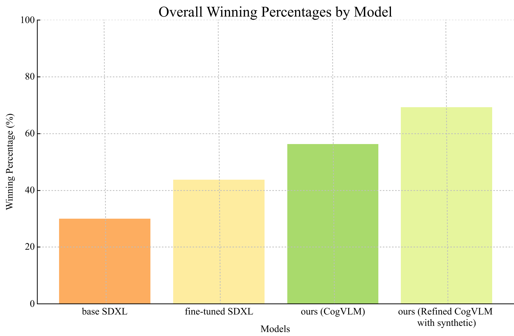

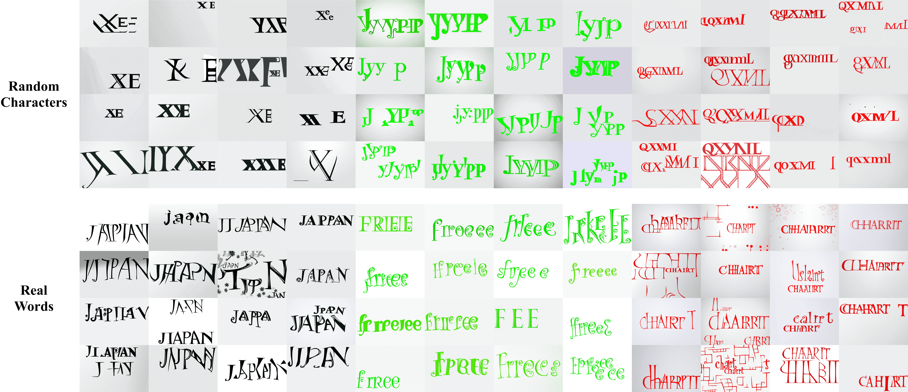

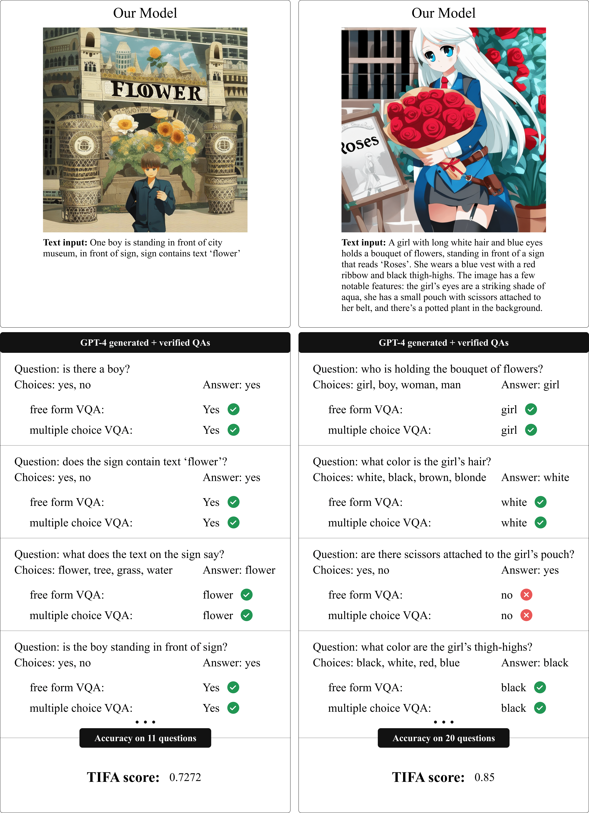

[Arxiv](https://arxiv.org/abs/2406.00505)