# 大型语言模型（LLMs）具备无监督自主学习的能力。

发布时间：2024年06月01日

`LLM理论

理由：这篇论文探讨的是大型语言模型（LLMs）的自主学习方法，这是一种理论上的创新，旨在改变传统依赖人类标注数据和预设训练目标的训练模式。论文提出的自主学习方法，允许模型通过与文本互动来自我提升，减少对人类监督的依赖，这属于LLM理论的范畴，因为它涉及到模型学习机制的根本性改变和理论探索。` `人工智能`

> LLMs Could Autonomously Learn Without External Supervision

# 摘要

> 在追求超越人类性能的征途中，大型语言模型（LLMs）历来依赖于人类标注的数据和预设的训练目标，这一过程既耗时又受限。本文提出了一种革命性的方法：LLMs的自主学习，一种自给自足的学习模式，让模型摆脱了人类监督的束缚。这种方法让LLMs能够像人类阅读理解文献一样，通过直接与文本互动来自我提升。我们摒弃了对标注数据的依赖，创造了一个模型自主识别并强化知识缺口的环境。实验结果表明，使用多样化的学习材料并在公共测验中评估，自主学习不仅超越了预训练和监督微调（SFT），还优于检索增强方法。这些发现不仅凸显了自主学习在提升LLM训练效率和效果上的潜力，也为开发更先进的、自给自足的AI系统奠定了基础。

> In the quest for super-human performance, Large Language Models (LLMs) have traditionally been tethered to human-annotated datasets and predefined training objectives-a process that is both labor-intensive and inherently limited. This paper presents a transformative approach: Autonomous Learning for LLMs, a self-sufficient learning paradigm that frees models from the constraints of human supervision. This method endows LLMs with the ability to self-educate through direct interaction with text, akin to a human reading and comprehending literature. Our approach eliminates the reliance on annotated data, fostering an Autonomous Learning environment where the model independently identifies and reinforces its knowledge gaps. Empirical results from our comprehensive experiments, which utilized a diverse array of learning materials and were evaluated against standard public quizzes, reveal that Autonomous Learning outstrips the performance of both Pre-training and Supervised Fine-Tuning (SFT), as well as retrieval-augmented methods. These findings underscore the potential of Autonomous Learning to not only enhance the efficiency and effectiveness of LLM training but also to pave the way for the development of more advanced, self-reliant AI systems.

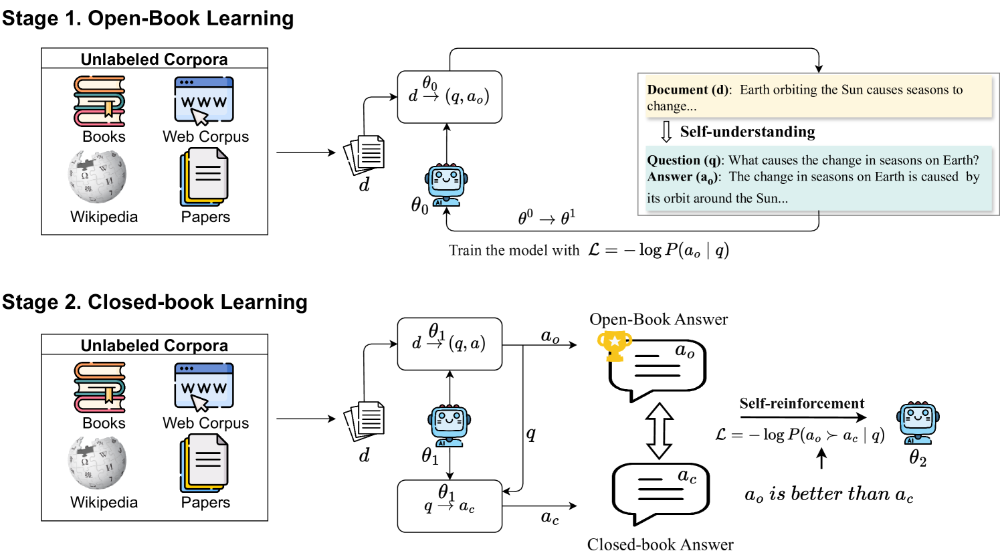

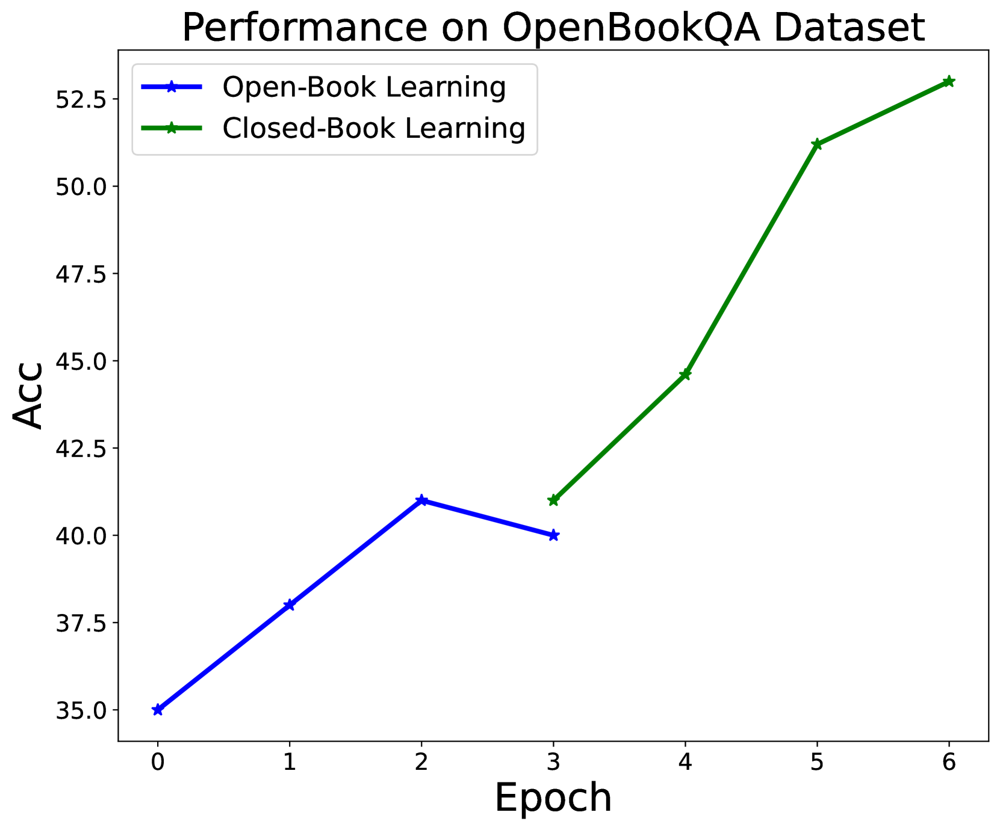

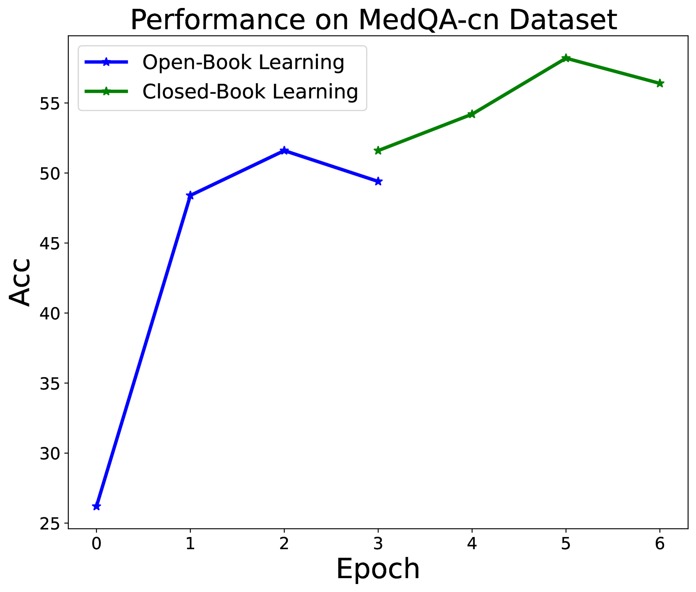

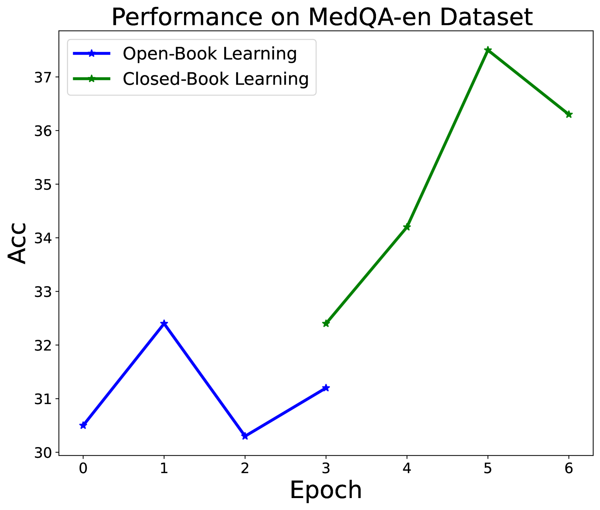

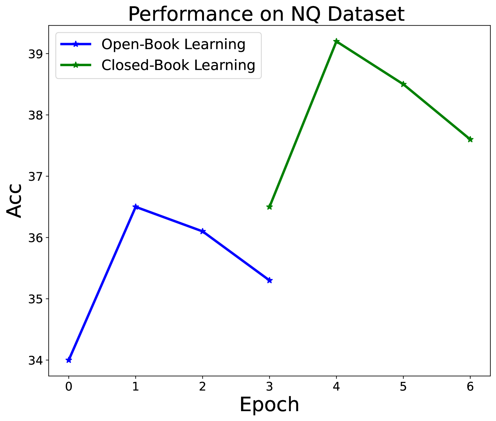

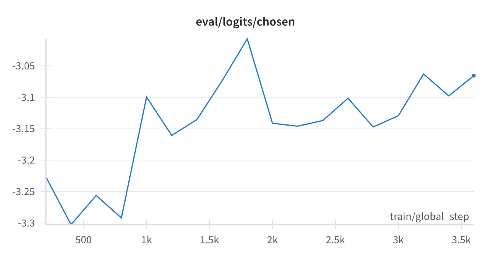

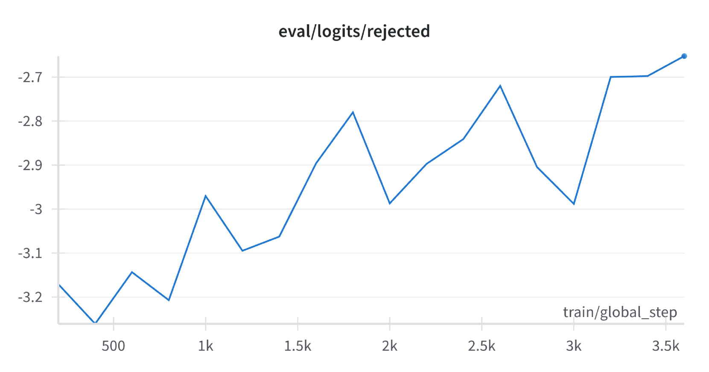

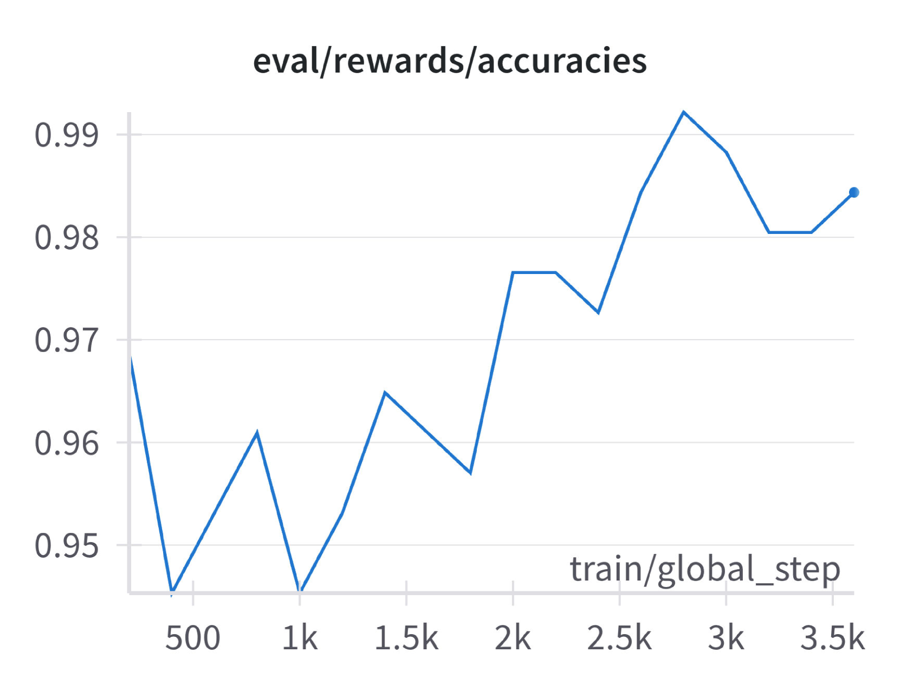

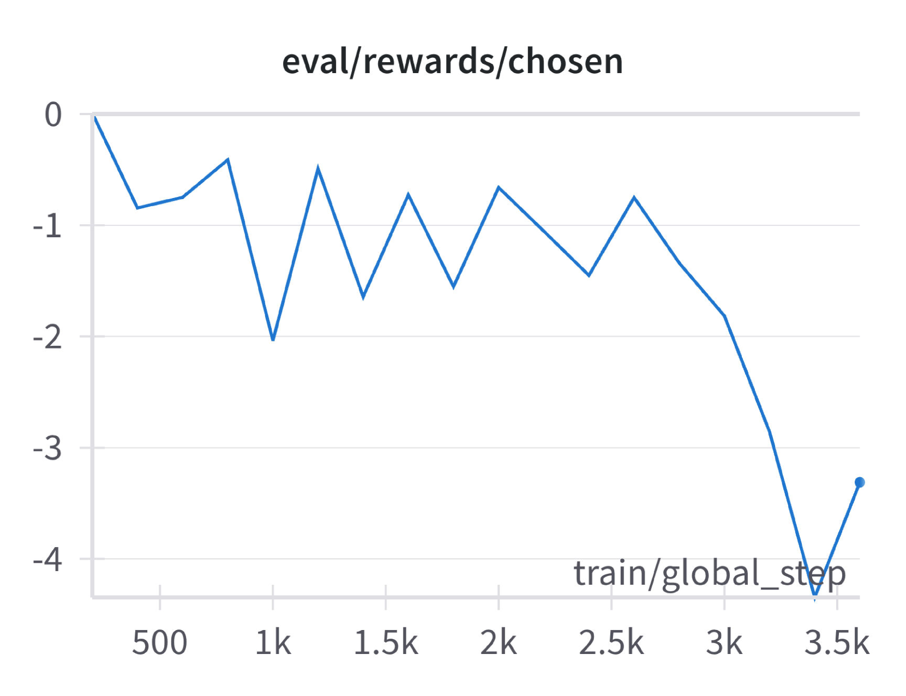

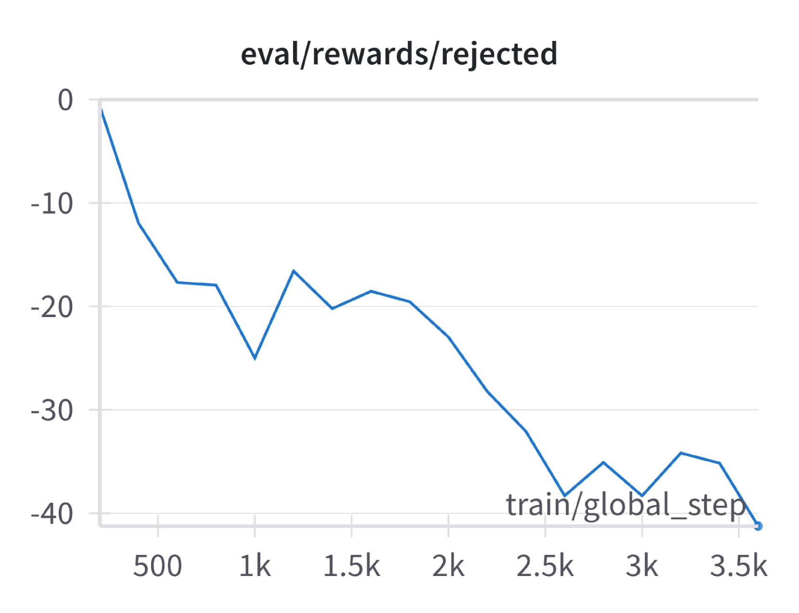

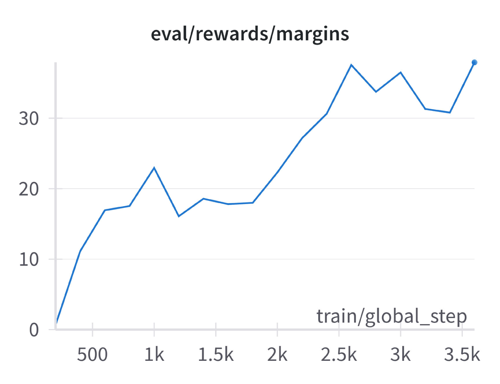

[Arxiv](https://arxiv.org/abs/2406.00606)