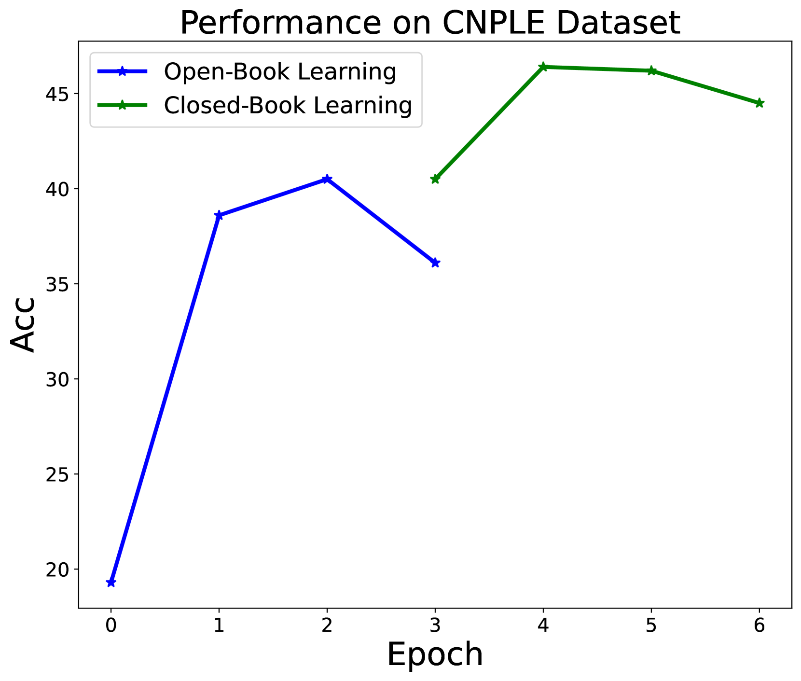

# 大型语言模型（LLMs）具备无需外部监督的自主学习能力。

发布时间：2024年06月01日

`Agent

这篇论文探讨了一种新的学习方法，即大型语言模型（LLMs）的自主学习，这种方法允许模型在没有人类监督的情况下自我学习。这与Agent的分类相符，因为Agent通常指的是能够自主行动和学习的智能体。论文中提到的自主学习模式，即模型通过与文本互动自我学习，并自主识别和强化知识缺口，体现了Agent的特性，即自主性和适应性。此外，论文中提到的自主学习在性能上超越了传统方法，这也符合Agent研究中对高效和自适应系统的追求。因此，将这篇论文归类为Agent是合适的。` `人工智能`

> LLMs Could Autonomously Learn Without External Supervision

# 摘要

> 在追求超越人类表现的征途中，大型语言模型（LLMs）传统上依赖于人类标注的数据和预设的训练目标，这一过程既耗时又受限。本文提出了一种革命性的方法：LLMs的自主学习，一种自给自足的学习模式，让模型摆脱了人类监督的束缚。这种方法让LLMs通过直接与文本互动自我学习，如同人类阅读理解文献一般。我们摒弃了对标注数据的依赖，创造了一个模型能够自主识别并强化知识缺口的环境。通过使用多样化的学习材料并在标准公共测验中评估的全面实验，我们发现自主学习在性能上超越了预训练、监督微调（SFT）及检索增强方法。这些成果不仅提升了LLM训练的效率和效果，更为开发更先进的、自给自足的AI系统开辟了新道路。

> In the quest for super-human performance, Large Language Models (LLMs) have traditionally been tethered to human-annotated datasets and predefined training objectives-a process that is both labor-intensive and inherently limited. This paper presents a transformative approach: Autonomous Learning for LLMs, a self-sufficient learning paradigm that frees models from the constraints of human supervision. This method endows LLMs with the ability to self-educate through direct interaction with text, akin to a human reading and comprehending literature. Our approach eliminates the reliance on annotated data, fostering an Autonomous Learning environment where the model independently identifies and reinforces its knowledge gaps. Empirical results from our comprehensive experiments, which utilized a diverse array of learning materials and were evaluated against standard public quizzes, reveal that Autonomous Learning outstrips the performance of both Pre-training and Supervised Fine-Tuning (SFT), as well as retrieval-augmented methods. These findings underscore the potential of Autonomous Learning to not only enhance the efficiency and effectiveness of LLM training but also to pave the way for the development of more advanced, self-reliant AI systems.

[Arxiv](https://arxiv.org/abs/2406.00606)